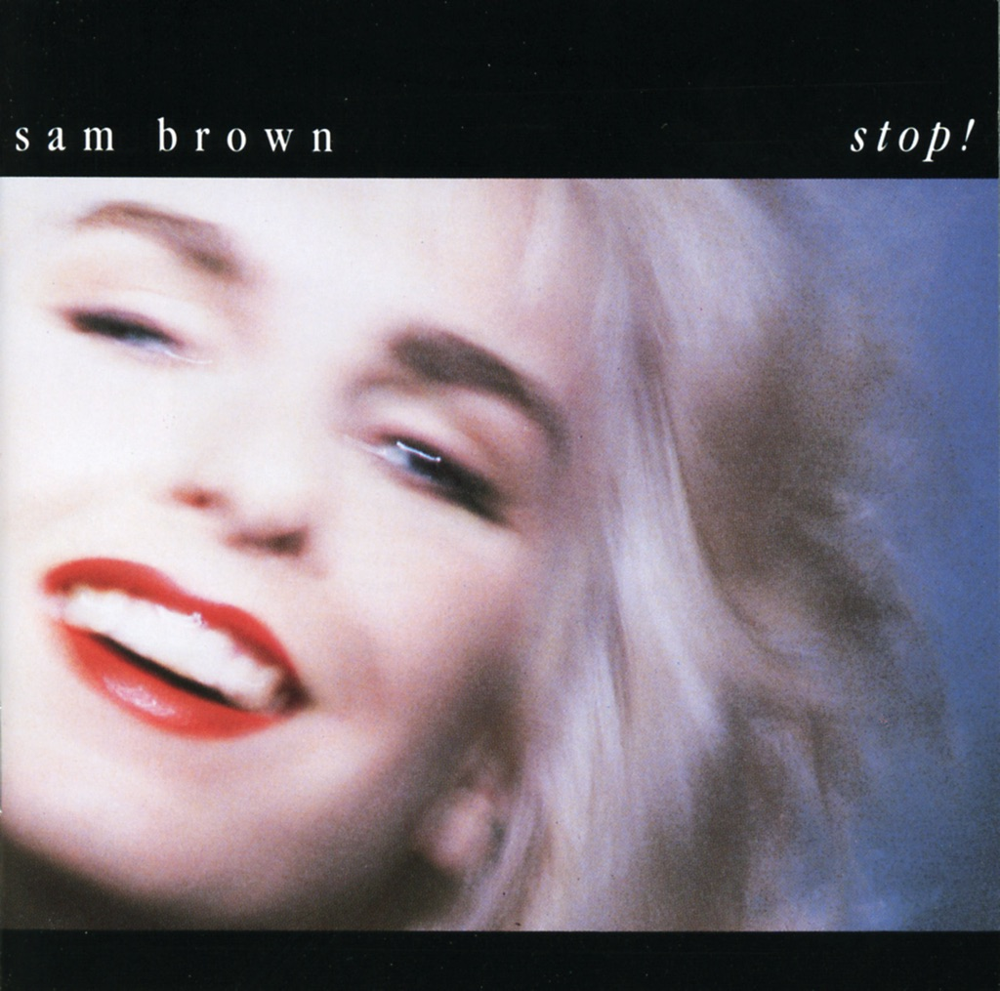

<!-- section break -->

1. Walking Back To Me (3:40)
2. Your Love Is All (4:09)
3. Stop (4:53)
4. It Makes Me Wonder (4:33)
5. This Feeling (3:21)
6. Tea (0:41)
7. Piece Of My Luck (3:00)
8. Ball And Chain (4:34)
9. Wrap Me Up (3:10)
10. I'll Be In Love (5:16)
11. Merry Go Round (3:07)
12. Sometimes You Just Don't Know (3:05)

<!-- section break -->

## Spotify


## Videos
### This Feeling
 

### More Videos

- [Walking Back To Me](https://www.youtube.com/watch?v=hTOBlrWzT0o)
- [Sam Brown - Stop! [LP Full Album]](https://www.youtube.com/watch?v=GKcZnjBSCBE)
- [Your Love Is All](https://www.youtube.com/watch?v=LEBiRGka5nU)
- [Stop](https://www.youtube.com/watch?v=kRHSAPiBfq8)
- [It Makes Me Wonder](https://www.youtube.com/watch?v=UUhjwspFCXI)
- [Tea](https://www.youtube.com/watch?v=RAQ0OmNsmRI)
- [Piece Of My Luck](https://www.youtube.com/watch?v=x05qXKVpJGU)
- [Ball And Chain](https://www.youtube.com/watch?v=xEoXSfjJzwA)
- [Wrap Me Up](https://www.youtube.com/watch?v=bBtt6SwSzzA)
- [I'll Be In Love](https://www.youtube.com/watch?v=xFfrFPhSAFE)
- [Merry Go Round](https://www.youtube.com/watch?v=Vj9OdQpY_4M)
- [Sometimes You Just Don't Know](https://www.youtube.com/watch?v=r-zwq1Xqab4)

## Release Information
|  Key           | Value                                                |
| ---------------| ---------------------------------------------------- |
| Release Year   | 1988                                   |
| Discogs Link   | [Sam Brown - Stop!](https://www.discogs.com/release/11811666-Sam-Brown-Stop) |
| Label          | A&M Records |
| Format         | Vinyl LP Album |
| Catalog Number | Ama 5195 |
| Notes | Differs to https://www.discogs.com/Sam-Brown-Stop/release/9230163 6 page insert with lyrics, not 4 page. Etched runout starts JA, not AJ. Song timings different.  |