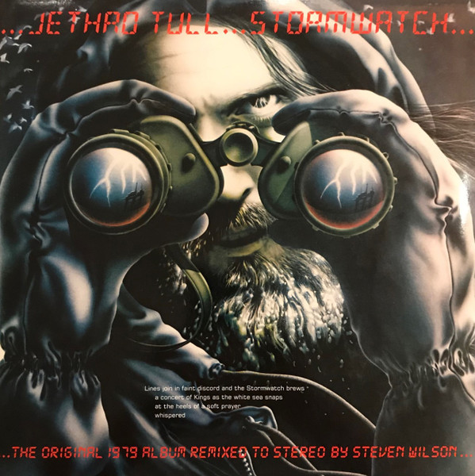

<!-- section break -->

1. North Sea Oil (3:11)
2. Orion (4:00)
3. Home (2:46)
4. Dark Ages (9:12)
5. Warm Sporran (3:58)
6. Something's On The Move (4:30)
7. Old Ghosts (4:24)
8. Dun Ringill (2:42)
9. Flying Dutchman (7:43)
10. Elegy (3:34)

<!-- section break -->

## Spotify


## Release Information
|  Key           | Value                                                |
| ---------------| ---------------------------------------------------- |
| Release Year   | 2020                                   |
| Discogs Link   | [Jethro Tull - Stormwatch](https://www.discogs.com/release/14968787-Jethro-Tull-Stormwatch) |
| Label          | Chrysalis |
| Format         | Vinyl LP Album Limited Edition Stereo (white vinyl, 180gm) |
| Catalog Number | 0190295300234 |
| Notes | The original 1979 album remixed to stereo by Steven Wilson, released on white vinyl - exclusive to Burning Shed - 500 copies. Standalone release of the main album, following on from the 2019 book-format reissue.  Also available as a black vinyl release. |