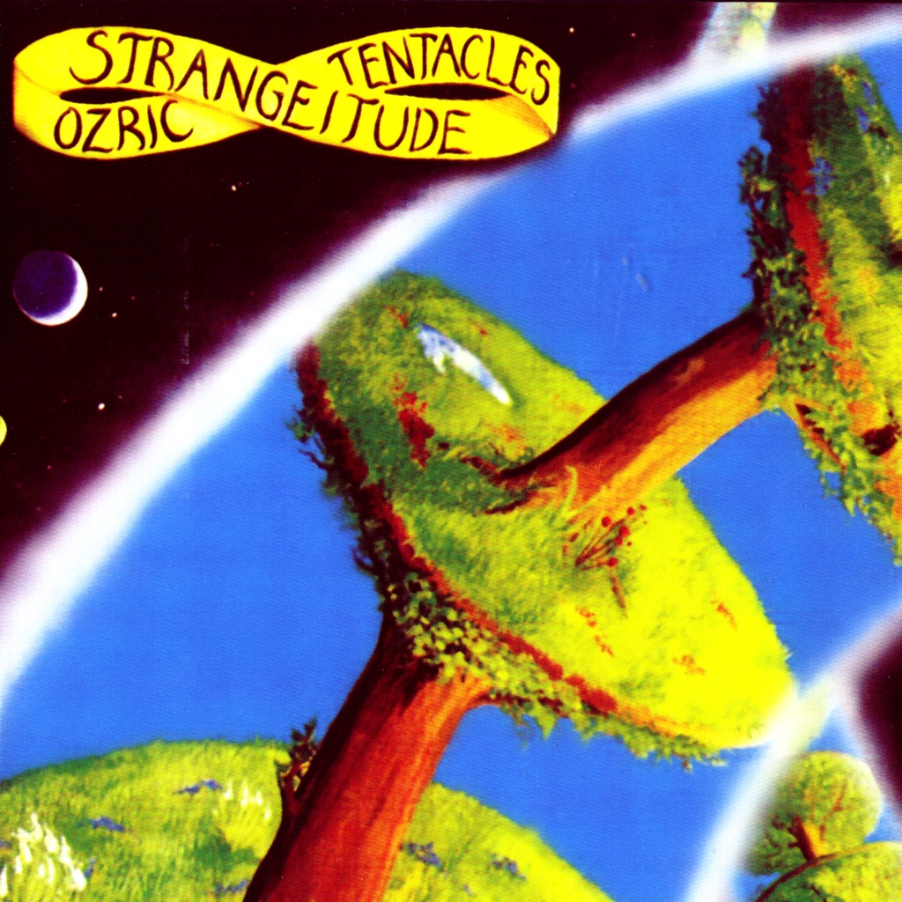

<!-- section break -->

1. White Rhino Tea
2. Sploosh!
3. Saucers
4. Strangeitude
5. Bizarre Bazaar
6. Space Between Your Ears

<!-- section break -->

## Spotify


## Videos
### Space Between Your Ears (2020 Ed Wynne Remaster)
 

### More Videos

- [White Rhino Tea (2020 Ed Wynne Remaster)](https://www.youtube.com/watch?v=NwhHFbeMILQ)
- [Sploosh! (2020 Ed Wynne Remaster)](https://www.youtube.com/watch?v=8nHntiMfapA)
- [Saucers (2020 Ed Wynne Remaster)](https://www.youtube.com/watch?v=KWKFUvdWZT0)
- [Strangeitude (2020 Ed Wynne Remaster)](https://www.youtube.com/watch?v=ZxLG8gvkqYk)
- [Bizarre Bazaar (2020 Ed Wynne Remaster)](https://www.youtube.com/watch?v=20zYKVTYMHo)

## Release Information
|  Key           | Value                                                |
| ---------------| ---------------------------------------------------- |
| Release Year   | 2020                                   |
| Discogs Link   | [Ozric Tentacles - Strangeitude](https://www.discogs.com/release/15499776-Ozric-Tentacles-Strangeitude) |
| Label          | Kscope |
| Format         | Vinyl LP Album Reissue Remastered (Green Transparent) |
| Catalog Number | KSCOPE1067 |
| Notes | Sticker in front: "Ozric Tentacles 2020 Ed Wynne Kscope Remaster Series On Coloured Vinyl"  Remastered by Ed Wynne in 2020 |