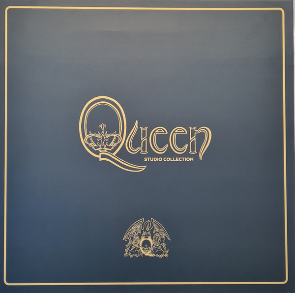

<!-- section break -->

1. Queen
2. Keep Yourself Alive
3. Doing All Right
4. Great King Rat
5. My Fairy King
6. Liar
7. The Night Comes Down
8. Modern Times Rock'n'Roll
9. Son And Daughter
10. Jesus
11. Seven Seas Of Rhye...
12. Queen II
13. Procession
14. Father To Son
15. White Queen (As It Began)
16. Some Day One Day
17. The Loser In The End
18. Ogre Battle
19. The Fairy Feller's Master Stroke
20. Nevermore
21. The March Of The Black Queen
22. Funny How Love Is
23. Seven Seas Of Rhye
24. Sheer Heart Attack
25. Brighton Rock
26. Killer Queen
27. Tenement Funster
28. Flick Of The Wrist
29. Lily Of The Valley
30. Now I'm Here
31. In The Lap Of The Gods
32. Stone Cold Crazy
33. Dear Friends
34. Misfire
35. Bring Back That Leroy Brown
36. She Makes Me (Stormtrooper In Stilettos)
37. In The Lap Of The Gods...Revisited
38. A Night At The Opera
39. Death On Two Legs (Dedicated To...
40. Lazing On A Sunday Afternoon
41. I'm In Love With My Car
42. You're My Best Friend
43. '39
44. Sweet Lady
45. Seaside Rendezvous
46. The Prophet's Song
47. Love Of My Life
48. Good Company
49. Bohemian Rhapsody
50. God Save The Queen
51. A Day At The Races
52. Tie Your Mother Down
53. You Take My Breath Away
54. Long Away
55. The Millionaire Waltz
56. You And I
57. Somebody To Love
58. White Man
59. Good Old-Fashioned Lover Boy
60. Drowse
61. Teo Torriatte (Let Us Cling Together)
62. News Of The World
63. We Will Rock You
64. We Are The Champions
65. Sheer Heart Attack
66. All Dead, All Dead
67. Spread Your Wings
68. Fight From The Inside
69. Get Down Make Love
70. Sleeping On The Sidewalk
71. Who Needs You
72. It's Late
73. My Melancholy Blues
74. Jazz
75. Mustapha
76. Fat Bottomed Girls
77. Jealousy
78. Bicycle Race
79. If You Can't Beat Them
80. Let Me Entertain You
81. Dead On Time
82. In Only Seven Days
83. Dreamers Ball
84. Fun It
85. Leaving Home Ain't Easy
86. Don't Stop Me Now
87. More Of That Jazz
88. The Game
89. Play The Game
90. Dragon Attack
91. Another One Bites The Dust
92. Need Your Loving Tonight
93. Crazy Little Thing Called Love
94. Rock It (Prime Jive)
95. Don't Try Suicide
96. Sail Away Sweet Sister
97. Coming Soon
98. Save Me
99. Flash Gordon
100. Flash's Theme
101. In The Space Capsule (The Love Theme)
102. Ming's Theme (In The Court Of Ming The Merciless)
103. The Ring (Hypnotic Seduction Of Dale)
104. Football Fight
105. In The Death Cell (Love Theme Reprise)
106. Execution Of Flash
107. The Kiss (Aura Resurrects Flash)
108. Arboria (Planet Of The Tree Men)
109. Escape From The Swamp
110. Flash To The Rescue
111. Vultan's Theme (Attack Of The Hawk Men)
112. Battle Theme
113. The Wedding March
114. Marriage Of Dale And Ming (And Flash Approaching)
115. Crash Dive On Mingo City
116. Flash's Theme Reprise (Victory Celebrations)
117. The Hero
118. Hot Space
119. Staying Power
120. Dancer
121. Back Chat
122. Body Language
123. Action This Day
124. Put Out The Fire
125. Life Is Real (Song For Lennon)
126. Calling All Girls
127. Las Palabras De Amor (The Words Of Love)
128. Cool Cat
129. Under Pressure
130. The Works
131. Radio Ga Ga
132. Tear It Up
133. It's A Hard Life
134. Man On The Prowl
135. Machines (Or 'Back To Humans')
136. I Want To Break Free
137. Keep Passing The Open Windows
138. Hammer To Fall
139. Is This The World We Created...?
140. A Kind Of Magic
141. One Vision
142. A Kind Of Magic
143. One Year Of Love
144. Pain Is So Close To Pleasure
145. Friends Will Be Friends
146. Who Wants To Live Forever
147. Gimme The Prize (Kurgan's Theme)
148. Don't Lose Your Head
149. Princes Of The Universe
150. The Miracle
151. Party
152. Khashoggi's Ship
153. The Miracle
154. I Want It All
155. The Invisible Man
156. Breakthru
157. Rain Must Fall
158. Scandal
159. My Baby Does Me
160. Was It All Worth It
161. Innuendo
162. Innuendo
163. I'm Going Slightly Mad
164. Headlong
165. These Are The Days Of Our Lives
166. Don't Try So Hard
167. Ride The Wild Wind
168. All God's People
169. I Can't Live With You
170. Delilah
171. The Hitman
172. Bijou
173. The Show Must Go On
174. Made In Heaven
175. It's A Beautiful Day
176. Made In Heaven
177. Let Me Live
178. Mother Love
179. My Life Has Been Saved
180. I Was Born To Love You
181. Heaven For Everyone
182. Too Much Love Will Kill You
183. You Don't Fool Me
184. A Winter's Tale
185. It's A Beautiful Day (Reprise)
186. "13"

<!-- section break -->

## Release Information
|  Key           | Value                                                |
| ---------------| ---------------------------------------------------- |
| Release Year   | 2015                                   |
| Discogs Link   | [Queen - Studio Collection](https://www.discogs.com/release/7554390-Queen-Studio-Collection) |
| Label          | Hollywood Records |
| Format         | Box Set Compilation (180 Gram), Vinyl LP Album Reissue Remastered Stereo (Purple), Vinyl 2× LP Single Sided Album Etched Reissue Remastered Stereo (Disc 1 White, Disc 2 Black), Vinyl LP Album Reissue Remastered Stereo (Red), Vinyl LP Album Reissue Remastered Stereo (White), Vinyl LP Album Reissue Remastered Stereo, Vinyl LP Album Reissue Remastered Stereo (Green), Vinyl LP Album Reissue Remastered Stereo (Pink), Vinyl LP Album Reissue Remastered Stereo (Silver), Vinyl LP Album Reissue Remastered Stereo (Yellow), Vinyl LP Album Reissue Remastered Stereo (Blue), Vinyl LP Album Reissue Remastered Stereo (Red), Vinyl LP Album Reissue Remastered Stereo (Orange), Vinyl LP Album Reissue Remastered Stereo (Blue-Green), Vinyl 2× LP Album Reissue Remastered Stereo (Disc 1 Blue, Disc 2 Purple), Vinyl 2× LP Album Reissue Remastered Stereo (Disc 1 Blue, Disc 2 Clear) |
| Catalog Number | D002232801 |
| Notes | There is also a [url=http://www.discogs.com/Queen-Studio-Collection/release/7521061] EU version[/url] released by Virgin EMI Records.   The Queen Studio Collection.  All 15 studio albums pressed on heavyweight 180g coloured vinyl. Half speed mastered at Abbey Road studios. LP's recreated using the finest technology from the original master tapes.  The collection includes a lavishly illustrated 108 page hardback book. Featuring an introductions to each album, quotes from the band, and rare photographs and memorabilia from the Queen Archive.  Notes on the individual albums: Queen - Originally released in July 1973. Produced at Trident Studios for Neptune Production. B2 was recorded at De Lane Lea Studios. All titles published by Feldman/Trident Music. ...and nobody played synthesizer. Lyrics on inner sleeve, published by Queen Music Ltd. / EMI Music Publishing Ltd. - Purple vinyl. Queen II - Originally released in March 1974. Engineered at Trident Studios, London. Gatefold sleeve with separate White and Black lyrics inner sleeves, published by Queen Music Ltd./ EMI Music Publishing Ltd., double vinyl - White and Black single sided vinyls to match the "sides" (they weren't originally labelled A and B sides, just White and Black sides), with etched reverses. ... and nobody played synthesizer...again. Sheer Heart Attack - Originally releases in November 1974. Recorded at Trident Studios, Wessex Sound Studios, Rockfield Studios & Air Studios. Lyrics on inner sleeve - Red vinyl. No synthesizer. A Night At The Opera - Originally released in November 1975. Recorded at Sarm Studios, Roundhouse Studios, Olympic Studios, Rockfield Studios, Scorpio Studios, Trident Studios and Lansdowne Studios. Mixed at Sarm Studios. Gatefold sleeve with embossed front crest and picture inner sleeve - White vinyl. G3 dedicated to Johnathan Harris, boy racer to the end. No Synthesizers! A Day At The Races - Originally released in December 1976. Gatefold sleeve with die cut picture inner sleeve - Black vinyl. No Synths! News Of The World - Originally released in October 1977. Gatefold sleeve with lyric/picture inner sleeve, published by Queen Music Ltd./ EMI Music Publishing Ltd. - Green vinyl. Jazz - Originally released in November 1978. Recorded at Mountain Studios in Montreux, Switzerland and Super bear Studios in Nice, France. Gatefold sleeve with embossed JAZZ on front and rear, picture inner sleeve and nude bicycle race poster with lyrics on reverse, published by Queen Music Ltd./ EMI Music Publishing Ltd. - Pink vinyl. The album is dedicated to John Harris. The Game - Originally released in June 1980. Recorded in various sessions at Musicland Studios, Munich, Germany. Mastered at Allen Zentz Mastering. Lyric/picture inner sleeve, published by Queen Music Ltd./ EMI Music Publishing Ltd. - Silver vinyl. This album includes the first appearance of a Synthesizer (an Oberheim OBX) on a Queen Album. Flash Gordon - Originally released in December 1980. Recorded at The Town House, The Music Centre, Wembley and Advision Studios, except R10, recorded at Utopia Studios. Additional orchestral arrangements recorded at Anvil Studios. Die cut lyric/picture inner sleeve, published by Queen Music Ltd./EMI Music/Wide Music Ltd. - Yellow vinyl. 4+I (Side 1) in the matrix/runout and 4-II (Side 2) respectively, are etched sideways. Hot Space - Originally released in May 1982. Recorded at Mountain Studios, Montreux, Switzerland & Musicland Studios, Munich, Germany. All composition ©1982 Queen Music Ltd./ EMI Music Publishing Ltd. except "Under Pressure" which is ©1981 Queen Music Ltd./ EMI Music Publishing Ltd. / Tintoretto Music. Administrated by RZO Music Ltd. Lyric/picture inner sleeve - Blue vinyl. The Works - Originally released in February 1984. Recorded at The Record Plant, Los Angeles, California, USA and Musicland Studios, Munich, Germany, August 83 - January 84. Lyric inner sleeve, published by Queen Music Ltd. / EMI Music Publishing Ltd. - Red vinyl. T=Λ (Side 1) in the matrix/runout is etched upside down. "This is the first album to come to you through the EMI-CAPITOL Organisation worldwide." A Kind Of Magic - Originally released in June 1986. Recorded mainly at The Townhouse Studios, London, Musicland Studios, Munich and Mountain Studios, Montreux. X1 recorded at Abbey Road Studios. Gatefold sleeve with lyric/picture inner sleeve, published by Queen Music Ltd. / EMI Music Publishing Ltd. - Orange vinyl. Joan Armatrading appears courtesy of A&M Records. Some songs on this album appear in different form in the film "Highlander". The Miracle - Originally released in May 1989. Recorded at Olympic Studios and The Townhouse Studios, London, England and Mountain Studios, Montreux, Switzerland. Mastered at The Townhouse Studios. Lyric/picture inner sleeve, published by Queen Music Ltd. / EMI Music Publishing Ltd. - Blue-Green vinyl. Computer keyboards: Passport Master Tracks Software; Tannoy speakers by Tannoy Ltd. 1+v (Side 2) in the matrix/runout is mirrored. Innuendo - Originally released in February 1991. Album recorded at Metropolis Studios, London, England and Mountain Studios, Montreux, Switzerland. Album mastered at The Townhouse. Gatefold sleeve with lyric/picture inner sleeves, double vinyl with full track lengths as released on CD version, published by Queen Music Ltd. / EMI Music Publishing Ltd. - Blue and Purple vinyls. 2++ (Side 1) in the matrix/runout is mirrored. 3v (Side 2) in the matrix/runout is etched on top of "MILES". 51 (Side 4) in the matrix/runout is mirrored and etched of BF85889. Made In Heaven - Originally released in 1995. Gatefold sleeve with lyric inner sleeves, published by Queen Music Ltd. / EMI Music Publishing Ltd. and three posters, double vinyl with full track lengths as released on CD version. - Blue and Clear vinyls. Dedicated to the immortal spirit of Freddie Mercury. 2IX (Side 2) in the matrix/runout is mirrored. 2+X (Side 3) in the matrix/runout is mirrored.  Description of set: The set is housed in a gold coloured box with a flip-open lid. The box has the Queen name in logo form on the front and STUDIO COLLECTION just beneath, along with the Queen crest near the bottom. This box comes in an outer slip case, this time black with the same design in gold on the front with a gold border. The rear shows the package contents, the sides list the LP names (and a bar code on one side). All the LP's come with printed inner sleeves as well as poly lined protective inner sleeves. The LP's themselves are also in individual cellophane covers. The hardback book is the same size as an LP, although thicker of course, with black cover and gold logo / text / crest.  |