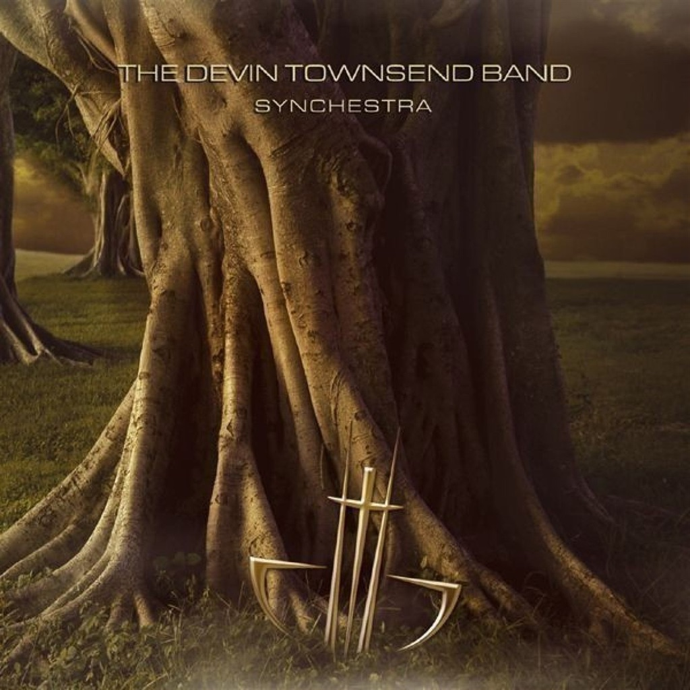

<!-- section break -->

1. Let It Roll
2. Hypergeek
3. Triumph
4. Babysong
5. Vampolka
6. Vampira
7. Mental Tan
8. Gaia
9. Pixillate
10. Judgement
11. A Simple Lullaby
12. Sunset
13. Notes From Africa

<!-- section break -->

## Videos
### The Devin Townsend Band – Vampira
 

### More Videos

- [The Devin Townsend Band - Vampira Inside Out Music](https://www.youtube.com/watch?v=MMLXoobDKWs)
- [The Devin Townsend Band ‎– Let It Roll](https://www.youtube.com/watch?v=FNGSwh80bZ4)

## Release Information
|  Key           | Value                                                |
| ---------------| ---------------------------------------------------- |
| Release Year   | 2010                                   |
| Discogs Link   | [The Devin Townsend Band - Synchestra](https://www.discogs.com/release/2376475-The-Devin-Townsend-Band-Synchestra) |
| Label          | Back On Black |
| Format         | Vinyl 2× LP Album Limited Edition Reissue (Brown, Gatefold, 180-Gram) |
| Catalog Number | BOBV246LP |
| Notes | Drums recorded at the Armoury.  Bass recorded at Hipposonic.  Grand piano and tuba recorded at 'Dave and Mike's Mom's House Studio'.  Deborah's vocals recorded at Tyz studios  Heather's vocals recorded at 'Rusty Trombone Studios'.  Mixed at The Devlab, then Hipposonic A Studios.  Mastered at GreenJacket.  Photos taken at The Bloedel Conservatory, Vancouver.    Manufactured and Distributed by Plastic Head.  Under license from Century Media.  ℗ Century Media 2006. © Back On Black 2010.    "℗&©" doesn't appear on the release itself but is corrected here.    Limited to 1000 Copies.   |