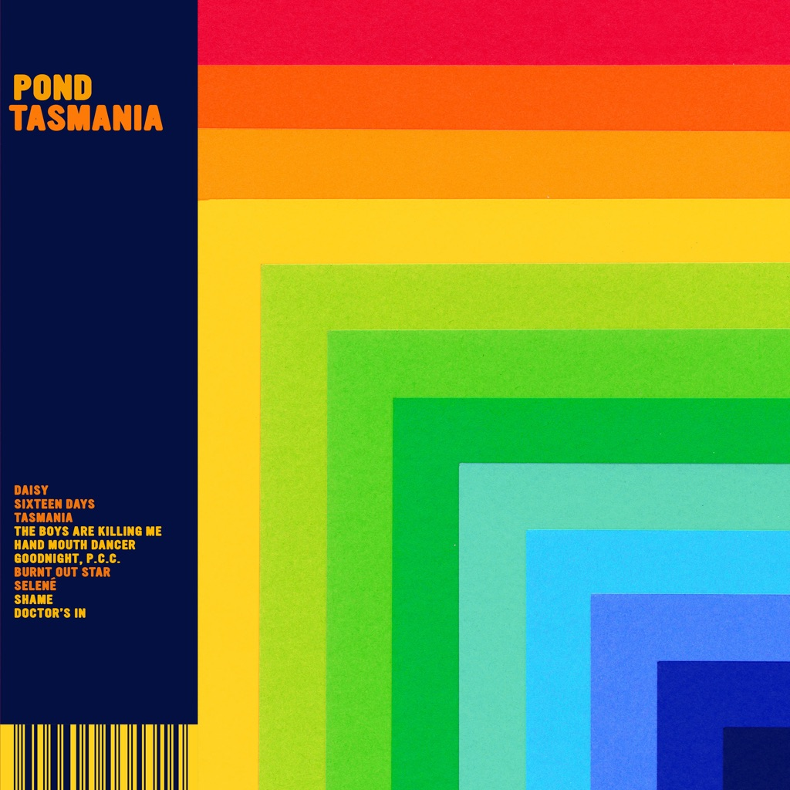

<!-- section break -->

1. Daisy
2. Sixteen Days
3. Tasmania
4. The Boys Are Killing Me
5. Hand Mouth Danger
6. Goodnight, P.C.C.
7. Burnt Out Star
8. Selene
9. Shame
10. Doctor's In

<!-- section break -->

## Videos
### POND - Tasmania (Official Audio)
 

### More Videos

- [Pond - Daisy (Official Video)](https://www.youtube.com/watch?v=Ap2gStsDZZo)

## Release Information
|  Key           | Value                                                |
| ---------------| ---------------------------------------------------- |
| Release Year   | 2019                                   |
| Discogs Link   | [Pond - Tasmania](https://www.discogs.com/release/13285382-Pond-Tasmania) |
| Label          | Marathon Artists |
| Format         | Vinyl 2× LP Album Limited Edition (White) |
| Catalog Number | MA0145LPX |
| Notes | Rough Trade exclusive, limited to 1000 copies on white vinyl. Comes with OBI strip and 'Exclusive White Double Vinyl' hype sticker. |