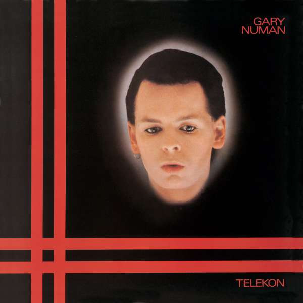

<!-- section break -->

1. This Wreckage
2. The Aircrash Bureau
3. Telekon
4. Remind Me To Smile
5. Sleep By Windows
6. I'm An Agent
7. I Dream Of Wires
8. Remember I Was Vapour
9. Please Push No More
10. The Joy Circuit
11. We Are Glass
12. Trois Gymnopedies (First Movement)
13. I Die: You Die
14. Down In The Park (Piano Version)
15. A Game Called Echo
16. Photograph
17. Remind Me To Smile (USA Mix)
18. I Die: You Die (Alternate Mix)

<!-- section break -->

## Spotify


## Videos
### Sleep by Windows
 

### More Videos

- [Gary Numan - This Wreckage](https://www.youtube.com/watch?v=m9uvIqIUq4U)
- [The Aircrash Bureau](https://www.youtube.com/watch?v=tbHix56qfG8)
- [Telekon](https://www.youtube.com/watch?v=EAFu1wj2f44)
- [Remind Me to Smile](https://www.youtube.com/watch?v=WW_dgV9sYnk)
- [I'm an Agent](https://www.youtube.com/watch?v=RfvdZQLwwtI)
- [I Dream of Wires](https://www.youtube.com/watch?v=cMWiXgFX3VE)
- [Remember I Was Vapour](https://www.youtube.com/watch?v=hYxZYbQ0HOE)
- [Please Push No More](https://www.youtube.com/watch?v=d_nomfDoiGQ)
- [The Joy Circuit](https://www.youtube.com/watch?v=_KQdSQRd-6g)

## Release Information
|  Key           | Value                                                |
| ---------------| ---------------------------------------------------- |
| Release Year   | 2015                                   |
| Discogs Link   | [Gary Numan - Telekon](https://www.discogs.com/release/7788320-Gary-Numan-Telekon) |
| Label          | Beggars Banquet |
| Format         | Vinyl 2× LP Album Reissue (Gatefold) |
| Catalog Number | BBQLP19 |
| Notes | 'We Are Glass' and 'I Die:You Die' were issued as singles but not included on the original vinyl release of the album (they did appear on the original UK cassette release). 'A Game Called Echo' was recorded at Rock City as part of the early album sessions and first relesed in 1985 on a retrospective 12''. 'Down In The Park (Piano Version)' was the B side of 'I Die:You Die'. 'Photograph' (B side of 'This Wreckage' single) and 'Trois Gymnopédies' (B side of 'We Are Glass') were tracks from 'Freerange' demo sessions for 'The Pleasure Principle' album and recorded between 9-12 April 1979. |