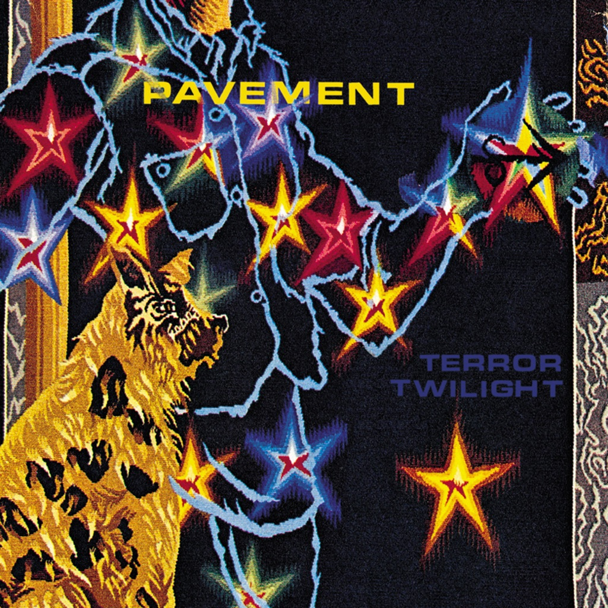

<!-- section break -->

1. Spit On A Stranger (3:04)
2. Folk Jam (3:34)
3. You Are A Light (3:54)
4. Cream Of Gold (3:47)
5. Major Leagues (3:25)
6. Platform Blues (4:42)
7. Ann Don't Cry (4:09)
8. Billie (3:44)
9. Speak, See, Remember (4:20)
10. The Hexx (5:39)
11. ...And Carrot Rope (3:52)

<!-- section break -->

## Spotify


## Videos
### Pavement - Spit On A Stranger (Official Video)
 

### More Videos

- [Pavement - Major Leagues (Official Video)](https://www.youtube.com/watch?v=qWmXoHLF0LE)

## Release Information
|  Key           | Value                                                |
| ---------------| ---------------------------------------------------- |
| Release Year   | 2010                                   |
| Discogs Link   | [Pavement - Terror Twilight](https://www.discogs.com/release/3014122-Pavement-Terror-Twilight) |
| Label          | Domino |
| Format         | Vinyl LP Reissue (180 gram) |
| Catalog Number | WIGLP 66 |
| Notes | Sticker says :180gm heavyweight vinyl comes with mp3s!    Comes with printed inner sleeve and free download code.   |