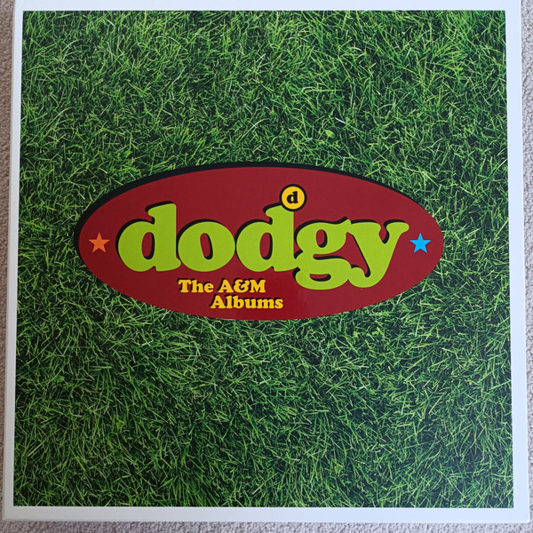

<!-- section break -->

1.  Water Under The Bridge (3:44)
2. I Need Another (3:49)
3. Lovebirds (3:56)
4. Satisfied (6:06)
5. Grand Old English Oak Tree (4:43)
6. Stand By Yourself (3:48)
7. As My Time Goes By (4:42)
8. Never Again (4:10)
9. Cold Tea (4:59)
10. We're Not Going To Take This Anymore (4:03)
11. Staying Out For The Summer
12. Melodies Haunt You
13. So Let Me Go Far
14. Crossroads
15. One Day
16. We Are Together
17. Whole Lot Easier
18. Making The Most Of
19. Waiting For The Day
20. What Have I Done Wrong?
21. Grassman
22. Intro (0:47)
23. In A Room (4:15)
24. Trust In Time (2:41)
25. You've Gotta Look Up (5:29)
26. If You're Thinking Of Me (5:53)
27. Ain't No Longer Asking (6:04)
28. Good Enough (4:01)
29. Grateful Moon
30. Found You (4:54)
31. Prey For Drinking (3:07)
32. Jack The Lad (3:40)
33. Long Life (4:47)
34. One Of Those Rivers (7:43)
35. U.K.R.I.P. (5:08)
36. Homegrown (5:52)
37. Is It Me

<!-- section break -->

## Release Information
|  Key           | Value                                                |
| ---------------| ---------------------------------------------------- |
| Release Year   | 2022                                   |
| Discogs Link   | [Dodgy - The A&M Albums](https://www.discogs.com/release/22286113-Dodgy-The-AM-Albums) |
| Label          | Demon Records |
| Format         | Vinyl LP Album Reissue Stereo, Vinyl LP Album Reissue Stereo, Vinyl 2× LP Album Reissue Stereo, Box Set Compilation Deluxe Edition Limited Edition |
| Catalog Number | DEMRECBOX60 |
