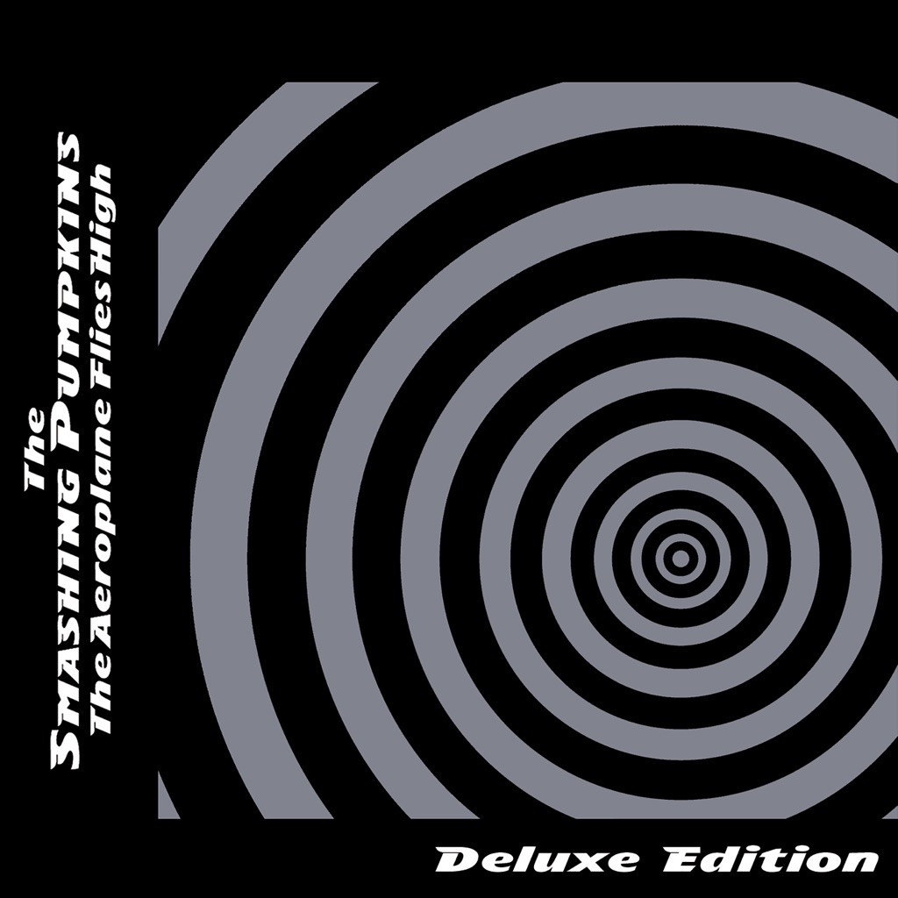

<!-- section break -->

1. Bullet With Butterfly Wings
2. Bullet With Butterfly Wings (4:16)
3. ...Said Sadly (3:09)
4. You're All I've Got Tonight (3:10)
5. Clones (We're All) (2:43)
6. A Night Like This (3:36)
7. Destination Unknown (4:14)
8. Dreaming (5:11)
9. 1979
10. 1979 (4:28)
11. Ugly (2:52)
12. The Boy (3:04)
13. Cherry (4:02)
14. Believe (3:15)
15. Set The Ray To Jerry (4:10)
16. Zero
17. Zero (2:39)
18. God (3:09)
19. Mouths Of Babes (3:46)
20. Tribute To Johnny (2:34)
21. Marquis In Spades (3:17)
22. Pennies (2:28)
23. Pastichio Medley (Early Fade Version) (17:10)
24. Tonight, Tonight
25. Tonight, Tonight (4:15)
26. Meladori Magpie (2:41)
27. Rotten Apples (3:02)
28. Jupiter's Lament (2:30)
29. Medellia Of The Gray Skies (3:11)
30. Blank (2:54)
31. Tonite Reprise (2:40)
32. Thirty-Three
33. Thirty-Three (4:10)
34. The Last Song (3:55)
35. The Aeroplane Flies High (Turns Left, Looks Right) (8:31)
36. Transformer (3:25)
37. The Bells (2:17)
38. My Blue Heaven (3:20)

<!-- section break -->

## Release Information
|  Key           | Value                                                |
| ---------------| ---------------------------------------------------- |
| Release Year   | 2013                                   |
| Discogs Link   | [The Smashing Pumpkins - The Aeroplane Flies High](https://www.discogs.com/release/4760393-The-Smashing-Pumpkins-The-Aeroplane-Flies-High) |
| Label          | Virgin |
| Format         | Box Set Compilation, Vinyl 5× 12" Maxi-Single Reissue Remastered |
| Catalog Number | B0018550-01 |
| Notes | "the end of what we had to offer, everything that followed the pieces of one without the other." - billy corgan  A1, I1 - Recorded at Pumpkinland and Chicago Recording Company. A2 - Mixed at The Chicago Recording Company. A3, A4, B2, B3 - Recorded at Soundworks Studios, Chicago.  Additional Recording on B3 at Farmer Brown's Studio. B1 - Recorded at Bugg Studios, Chicago. C1, I1 - Mixed at The Village Recorder. C2 to D3, - Mixed at Soundworks Recording Studios. C1 to D3 - Recorded at Pumpkinland, Chicago Recording Company and Soundworks Recording Studios. G1, H4 - Recorded at CRC. G2 to H1, H3 - Recorded at Sadland. H2 - Recorded at Soundworks. I2 to J1 - Recorded at Charing Cross Studios, Sydney, and Soundworks Recording Studios, Chicago. J2 - Recorded at Bugg Studios, Chicago and The Place, NYC. J3 - Recorded at Soundworks Recording Studios, Chicago. I2 to J3 - Mixed at Chung King, NYC.  "The Pastichio Medley is from a variety of sources recorded during completion of Mellon Collie And The Infinite Sadness.  The LP version has been faded out earlier than the original version in order to fit the vinyl format." |