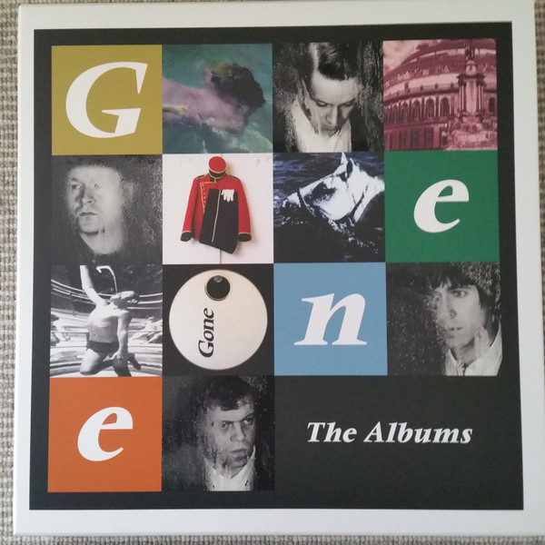

<!-- section break -->

1. Olympian
2. Haunted By You
3. Your Love, It Lies
4. Truth, Rest Your Head
5. A Car That Sped
6. Left-Handed
7. London, Can You Wait?
8. To The City
9. Still Can't Find The Phone
10. Sleep Well Tonight
11. Olympian
12. We'll Find Our Own Way
13. To See The Lights
14. Be My Light, Be My Guide
15. Sick, Sober & Sorry
16. Her Fifteen Years
17. Haunted By You (Live - Helter Shelter 6/7/95)
18. I Can't Decide If She Really Loves Me
19. To See The Lights
20. I Can't Help Myself
21. A Car That Sped (Radio 1 Session 1/2/95)
22. For The Dead (Version)
23. Sleep Well Tonight (Live - Forum 31/3/95)
24. How Much For Love
25. London, Can You Wait? (Radio 1 Session 18/5/94)
26. I Can't Help Myself (Radio 1 Session 18/5/94)
27. Child's Body
28. Don't Let Me Down (Radio 1 Session 1/2/95)
29. I Say A Little Prayer (Live - Glastonbury 25/6/95)
30. Do You Want To Hear It From Me
31. This Is Not My Crime
32. Olympian (Live - Forum 31/3/95)
33. Child's Body (Live - Forum 31/3/95)
34. Untitled
35. Drawn To The Deep End
36. New Amusements
37. Fighting Fit
38. Where Are They Now?
39. Speak To Me Someone
40. We Could Be Kings
41. Why I Was Born
42. Long Sleeves For The Summer
43. Save Me, I'm Yours
44. Voice Of The Father
45. The Accidental
46. I Love You, What Are You?
47. Sub Rosa
48. Revelations
49. As Good As It Gets
50. In Love With Love
51. Love Won't Work
52. The British Disease
53. Fill Her Up
54. Something In The Water
55. Mayday
56. Angel
57. The Looker
58. Little Child
59. Stop
60. The Police Will Never Find You
61. You'll Never Walk Again
62. Libertine
63. Does He Have A Name?
64. A Simple Request
65. Is It Over?
66. O Lover
67. Let Me Rest
68. We'll Get What We Deserve
69. Walking In The Shallows
70. Yours For The Taking
71. You
72. Spy In The Clubs
73. Somewhere In The World

<!-- section break -->

## Release Information
|  Key           | Value                                                |
| ---------------| ---------------------------------------------------- |
| Release Year   | 2020                                   |
| Discogs Link   | [Gene - The Albums](https://www.discogs.com/release/15800345-Gene-The-Albums) |
| Label          | Demon Records |
| Format         | Box Set Compilation Limited Edition Special Edition, Vinyl LP Album Reissue (White, 180g), Vinyl 2× LP Compilation Reissue (Gold. 180g), Vinyl 2× LP Album Reissue (Maroon, Gatefold, 180g), Vinyl LP Album Reissue (Green, 180g), Vinyl 2× LP Album Reissue (Pink, 180g) |
| Catalog Number | DEMRECBOX49X |
| Notes | Limited to 1,000 units  Includes an exclusive 12 x 12 print signed by the band  Includes a booklet with written notes by each member and a piece by journalist Keith Cameron  Track F6, "Untitled," is the song For The Dead (Demo Version), the same song that is listed by name in the 2014 Deluxe Edition CD reissue [r5433760].  |