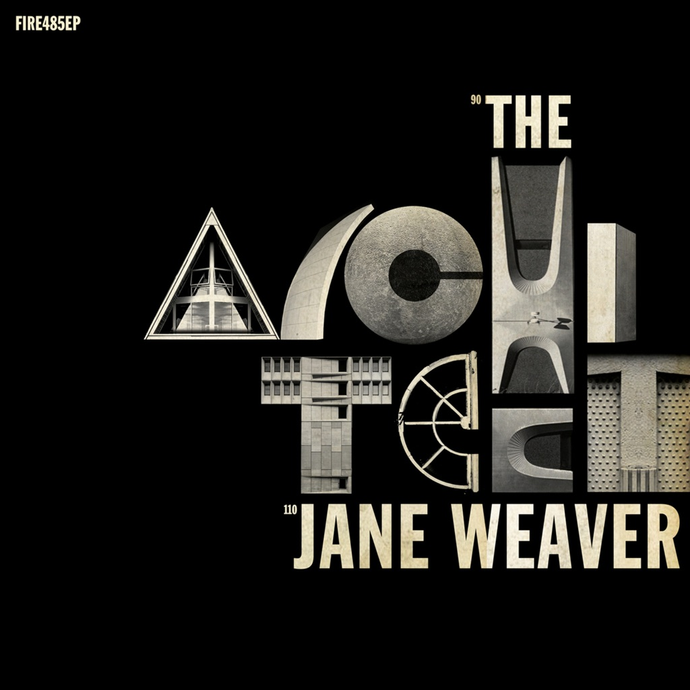

<!-- section break -->

1. The Architect
2. The Architect - Andy Votel's Brutaliszt 250KG Readymix
3. Code
4. Element

<!-- section break -->

## Spotify


## Videos
### Jane Weaver - The Architect
 

## Release Information
|  Key           | Value                                                |
| ---------------| ---------------------------------------------------- |
| Release Year   | 2017                                   |
| Discogs Link   | [Jane Weaver - The Architect](https://www.discogs.com/release/11045283-Jane-Weaver-The-Architect) |
| Label          | Fire Records |
| Format         | Vinyl 12" 45 RPM EP |
| Catalog Number | FIRE485EP |
| Notes | Includes a postcard with a download code. |