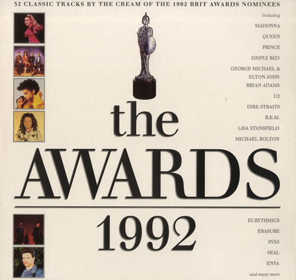

<!-- section break -->

1. Innuendo (6:29)
2. Calling Elvis (6:23)
3. Mysterious Ways (4:01)
4. Cream (4:10)
5. Rescue Me (4:51)
6. Stars (4:06)
7. Can't Stop This Thing We Started (4:25)
8. Don't Let The Sun Go Down On Me (5:46)
9. When A Man Loves A Woman (3:48)
10. All Woman (4:46)
11. Promise Me (3:33)
12. Hole Hearted (3:36)
13. Shiny Happy People (3:43)
14. Love Is A Stranger (3:39)
15. Sit Down (4:01)
16. Mystify (Live) (3:14)
17. Love To Hate You (3:55)
18. Killer (4:17)
19. Justified And Ancient (Stand By The JAMS) (3:37)
20. Unbelievable (3:29)
21. Just Another Dream (3:55)
22. Set Adrift On Memory Bliss (3:54)
23. Thinking About Your Love (3:54)
24. All 4 Love (3:29)
25. Sunshine On A Rainy Day (Original 7" Mix) (4:11)
26. Unfinished Sympathy (4:33)
27. The King Is Half Undressed (3:47)
28. Mustang Sally (3:59)
29. Blue Hotel (3:11)
30. It Had To Be You (2:38)
31. Caribbean Blue
32. Inspector Morse (Main Theme)

<!-- section break -->

## Release Information
|  Key           | Value                                                |
| ---------------| ---------------------------------------------------- |
| Release Year   | 1992                                   |
| Discogs Link   | [Various - The Awards 1992](https://www.discogs.com/release/2697679-Various-The-Awards-1992) |
| Label          | Polygram TV |
| Format         | Vinyl 2× LP Compilation |
| Catalog Number | 515 207-1 |
| Notes | The Brits 1992 sponsored by Britannia Music Club. 32 classic tracks by the cream of the 1992 Brit Award nominees. Gatefold cover with pictures and synopsis of each track/artist. |