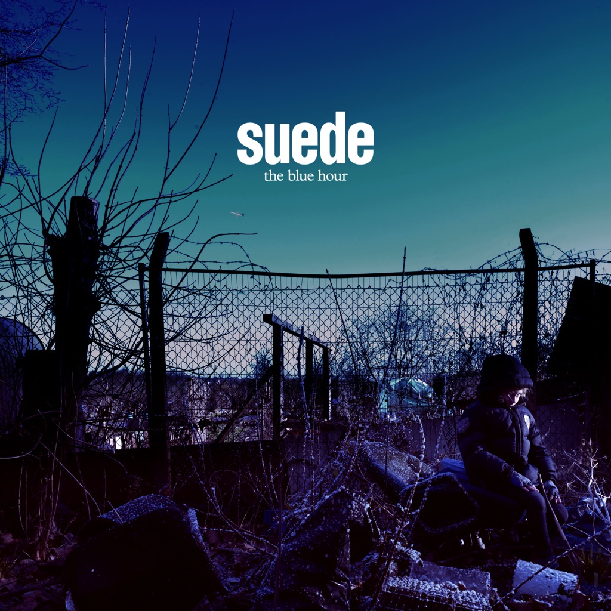

<!-- section break -->

1. As One
2. Wastelands
3. Mistress
4. Beyond The Outskirts
5. Chalk Circles
6. Cold Hands
7. Life Is Golden
8. Roadkill
9. Tides
10. Don't Be Afraid If Nobody Loves You
11. Dead Bird
12. All The Wild Places
13. The Invisibles
14. Flytipping

<!-- section break -->

## Spotify


## Videos
### SUEDE - THE INVISIBLES
 

### More Videos

- [Suede - Wastelands (Official Video)](https://www.youtube.com/watch?v=qks__ZNvhiw)

## Release Information
|  Key           | Value                                                |
| ---------------| ---------------------------------------------------- |
| Release Year   | 2018                                   |
| Discogs Link   | [Suede - The Blue Hour](https://www.discogs.com/release/12541434-Suede-The-Blue-Hour) |
| Label          | Warner Music UK |
| Format         | Vinyl 2× LP Album Limited Edition (Blue) |
| Catalog Number | WEA 503 |
| Notes | Gatefold sleeve with printed inner sleeves. The inner side of the gatefold sleeve contains lyrics and credits for tracks A1 to B1. The other lyrics and track credits are on the inner sleeves. The general credits (production, recording, companies etc.) are on the back side of the gatefold sleeve.  No credits on this release for track D1 ("Dead Bird"), which is a short recording of Brett Anderson and his little son talking to each other in the garden combined with an orchestral score. The credits above are taken from the box set [r12544860].  The City Of Prague Philharmonic Orchestra was recorded at Smecky Studios, Prague. All credits regarding the recording of The City Of Prague Philharmonic Orchestra on tracks A1 to A3, B4, C1, D1 to D3 are taken from the box set [r12544860]. |