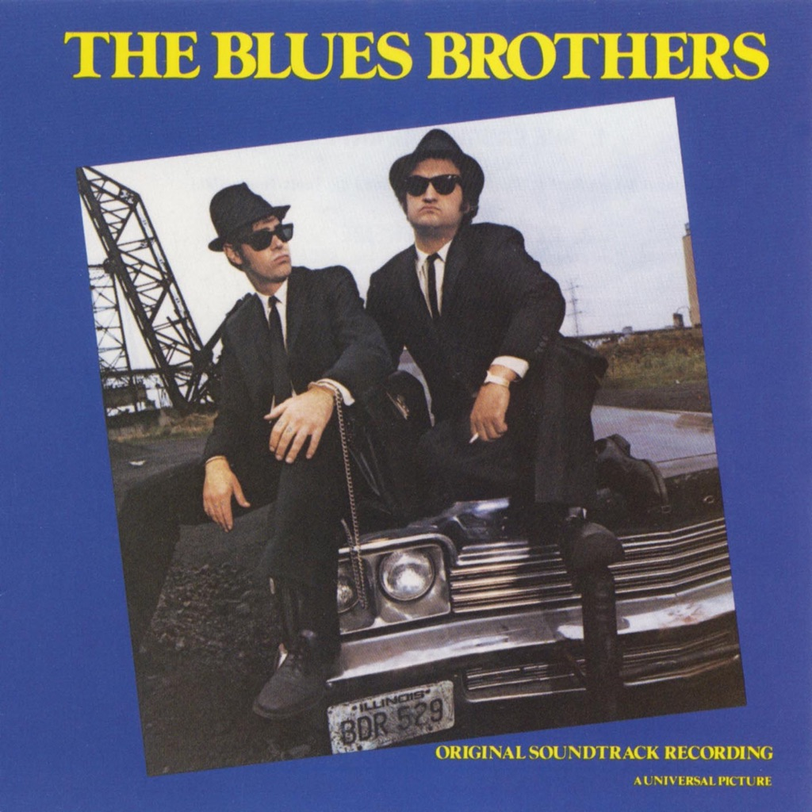

<!-- section break -->

1. She Caught The Katy (4:10)
2. Peter Gunn Theme (3:46)
3. Gimme Some Lovin' (3:06)
4. Shake Your Tailfeather (2:48)
5. Everybody Needs Somebody To Love (3:21)
6. The Old Landmark (2:56)
7. Think (3:13)
8. Theme From Rawhide (2:37)
9. Minnie The Moocher (3:23)
10. Sweet Home Chicago (7:48)
11. Jailhouse Rock (3:19)

<!-- section break -->

## Videos
### The Blues Brothers - Theme From Rawhide (1980) from The Blues Brothers Music On Vinyl – MOVLP1072
 

### More Videos

- [The Blues Brothers - She Caught the Katy (Official Audio)](https://www.youtube.com/watch?v=o5xexv-dMrM)
- [The Blues Brothers - Peter Gunn Theme (Official Audio)](https://www.youtube.com/watch?v=9DgFOsEs-kE)
- [The Blues Brothers - Gimme Some Lovin' (Official Audio)](https://www.youtube.com/watch?v=-aqZmPInK3o)
- [The Blues Brothers & Ray Charles - Shake A Tail Feather (Official Audio)](https://www.youtube.com/watch?v=mm0mmkAYwPc)
- [The Blues Brothers - Everybody Needs Somebody to Love (Official Audio)](https://www.youtube.com/watch?v=wDvIGZ-_au4)
- [The Blues Brothers - The Old Landmark (feat. James Brown) (Official Audio)](https://www.youtube.com/watch?v=CmO7LQMVlaI)
- [The Blues Brothers & Aretha Franklin - Think (Official Audio)](https://www.youtube.com/watch?v=tc36-Li5eww)
- [The Blues Brothers - Theme from Rawhide (Official Audio)](https://www.youtube.com/watch?v=rtP7yH7l87w)
- [The Blues Brothers - Minnie the Moocher (Official Audio)](https://www.youtube.com/watch?v=NJqh_KX5x3o)
- [The Blues Brothers - Sweet Home Chicago (Official Audio)](https://www.youtube.com/watch?v=euJ22UqLD5Y)
- [The Blues Brothers - Jailhouse Rock (Official Audio)](https://www.youtube.com/watch?v=TosN2G1mmTs)

## Release Information
|  Key           | Value                                                |
| ---------------| ---------------------------------------------------- |
| Release Year   | 1980                                   |
| Discogs Link   | [The Blues Brothers - The Blues Brothers (Original Soundtrack Recording)](https://www.discogs.com/release/4625231-The-Blues-Brothers-The-Blues-Brothers-Original-Soundtrack-Recording) |
| Label          | Atlantic |
| Format         | Vinyl LP Album |
| Catalog Number | K 50715 |
| Notes | A Phantom/Black Rhino Production.  Original recording: Universal Recording, Chicago. Additional recording: Record Plant, Los Angeles Record Plant, New York City Soundmixers, New York City  Mixed at Record Plant, NYC Mastered at The Master Cutting Room.  ℗©1980 Atlantic Recording Corporation. Printed and made in England   |