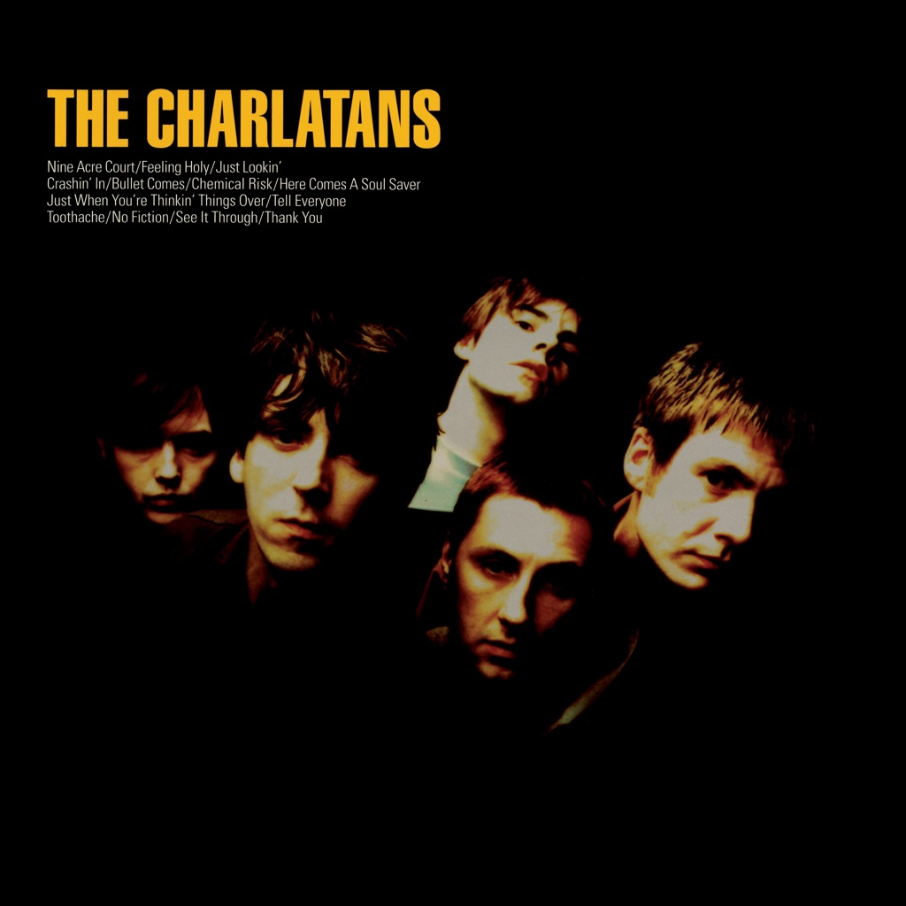

<!-- section break -->

1. Nine Acre Court (3:45)
2. Feeling Holy (5:16)
3. Just Lookin' (3:49)
4. Crashin' In (5:00)
5. Bullet Comes (5:23)
6. Chemical Risk (Toothache Remix) (3:39)
7. Here Comes A Soul Saver (3:23)
8. Just When You're Thinkin' Things Over (4:51)
9. Tell Everyone (3:32)
10. Toothache (5:15)
11. No Fiction (3:39)
12. See It Through (4:07)
13. Thank You (3:35)

<!-- section break -->

## Spotify


## Videos
### THE CHARLATANS - Bullet comes
 

### More Videos

- [The Charlatans - Just When You're Thinkin' Things Over](https://www.youtube.com/watch?v=blqPQP7RPXw)
- [The Charlatans - Crashin In](https://www.youtube.com/watch?v=NlrG6wPgOLo)
- [the charlatans-just lookin](https://www.youtube.com/watch?v=vsjdaOxX8bU)
- [The Charlatans-Crashin' In on The White Room.](https://www.youtube.com/watch?v=CZnxlnjWBNI)
- [The Charlatans - Feeling Holy](https://www.youtube.com/watch?v=-mSwij3eShM)
- [The Charlatans - Nine Acre Court](https://www.youtube.com/watch?v=uT5DUezAaRw)

## Release Information
|  Key           | Value                                                |
| ---------------| ---------------------------------------------------- |
| Release Year   | 2021                                   |
| Discogs Link   | [The Charlatans - The Charlatans](https://www.discogs.com/release/20376190-The-Charlatans-The-Charlatans) |
| Label          | Beggars Arkive |
| Format         | Vinyl 2× LP Album Reissue Remastered Stereo (Yellow Marbled) |
| Catalog Number | BBL 174 LP2 |
| Notes | Gatefold sleeve.    nb: Secondary barcode sticker not on most copies.  For mispressing featuring Gary Numan see "[r=20732044]". |