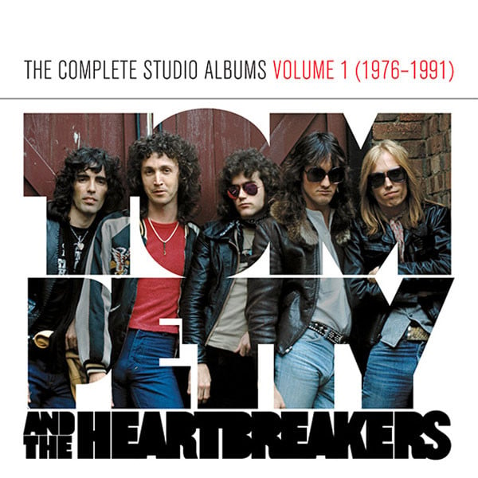

<!-- section break -->

1. Tom Petty And The Heartbreakers
2. Rockin' Around (With You)  (2:26)
3. Breakdown (2:42)
4. Hometown Blues (2:14)
5. The Wild One, Forever (3:01)
6. Anything That's Rock 'N' Roll (2:23)
7. Strangered In The Night (3:32)
8. Fooled Again (I Don't Like It) (3:54)
9. Mystery Man (3:04)
10. Luna (3:59)
11. American Girl (3:33)
12. You're Gonna Get It!
13. When The Time Comes (2:48)
14. You're Gonna Get It (2:57)
15. Hurt (3:17)
16. Magnolia (2:59)
17. Too Much Ain't Enough (2:46)
18. I Need To Know (2:23)
19. Listen To Her Heart (3:01)
20. No Second Thoughts (2:38)
21. Restless (3:22)
22. Baby's A Rock 'N' Roller (2:54)
23. Damn The Torpedoes
24. Refugee (3:21)
25. Here Comes My Girl (4:33)
26. Even The Losers (3:35)
27. Shadow Of A Doubt (A Complex Kid) (4:53)
28. Century City (3:40)
29. Don't Do Me Like That (2:40)
30. You Tell Me (4:32)
31. What Are You Doin' In My Life (3:25)
32. Louisiana Rain (4:46)
33. Hard Promises
34. The Waiting (3:54)
35. A Woman In Love (It's Not Me) (4:21)
36. Nightwatchman (3:58)
37. Something Big (4:45)
38. Kings Road (3:21)
39. Letting You Go (3:22)
40. A Thing About You (3:32)
41. Insider (4:21)
42. The Criminal Kind (3:55)
43. You Can Still Change Your Mind (4:01)
44. Long After Dark
45. A One Story Town (3:05)
46. You Got Lucky (3:37)
47. Deliver Me (3:27)
48. Change Of Heart (3:19)
49. Finding Out (3:35)
50. We Stand A Chance (3:37)
51. Straight Into Darkness (3:48)
52. The Same Old You (3:29)
53. Between Two Worlds (5:10)
54. A Wasted Life (4:37)
55. Southern Accents
56. Rebels (5:29)
57. It Ain't Nothin' To Me (5:10)
58. Don't Come Around Here No More (5:06)
59. Southern Accents (3:11)
60. Make It Better (Forget About Me) (4:17)
61. Spike (3:32)
62. Dogs On The Run (3:39)
63. Mary's New Car (3:45)
64. The Best Of Everything (3:59)
65. "Let Me Up (I've Had Enough)"
66. Jammin' Me (4:09)
67. Runaway Trains (5:13)
68. The Damage You've Done (3:53)
69. It'll All Work Out (3:11)
70. My Life / Your World (4:40)
71. Think About Me (3:45)
72. All Mixed Up (3:42)
73. A Self-Made Man (3:02)
74. Ain't Love Strange (2:40)
75. How Many More Days (3:18)
76. Let Me Up (I've Had Enough)	 (3:31)
77. Full Moon Fever
78. Free Fallin'  (4:14)
79. I Won't Back Down (2:56)
80. Love Is A Long Road (4:06)
81. A Face In The Crowd (3:58)
82. Runnin' Down A Dream (4:23)
83. Feel A Whole Lot Better (2:47)
84. Yer So Bad (3:05)
85. Depending On You  (2:47)
86. The Apartment Song (2:31)
87. Alright For Now (2:00)
88. A Mind With A Heart Of Its Own (3:29)
89. Zombie Zoo (2:58)
90. Into The Great Wide Open
91. Learning To Fly (4:01)
92. King's Highway (3:05)
93. Into The Great Wide Open (3:42)
94. Two Gunslingers (3:08)
95. The Dark Of The Sun (3:23)
96. All Or Nothin' (4:05)
97. All The Wrong Reasons (3:44)
98. Too Good To Be True (3:58)
99. Out In The Cold (3:41)
100. You And I Will Meet Again (3:45)
101. Makin' Some Noise (3:25)
102. Built To Last (3:59)

<!-- section break -->

## Release Information
|  Key           | Value                                                |
| ---------------| ---------------------------------------------------- |
| Release Year   | 2016                                   |
| Discogs Link   | [Tom Petty And The Heartbreakers - The Complete Studio Albums Volume 1 (1976-1991)](https://www.discogs.com/release/9521857-Tom-Petty-And-The-Heartbreakers-The-Complete-Studio-Albums-Volume-1-1976-1991) |
| Label          | UMe |
| Format         | Box Set Compilation Limited Edition, Vinyl LP Album Reissue Remastered, Vinyl LP Album Reissue Remastered, Vinyl LP Album Reissue Remastered, Vinyl LP Album Reissue Remastered, Vinyl LP Album Reissue Remastered, Vinyl LP Album Reissue Remastered, Vinyl LP Album Reissue Remastered, Vinyl LP Album Reissue Remastered, Vinyl LP Album Reissue Remastered |
| Catalog Number | 00602547952158 |
| Notes | Made in the EU.  All discs has the same dead wax information as the US release. First two LPs "Manufatured in Germany" on label.  First of two box sets released December 9, 2016, comprising Tom Petty and The Heartbreakers' studio album releases.  [b]The Studio Album Vinyl Collection (1976-1991)[/b] features the first 9 Tom Petty albums each pressed on 180g vinyl. All housed in a deluxe LP box with flip top lid.  • Cut by Chris Bellman at Bernie Grundman Mastering. • Cut from Original Analog Master Tapes.  Includes: Tom Petty And The Heartbreakers* (1976) You're Gonna Get It!* (1978) Damn The Torpedoes* (1979) Hard Promises (1981) Long After Dark (1982) Southern Accents (1985) Let Me Up (I've Had Enough) (1987) Full Moon Fever (1989) Into the Great Wide Open (1991) * remastered since 2010 - others remastered for this box set.  Albums with original cover art including inners and leaflets.  Volume 2 is here: [r=9481317]  |