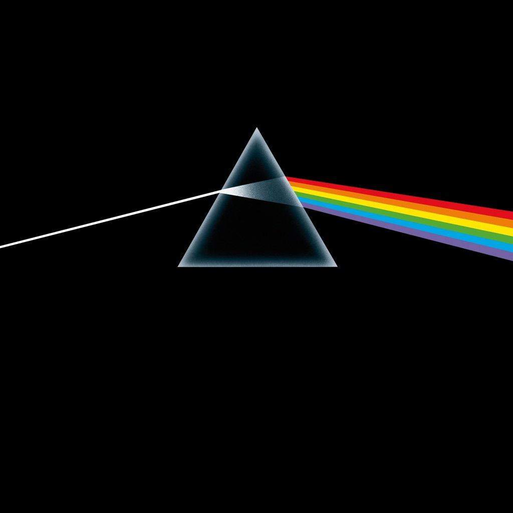

<!-- section break -->

1. Speak To Me
2. Breathe (In The Air)
3. On The Run
4. Time
5. The Great Gig In The Sky
6. Money
7. Us And Them
8. Any Colour You Like
9. Brain Damage
10. Eclipse

<!-- section break -->

## Spotify


## Release Information
|  Key           | Value                                                |
| ---------------| ---------------------------------------------------- |
| Release Year   | 2016                                   |
| Discogs Link   | [Pink Floyd - The Dark Side Of The Moon](https://www.discogs.com/release/9287809-Pink-Floyd-The-Dark-Side-Of-The-Moon) |
| Label          | Pink Floyd Records |
| Format         | Vinyl LP Album Reissue Remastered Stereo (180g, Gatefold) |
| Catalog Number | PFRLP8 |
| Notes | Comes with a rectangular sticker and a round hype sticker on the front of the shrink wrap. Release contains two posters and two postcard-sized stickers like the original release. Some copies have been sold with a wrong rectangular sticker from [r=8961614] instead of the regular one (see picture).  [Rectangular sticker]: The stereo remastered album on heavyweight 180g vinyl Remastered from the original analogue tapes by JAMES GUTHRIE, JOEL PLANTE and BERNIE GRUNDMAN Original UK release date: March 1973.  [Round hype sticker]: Pink Floyd The Dark Side Of The Moon 5099902987613  [Publishers]: Tracks 1, 5 and 8 published by Pink Floyd Music Publishers Ltd. administered by Imagem UK Ltd. for the world excluding USA & Canada. USA & Canada: TRO-Hampshire House Publishing Corp. Tracks 2, 3, 4 and 7 published by Pink Floyd Music Publishers Ltd. administered by Imagem UK Ltd./ Roger Waters Music Overseas Ltd., Artemis Muziekuitguverij B.V. (BUM/STE) administered by Warner Chappell Music Publishing Ltd. for the World except USA & Canada. USA & Canada: TRO-Hampshire House Publishing Corp. Tracks 6, 9 and 10 published by Roger Waters Music Overseas Ltd.,  Artemis Muziekuitguverij B.V. (BUM/STE) administered by Warner Chappell Music Publishing Ltd. for  the World except USA & Canada. USA & Canada: TRO-Hampshire House Publishing Corp.  Recorded at Abbey Road Studios, London between June 1972 and January 1973.  ℗ 2016 Pink Floyd Music Ltd., marketed and distributed by Parlophone Records Ltd., a Warner Music Group Company. © 2016 Pink Floyd Music Ltd.  The copyright in this sound recording and artwork is owned by Pink Floyd Music Ltd. Made in the E.U. www.pinkfloyd.com  Made and Printed in the E.U.  [Runouts]: In all cases, '16690 [#]A' and '16690 [#]B' are stamped, with the remainder being etched.  |