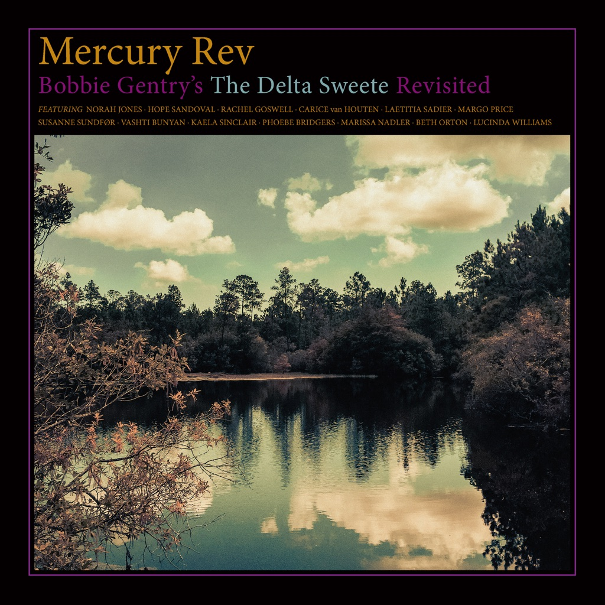

<!-- section break -->

1. The Delta Sweete: Remixed
2. Okolona River Bottom Band
3. Big Boss Man
4. Reunion
5. Parchman Farm
6. Mornin' Glory
7. Sermon
8. Tobacco Road
9. Penduli Pendulum
10. Jessye' Lisabeth
11. Refractions
12. Louisiana Man
13. Courtyard
14. The Delta Sweete: Bonus Tracks
15. Okolona River Bottom Band (Special Instrumental)
16. Mississippi Delta (Alternate Version)
17. Seventh Son (Band Version)
18. The Way I Do (Demo)
19. Feelin' Good (Demo)
20. Mornin' Glory (Demo)
21. Sermon (Demo)
22. Jessye' Lisabeth (Demo)
23. Refractions (Demo)
24. Louisiana Man (Demo)

<!-- section break -->

## Spotify


## Videos
### Mornin' Glory (Remastered 2020)
 

### More Videos

- [Okolona River Bottom Band (Remastered 2020)](https://www.youtube.com/watch?v=pgt3aOY5Mqo)
- [Big Boss Man (Remastered 2020)](https://www.youtube.com/watch?v=lJIOZOa_enQ)
- [Reunion (Remastered 2020)](https://www.youtube.com/watch?v=xBl4YQMoBKk)
- [Parchman Farm (Remastered 2020)](https://www.youtube.com/watch?v=KuPDYHIkJzA)
- [Sermon (Remastered 2020)](https://www.youtube.com/watch?v=TcouR0lwaSo)
- [Tobacco Road (Remastered 2020)](https://www.youtube.com/watch?v=_ytkmI7xKeo)
- [Penduli Pendulum (Remastered 2020)](https://www.youtube.com/watch?v=SSfbqweC3i4)
- [Jessye' Lisabeth (Remastered 2020)](https://www.youtube.com/watch?v=a9IoXpuOLAI)
- [Refractions (Remastered 2020)](https://www.youtube.com/watch?v=hl9Q1-Lobes)
- [Louisiana Man (Remastered 2020)](https://www.youtube.com/watch?v=0UsFJnARGVU)
- [Courtyard (Remastered 2020)](https://www.youtube.com/watch?v=F3XH5Gj9TGI)
- [Okolona River Bottom Band (Instrumental)](https://www.youtube.com/watch?v=JSzahtQw2FQ)
- [Mississippi Delta (Alternate Take)](https://www.youtube.com/watch?v=e8l4qxSyHTU)
- [Seventh Son (Band Version)](https://www.youtube.com/watch?v=-SZbH71SztA)
- [The Way I Do (Demo)](https://www.youtube.com/watch?v=O10AQqtlhpQ)
- [Feelin' Good (Demo)](https://www.youtube.com/watch?v=GpJdb2-3hP4)
- [Mornin' Glory (Demo)](https://www.youtube.com/watch?v=86rcSI5bd9Y)
- [Sermon (Demo)](https://www.youtube.com/watch?v=XpVexJ7dc6M)
- [Jessye' Lisabeth (Demo)](https://www.youtube.com/watch?v=N7ZBS_6ikiY)
- [Refractions (Demo)](https://www.youtube.com/watch?v=RpVThV7h0X0)
- [Louisiana Man (Demo)](https://www.youtube.com/watch?v=-JWiyebdKi4)
- [Mornin' Glory](https://www.youtube.com/watch?v=_CFkyuPoH44)

## Release Information
|  Key           | Value                                                |
| ---------------| ---------------------------------------------------- |
| Release Year   | 2020                                   |
| Discogs Link   | [Bobbie Gentry - The Delta Sweete](https://www.discogs.com/release/15623295-Bobbie-Gentry-The-Delta-Sweete) |
| Label          | Capitol Records |
| Format         | Vinyl LP Album Reissue, Vinyl LP, All Media Stereo (180 Gram) |
| Catalog Number | 00600753904770 |
| Notes | Writing credits as given on inner sleeve  Gatefold sleeve with flipback design, includes two printed inner sleeves.  Sides A & B are a new stereo remix of the original album, exclusive to this release. Side C & D are bonus tracks, all either previously unreleased or appearing for the first time on vinyl.  Includes Download Code  Items ordered from Recordstore.co.uk came with an exclusive limited edition hand numbered /500,  12" lithograph print. |