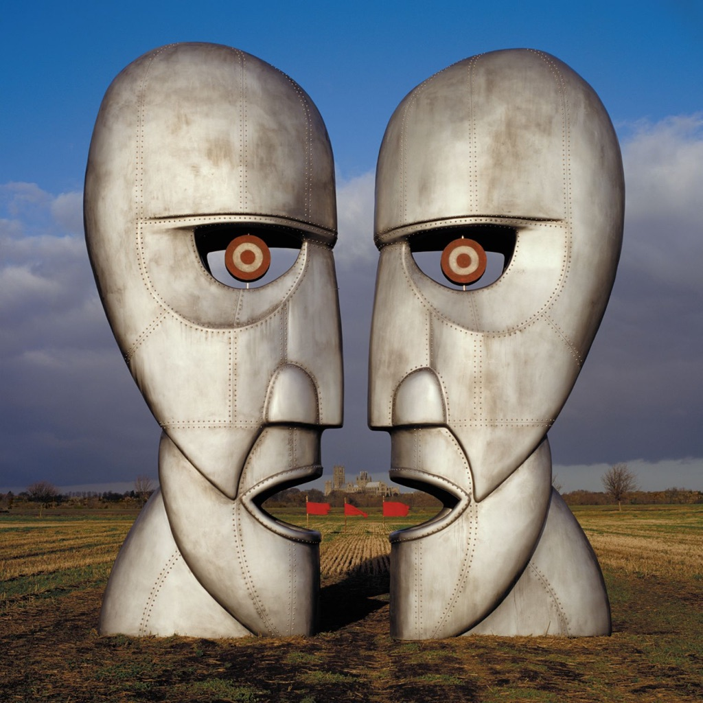

<!-- section break -->

1. Cluster One (5:58)
2. What Do You Want From Me (4:21)
3. Poles Apart (7:04)
4. Marooned (5:29)
5. A Great Day For Freedom (4:17)
6. Wearing The Inside Out (6:49)
7. Take It Back (6:12)
8. Coming Back To Life (6:19)
9. Keep Talking (6:11)
10. Lost For Words (5:14)
11. High Hopes (8:31)

<!-- section break -->

## Spotify


## Release Information
|  Key           | Value                                                |
| ---------------| ---------------------------------------------------- |
| Release Year   | 2019                                   |
| Discogs Link   | [Pink Floyd - The Division Bell](https://www.discogs.com/release/13718487-Pink-Floyd-The-Division-Bell) |
| Label          | Parlophone |
| Format         | Vinyl 2× LP Album Limited Edition Reissue Remastered Repress (Blue) |
| Catalog Number | 0190295477394 |
| Notes | 25th Anniversary Blue Heavyweight Vinyl  Gatefold Sleeve Plus Full Colour Lyric Inner Sleeves Mastered From The Original Analogue Tapes With a Special Appearance by Stephen Hawking in "Keep Talkin"   Ⓟ 2019 Pink Floyd (1987) Ltd, marketed and distributed by Parlophone Records Ltd., a Warner Music Group Company. Ⓒ 2019 Pink Floyd (1987) Ltd, The copyright in this sound recording and artwork is owned by Pink Floyd (1987) Ltd. This label copy is the subject of copyright protection. All rights reserved. Made in the E.U.  [Runouts] All runout data is etched except for The Mastering Lab mark "TML-M" which is stamped  |