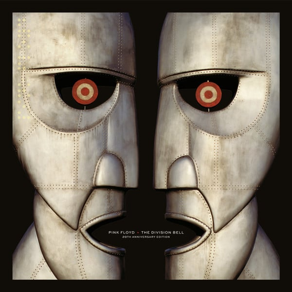

<!-- section break -->

1. Cluster One
2. What Do You Want From Me
3. Poles Apart
4. Marroned
5. A Great Day For Freedom
6. Wearing The Inside Out
7. Take It Back
8. Coming Back To Life
9. Keep Talking
10. Lost For Words
11. High Hopes
12. Take It Back (Edit)
13. Astronomy Domine (Live)
14. High Hopes (Edit)
15. Keep Talking (Edit)
16. The Fate Of The Bell (High Hopes - Radio Edit)
17. Keep Talking (Radio Edit)
18. One Of These Days (Live)
19. CD  Tsui (The Division Bell)
20. Blu-ray Disc (All PCM Stereo and Unreleased 5.1 Mix Audio And Video) 

<!-- section break -->

## Release Information
|  Key           | Value                                                |
| ---------------| ---------------------------------------------------- |
| Release Year   | 2014                                   |
| Discogs Link   | [Pink Floyd - The Division Bell 20th. Anniversary De Luxe Box](https://www.discogs.com/release/6229448-Pink-Floyd-The-Division-Bell-20th-Anniversary-De-Luxe-Box) |
| Label          | Warner Music |
| Format         | Box Set Limited Edition, Vinyl 2× LP Album Remastered (Gatefold Sleeve), Blu-ray Album Remastered Stereo Multichannel, Vinyl 7" 45 RPM Single (Red Color), Vinyl 7" 45 RPM Single (Transparent), Vinyl 12" Single (Blue Color), CD Album Reissue Remastered |
| Catalog Number | WPZR-30576/83 |
| Notes | Set Box Include:   - 2   LP Editions Of The Album  - 2     7" Vinyl Replica  - 1   12" Vinyl Replica  - 1   CD The 2011 ‘Discovery’ remaster of "The Division Bell"  - 1   Blu-ray  The Division Bell Album in HD Audio and Audio-Visual Material  - 1   Download Card  -  Additional  Art Prints and Booklet    The Set box is Japan Import (Made in EU)    On gatefold 2-vinyl release all full length tracks first time on vinyl because on originally vinyl-edition release all tracks was edited to fit on a single LP.  - Tracks 1-11 are CD track-numbers and same on Blu-ray stereo / multichannel versions.  - Vinyl 1 A side : A1, A2, A3 as tracks 1 to 3  - Vinyl 1 B side : B1, B2, B3 as tracks 4 to 6  - Vinyl 2 A side : A1, A2, A3 as tracks 7 to 9  - Vinyl 2 B side : B1, B2 as tracks 10 and 11 |