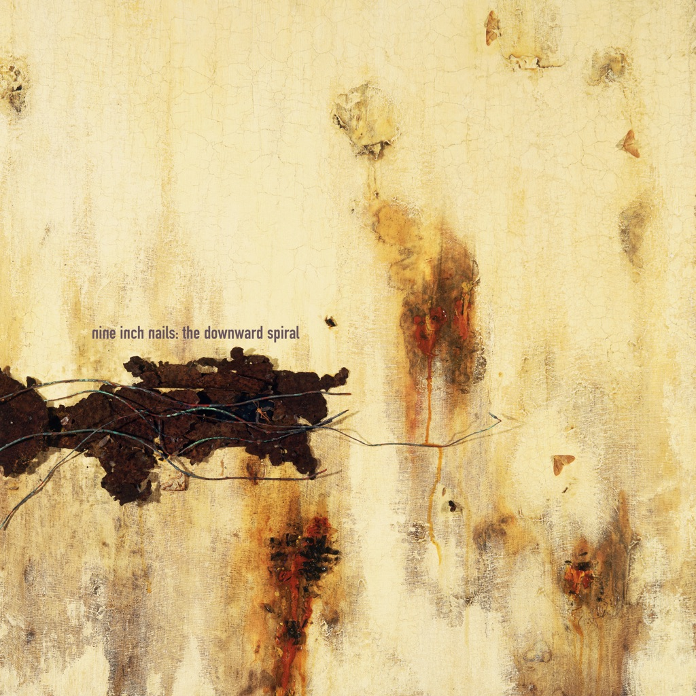

<!-- section break -->

1. Mr Self Destruct (4:32)
2. Piggy (4:22)
3. Heresy (3:54)
4. March Of The Pigs (2:58)
5. Closer (6:14)
6. Ruiner (4:56)
7. The Becoming (5:32)
8. I Do Not Want This (5:41)
9. Big Man With A Gun (1:36)
10. A Warm Place (3:22)
11. Eraser (5:51)
12. Reptile (5:54)
13. The Downward Spiral (3:57)
14. Hurt (6:14)

<!-- section break -->

## Spotify


## Videos
### The Downward Spiral
 

### More Videos

- [Mr. Self Destruct](https://www.youtube.com/watch?v=lZY91ZsyHGw)

## Release Information
|  Key           | Value                                                |
| ---------------| ---------------------------------------------------- |
| Release Year   | 2008                                   |
| Discogs Link   | [Nine Inch Nails - The Downward Spiral](https://www.discogs.com/release/1475731-Nine-Inch-Nails-The-Downward-Spiral) |
| Label          | Interscope Records |
| Format         | Vinyl 2× LP Album Reissue |
| Catalog Number | B0011697-01 |
| Notes | Comes in a gatefold sleeve with full colour printed inner sleeves, housed in a plastic wallet with Back To Black [url=https://img.discogs.com/A2aHt4qSFp2-PDQZC4dW2SKDY5k=/fit-in/600x600/filters:strip_icc():format(jpeg):mode_rgb():quality(90)/discogs-images/R-1475731-1222631244.jpeg.jpg]hype sticker[/url] affixed: "[Back To Black logo] 60th Vinyl Anniversary Premium Audiophile Pressing On Heavyweight 180 Gram Vinyl In All Original Packaging! B2BSTK ST01"  Adrian Belew appears courtesy of [l=Caroline Records]. Stephen Perkins appears courtesy of [l=Warner Bros. Records Inc.] Nine Inch Nails live: Robin Finck, Danny Lohner, Chris Vrenna, James Wooley.  Studios: Le Pig of Beverly Hills, The Record Plant, A&M Studios. Mastering: Gateway Mastering, Portland, Maine.  Thankyou: Interscope, Jimmy Iovine; Silvia Garcia; Susie Tallman; Peter Christopherson; Rick Rubin; Missy Worth; Brian Warner and Marilyn Manson; Brian Liesegang; the temporarily displaced Richard Bugg; Coco-Puff; Scott Hasson, Mark Tindle, Mike Morongell, Shelly Yakus and A&M; Cally, Jamie Spencer, Marc Marot, Chris Blackwell and Island UK; Paul Connolly; Alex Kochan; Ian Flooks; Mark Blasquez; Sean Wihelmsen and Nadine's; Opcode Systems; Pat Stolpz, Martin Arthurs and Amek; Joseph Cultice; Handy Andy; Marina Chavez; Walter Cessna; Tina Montalbano; Carol Davis  We miss you Jeff Ward  ℗© 1994 Interscope Records All tracks ©1994 Leaving Hope Music, Inc./TGH Records, llc., ASCAP. All rights reserved, used by permission. |