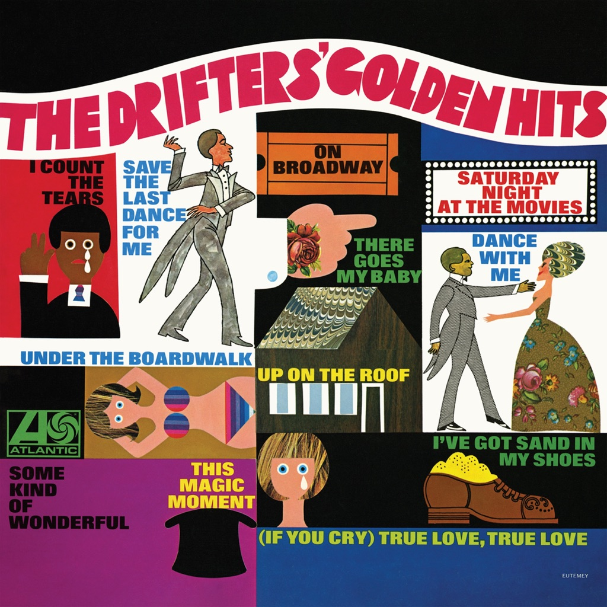

<!-- section break -->

1. There Goes My Baby (2:11)
2. (If You Cry) True Love, True Love (2:17)
3. Dance With Me (2:21)
4. This Magic Moment (2:28)
5. Save The Last Dance For Me (2:34)
6. I Count The Tears (2:06)
7. Some Kind Of Wonderful (2:17)
8. Up On The Roof (2:34)
9. On Broadway (3:05)
10. Under The Boardwalk (2:40)
11. I've Got Sand In My Shoes (2:48)
12. Saturday Night At The Movies (2:26)

<!-- section break -->

## Spotify


## Videos
### The Drifters - On Broadway (1963)
 

### More Videos

- [The Drifters - Saturday Night At The Movies](https://www.youtube.com/watch?v=yIkjFhoW2ns)
- [The Drifters - Up on the Roof - Stereo LP - HQ](https://www.youtube.com/watch?v=K6RyTRCK-CM)
- [This Magic Moment](https://www.youtube.com/watch?v=a4PPUp6XS5I)
- [I Count The Tears --The Drifters](https://www.youtube.com/watch?v=b-D4SqUDS0M)
- [The Drifters  There Goes My Baby](https://www.youtube.com/watch?v=ehFWRG5gHyI)
- [The Drifters - Under the Boardwalk - Stereo LP - HQ](https://www.youtube.com/watch?v=PAIiYJQNSnY)
- [The Drifters - I've Got Sand In My Shoes - Stereo LP - HQ](https://www.youtube.com/watch?v=dWoC8puTaoM)
- [1959 HITS ARCHIVE: (If You Cry) True Love, True Love - Drifters](https://www.youtube.com/watch?v=oRpkU1e_LYk)
- [The Drifters - On Broadway - Stereo LP - HQ](https://www.youtube.com/watch?v=KUMvG0yNPtY)

## Release Information
|  Key           | Value                                                |
| ---------------| ---------------------------------------------------- |
| Release Year   | 0                                   |
| Discogs Link   | [The Drifters - The Drifters' Golden Hits](https://www.discogs.com/release/1250865-The-Drifters-The-Drifters-Golden-Hits) |
| Label          | Atlantic |
| Format         | Vinyl LP Compilation Reissue |
| Catalog Number | K 40018 |
| Notes | An Atlantic Record, distributed by WEA Records Ltd. |