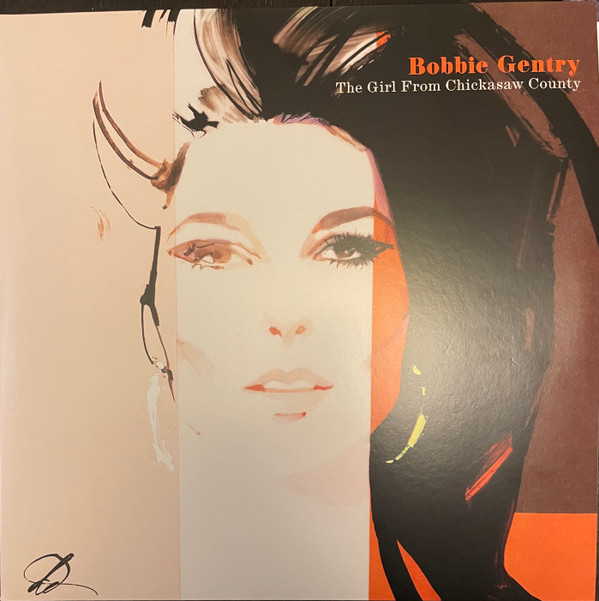

<!-- section break -->

1. Ode To Billie Joe
2. Chickasaw County Child
3. Hurry, Tuesday Child (Demo)
4. Sunday Best (Alternate Take)
5. Mississippi Delta (Alternate Version)
6. Okolona River Bottom Band
7. Refractions
8. Courtyard
9. Mornin' Glory
10. Sweete Peony (Alternate Version)
11. Casket Vignette
12. Recollection
13. Sittin' Pretty
14. Hushabye Mountain
15. The Conspiracy Of Homer Jones
16. Sunday Mornin' (Alternative Version)
17. Let It Be Me (Without Strings)
18. God Bless The Child
19. This Girl's In Love With You
20. Touch 'Em With Love (Stereo Version)
21. Seasons Come, Seasons Go (Demo)
22. Glory Hallelujah, How They'll Sing (Alternate Take)
23. Fancy
24. He Made A Woman Out Of Me
25. Circle 'Round The Sun
26. Apartment 21 (Stereo Version)
27. Benjamin
28. But I Can't Get Back
29. Lookin' In
30. Smoke
31. Joanne
32. The Girl From Cincinnati

<!-- section break -->

## Videos
### Mean Stepmama Blues
 

### More Videos

- [Ode To Billie Joe](https://www.youtube.com/watch?v=cJZ_ViDADOE)
- [I Saw An Angel Die](https://www.youtube.com/watch?v=hvGDAUW9SDw)
- [Chickasaw County Child](https://www.youtube.com/watch?v=DGkH7VRo0O8)
- [Sunday Best (Alternate Take)](https://www.youtube.com/watch?v=sbT05ZirqdM)
- [Hurry, Tuesday Child (Demo)](https://www.youtube.com/watch?v=TYBfxq4nX6k)
- [Niki Hokey / Barefootin' (Live)](https://www.youtube.com/watch?v=59T09SaNUd0)
- [Mississippi Delta (Alternate Take)](https://www.youtube.com/watch?v=xPlwgCtGB04)
- [Seventh Son (Band Version)](https://www.youtube.com/watch?v=V2YrhjwoiS8)
- [Mornin' Glory](https://www.youtube.com/watch?v=ZAeANJk4-j4)
- [Jessye' Lisabeth](https://www.youtube.com/watch?v=ckpD3EFMWhs)
- [Refractions](https://www.youtube.com/watch?v=HgMIMTKZmig)
- [Bobbie Gentry - Courtyard](https://www.youtube.com/watch?v=vUbrXyiM6pw)
- [Feelin' Good (Demo)](https://www.youtube.com/watch?v=pd6H796tPiE)
- [Sweet Peony (Alternate Take)](https://www.youtube.com/watch?v=n3Jju6NQTw8)
- [Bobbie Gentry - Casket Vignette](https://www.youtube.com/watch?v=UuilL4S0A4M)
- [Recollection](https://www.youtube.com/watch?v=IYbxzin0A7g)
- [Eleanor Rigby](https://www.youtube.com/watch?v=AkK5F-WVPHU)
- [Sittin' Pretty](https://www.youtube.com/watch?v=DEYwYSn5Row)
- [Hushabye Mountain](https://www.youtube.com/watch?v=iymsFUmJ7-E)
- [The Conspiracy Of Homer Jones](https://www.youtube.com/watch?v=Mp6sRJh_BDA)
- [Sunday Mornin' (Alternate Take)](https://www.youtube.com/watch?v=b9Um-oyewto)
- [Let It Be Me (Without Strings)](https://www.youtube.com/watch?v=-joG-oua1-Y)
- [Supper Time](https://www.youtube.com/watch?v=a5yRVAgC4WU)
- [God Bless The Child](https://www.youtube.com/watch?v=wEyYU1g0qfQ)
- [This Girls In Love With You](https://www.youtube.com/watch?v=5E11C6xNKaU)
- [Touch 'Em With Love (Alternate Stereo Take)](https://www.youtube.com/watch?v=ynlltsMEzkA)
- [Greyhound Goin' Somewhere](https://www.youtube.com/watch?v=csOdjq4wX3g)
- [Seasons Come, Seasons Go (Demo)](https://www.youtube.com/watch?v=jf6cdPnu0qU)
- [Glory Hallelujah, How They'll Sing (Alternate Take)](https://www.youtube.com/watch?v=zL31IJ9LhLs)
- [Fancy (Mono / Radio Edit)](https://www.youtube.com/watch?v=DwMxYfjXYiA)
- [Find 'Em, Fool 'Em And Forget 'Em](https://www.youtube.com/watch?v=rizcoGFfgIg)
- [He Made A Woman Out Of Me](https://www.youtube.com/watch?v=v8smDOw1B6c)
- [Rainmaker](https://www.youtube.com/watch?v=z_CQo5JILcU)
- [Circle ‘Round the Sun](https://www.youtube.com/watch?v=ArsjiIZxKok)
- [Apartment 21](https://www.youtube.com/watch?v=SL_Ipup_nRU)
- [Billy The Kid (Live)](https://www.youtube.com/watch?v=SyMcUrBbrHM)
- [Benjamin](https://www.youtube.com/watch?v=qLwkQYw5VYA)
- [But I Can't Get Back](https://www.youtube.com/watch?v=NzyynkTW6Ak)
- [Belinda (Alternate Take)](https://www.youtube.com/watch?v=vLqNo_VzQIE)
- [Lookin' In](https://www.youtube.com/watch?v=R8f9PimNb90)
- [Smoke](https://www.youtube.com/watch?v=SHBVEUr2QAY)
- [Joanne](https://www.youtube.com/watch?v=X0baW7xZcYY)
- [You And Me Together](https://www.youtube.com/watch?v=XpsAppX-j8M)
- [The Girl From Cincinnati](https://www.youtube.com/watch?v=ynnH6kmOH_A)

## Release Information
|  Key           | Value                                                |
| ---------------| ---------------------------------------------------- |
| Release Year   | 2022                                   |
| Discogs Link   | [Bobbie Gentry - The Girl From Chickasaw County (Highlights From The Capitol Masters)](https://www.discogs.com/release/24114149-Bobbie-Gentry-The-Girl-From-Chickasaw-County-Highlights-From-The-Capitol-Masters) |
| Label          | UMC |
| Format         | Vinyl 2× LP Compilation Remastered Stereo |
| Catalog Number | 5395656 |
| Notes | Gatefold double album with 4-page insert of notes titled "An Introduction To The Recordings", printed inner sleeves , hype sticker on front shrink-wrap and "Made in Germany" sticker on back shrink-wrap.  [From insert] Transfers by Iron Mountain Entertainment Services. Photographs from the collection of Andrew Batt, Capitol Records and the BBC  [From back cover] This compilation ℗ 2022 Universal Music Operations Limited, © 2022 Universal Music Operations Limited Made in the EU.  [From hype sticker] Highlights from the acclaimed Grammy nominated boxset. Includes the classic tracks "Ode To Billie Joe" and "Fancy", as well as demos, outtakes and deepcuts.  [Track details] A1, A2 <> Universal/MCA Music Limited; Originally released on "Ode To Billie Joe" 21/08/1967 A3 to A5, B2, B5, C4, D4 to D6 <> Universal/MCA Music Limited; Originally released on "The Girl From Chickasaw County" 21/09/2018 A6 to B1 <> Universal/MCA Music Limited; Originally released on "The Delta Sweete - Deluxe" 31/07/2020 B3, B4 <> Universal/MCA Music Limited; Remixed for this release B6 <> EMI United Partnership Ltd.; Remixed for this release B7 <> Blue Crest Music, Inc. Hill and Range Songs, Inc.; Originally released on "The Girl From Chickasaw County" 21/09/2018 B8 <> Strictly Confidential; Originally released on "The Girl From Chickasaw County" 21/09/2018 B9, C5 <> Universal Music Publ. International MGB Ltd. / BMG Music Publishing International Ltd.; Originally released on "The Girl From Chickasaw County" 21/09/2018 C1 <> Carlin Music Corp.; Originally released on "The Girl From Chickasaw County" 21/09/2018 C2 <> Warner/Chappell Music Publishing Limited / BMG Rights Management (UK) Ltd. (Hal David); Originally released on "The Girl From Chickasaw County" 21/09/2018 C3 <> Sony/ATB Music Publishing (UK) Limited; Originally released on "The Girl From Chickasaw County" 21/09/2018 C6 <> Universal/MCA Music Limited; Originally released on "Fancy" 06/04/1970 C7 <> Imagem Music; Originally released on "Fancy" 06/04/1970 C8 <> Originally released on "The Girl From Chickasaw County" 21/09/2018 D1 <> Warner/Chappell North America Limited; Originally released on "The Girl From Chickasaw County" 21/09/2018 D2, D3 <> Universal/MCA Music Limited; Originally released on "Patchwork" 26/04/1971 D7 <> EMI Songs Ltd.; Originally released on "The Girl From Cincinnati" 7" 08/1972  Runouts are etched |