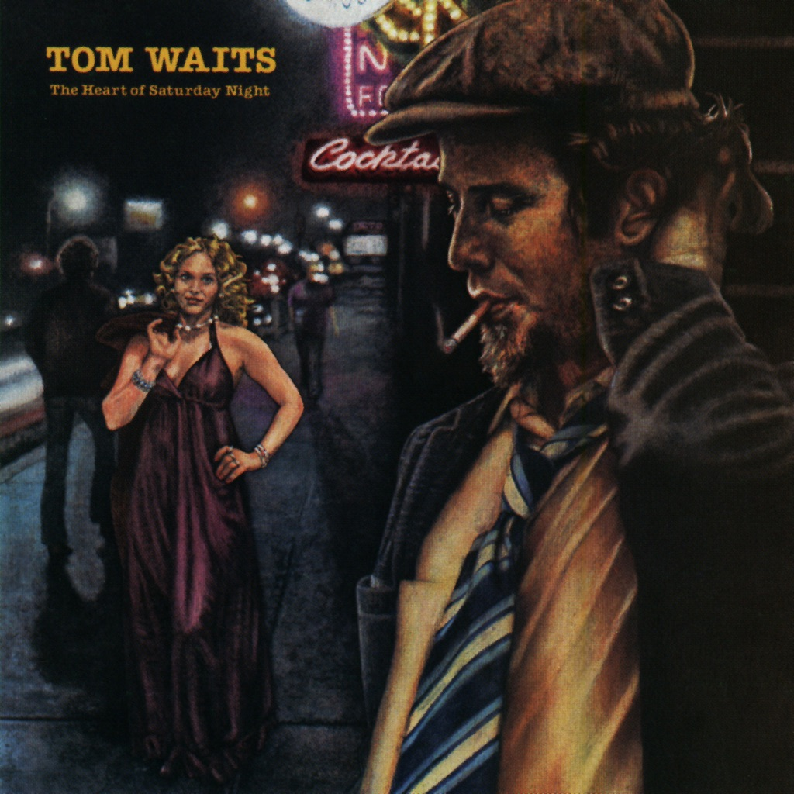

<!-- section break -->

1. New Coat Of Paint (3:20)
2. San Diego Serenade (3:25)
3. Semi Suite (3:22)
4. Shiver Me Timbers (4:21)
5. Diamonds On My Windshield (3:10)
6. (Looking For) The Heart Of Saturday Night (3:50)
7. Fumblin' With The Blues (2:59)
8. Please Call Me, Baby (4:23)
9. Depot, Depot (3:42)
10. Drunk On The Moon (5:05)
11. The Ghosts Of Saturday Night (After Hours At Napoleone's Pizza House) (3:17)

<!-- section break -->

## Spotify


## Videos
### Tom Waits - The Heart of Saturday Night  (Full Album)
 

### More Videos

- [Tom Waits - (Looking For) The Heart Of Saturday Night](https://www.youtube.com/watch?v=lbH6BUNsuts)

## Release Information
|  Key           | Value                                                |
| ---------------| ---------------------------------------------------- |
| Release Year   | 2018                                   |
| Discogs Link   | [Tom Waits - The Heart Of Saturday Night](https://www.discogs.com/release/11978889-Tom-Waits-The-Heart-Of-Saturday-Night) |
| Label          | Anti- |
| Format         | Vinyl LP Album Limited Edition Reissue Remastered (Yellow Opaque) |
| Catalog Number | 87566-1 |
