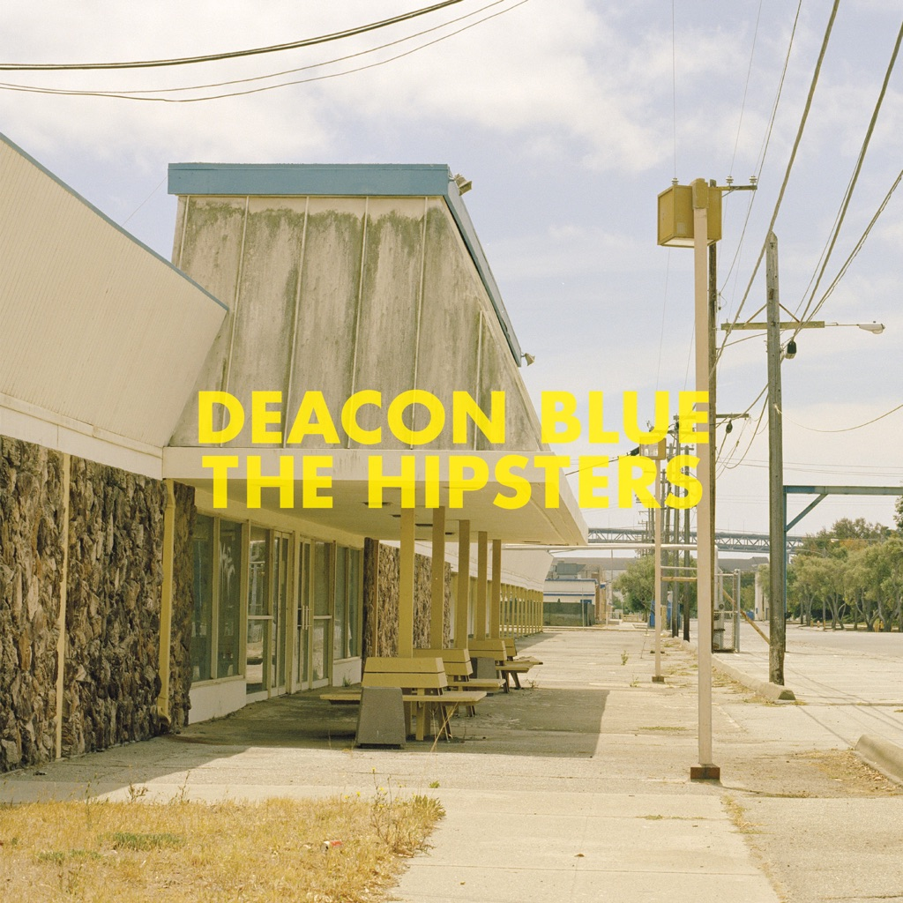

<!-- section break -->

1. Here I Am In London Town
2. The Hipsters
3. Stars
4. Turn
5. The Rest
6. The Outsiders
7. That's What We Can Do
8. She'll Understand
9. Laura From Memory
10. It Will End In Tears
11. Is There No Way Back To You

<!-- section break -->

## Spotify


## Release Information
|  Key           | Value                                                |
| ---------------| ---------------------------------------------------- |
| Release Year   | 2013                                   |
| Discogs Link   | [Deacon Blue - The Hipsters](https://www.discogs.com/release/5167648-Deacon-Blue-The-Hipsters) |
| Label          | Demon Records |
| Format         | Vinyl LP Album (Yellow Transparent ) |
| Catalog Number | DEACONLP001 |
| Notes | ℗ & © 2012 Demon Music Group Ltd.    Includes code for free MP3 download of the album. |