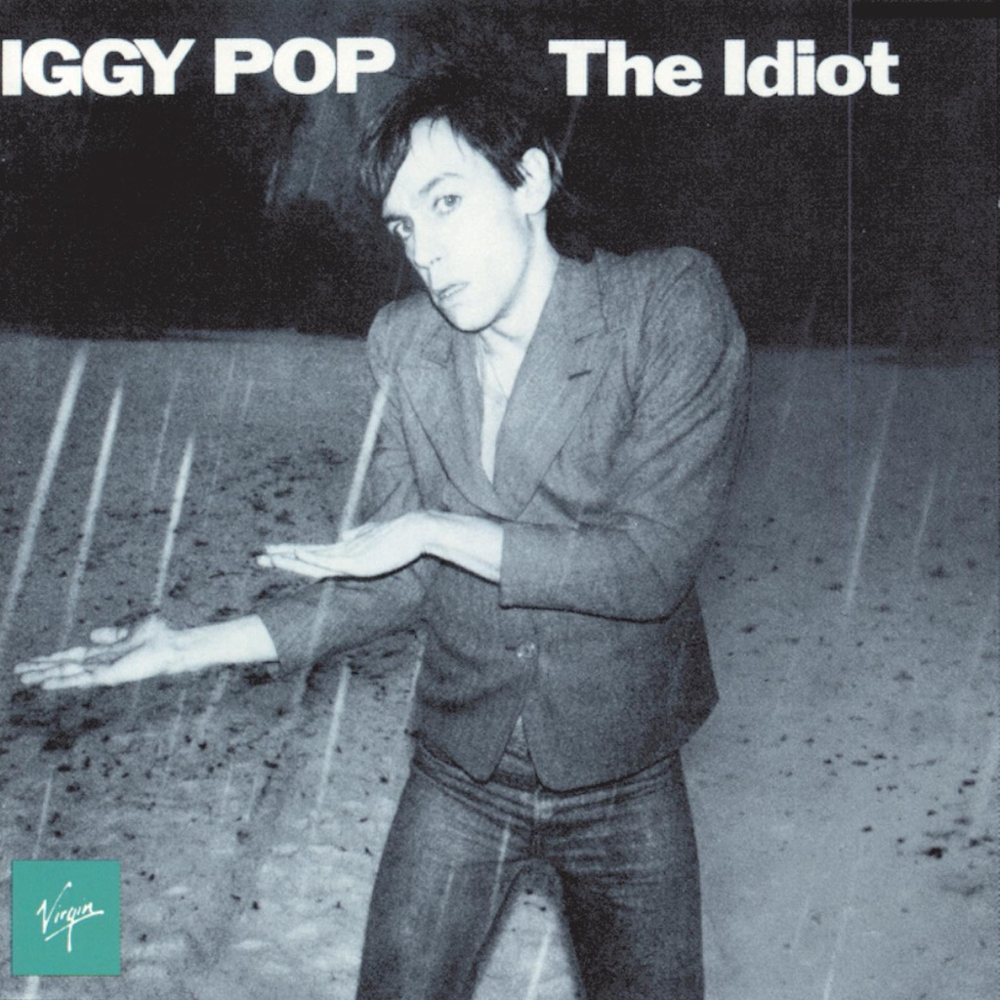

<!-- section break -->

1. Sister Midnight (4:23)
2. Nightclubbing (4:18)
3. Funtime (2:53)
4. Baby (3:20)
5. China Girl (5:12)
6. Dum Dum Boys (7:12)
7. Tiny Girls (3:03)
8. Mass Production (8:28)

<!-- section break -->

## Spotify


## Videos
### Sister Midnight
 

### More Videos

- [Nightclubbing](https://www.youtube.com/watch?v=EpECxEO4uZM)
- [Funtime](https://www.youtube.com/watch?v=DDYatCwJvCA)
- [Baby](https://www.youtube.com/watch?v=nU3EyAYg4t4)
- [China Girl](https://www.youtube.com/watch?v=slU0PSJedbU)
- [Dum Dum Boys](https://www.youtube.com/watch?v=12Uks7c0G8c)
- [Tiny Girls](https://www.youtube.com/watch?v=80BN9xWkRsQ)
- [Mass Production](https://www.youtube.com/watch?v=CmmlxVlUz7Y)

## Release Information
|  Key           | Value                                                |
| ---------------| ---------------------------------------------------- |
| Release Year   | 2017                                   |
| Discogs Link   | [Iggy Pop - The Idiot](https://www.discogs.com/release/10451933-Iggy-Pop-The-Idiot) |
| Label          | UMC |
| Format         | Vinyl LP Album Limited Edition Reissue (Silver, 180) |
| Catalog Number | 00600753772461 |
| Notes | Exclusive to HMV stores in the UK as part of their Vinyl Week. Limited to 1500 copies. Includes voucher to download MP3 version of the album.  Made in the E.U. |