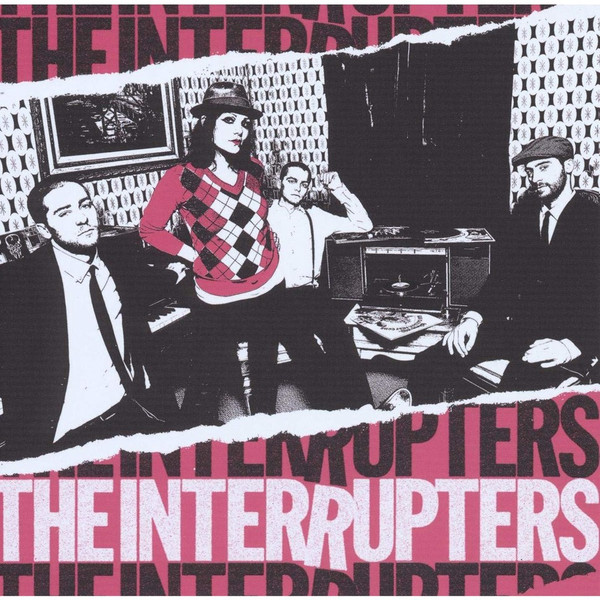

<!-- section break -->

1. Take Back The Power
2. White Noise
3. Can't Be Trusted
4. Liberty
5. Judge Not
6. This Is The New Sound
7. Babylon
8. Family
9. Easy On You
10. A Friend Like Me
11. Last Call
12. Haven't Seen The Last Of Me
13. Jenny Drinks

<!-- section break -->

## Spotify


## Videos
### The Interrupters - A Friend Like Me  **OFFICIAL VIDEO**
 

### More Videos

- [The Interrupters - The Interrupters (Full Album)](https://www.youtube.com/watch?v=qEVTRsNuLNM)
- [The Interrupters - Take Back The Power](https://www.youtube.com/watch?v=q7Ol-YDS4Jc)

## Release Information
|  Key           | Value                                                |
| ---------------| ---------------------------------------------------- |
| Release Year   | 2016                                   |
| Discogs Link   | [The Interrupters - The Interrupters](https://www.discogs.com/release/13602776-The-Interrupters-The-Interrupters) |
| Label          | Hellcat Records |
| Format         | Vinyl LP Album Repress |
| Catalog Number | 0530-1 |
| Notes | Track A7 & B6 are bonus tracks. Printed innersleeve with lyrics |