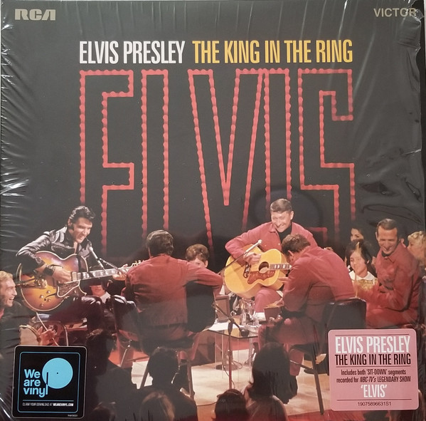

<!-- section break -->

1. That’s All Right (4:08)
2. Heartbreak Hotel (2:55)
3. Love Me (3:12)
4. Baby What You Want Me To Do (5:44)
5. Blue Suede Shoes (2:20)
6. Baby What You Want Me To Do (4:03)
7. Lawdy, Miss Clawdy (3:03)
8. Are You Lonesome Tonight? (2:51)
9. When My Blue Moon Turns To Gold Again (0:38)
10. Blue Christmas (2:36)
11. Trying To Get To You (2:50)
12. One Night (3:57)
13. Baby What You Want Me To Do (5:11)
14. One Night (2:37)
15. Memories (3:24)
16. Heartbreak Hotel (4:12)
17. Baby What You Want Me To Do (3:27)
18. Introductions (2:17)
19. That’s All Right (3:08)
20. Are You Lonesome Tonight? (4:00)
21. Baby What You Want Me To Do  (3:24)
22. Blue Suede Shoes (2:27)
23. One Night (3:20)
24. Love Me (4:14)
25. Trying To Get To You (3:04)
26. Lawdy, Miss Clawdy (2:57)
27. Santa Claus Is Back In Town (1:18)
28. Blue Christmas  (4:02)
29. Tiger Man  (3:11)
30. When My Blue Moon Turns To Gold Again  (1:17)
31. Memories  (3:13)

<!-- section break -->

## Release Information
|  Key           | Value                                                |
| ---------------| ---------------------------------------------------- |
| Release Year   | 2018                                   |
| Discogs Link   | [Elvis Presley - The King In The Ring](https://www.discogs.com/release/12877130-Elvis-Presley-The-King-In-The-Ring) |
| Label          | RCA Victor |
| Format         | Vinyl 2× LP Album Compilation |
| Catalog Number | 19075896631 |
| Notes | Black Vinyl . Gatefold sleeve.  Recorded at NBC Studios Burbank, June 27, 1968  6PM & 8PM shows.  Made in the US.  Track information: Tracks A6,B7,D3,D5,D6  originally released 1968 Tracks C5,D1,D2 originally released 1974 Tracks B6, C7 originally released 1976 Track A5 originally released 1981 Track C4 originally released 1983 Tracks B2,B4 originally released 1997 Tracks A1to A4, A7,B1,B3,B5,B8, C1 to C3, C6, C8,D4,D7,D8 originally released 1998 All tracks originally recorded 1968 |