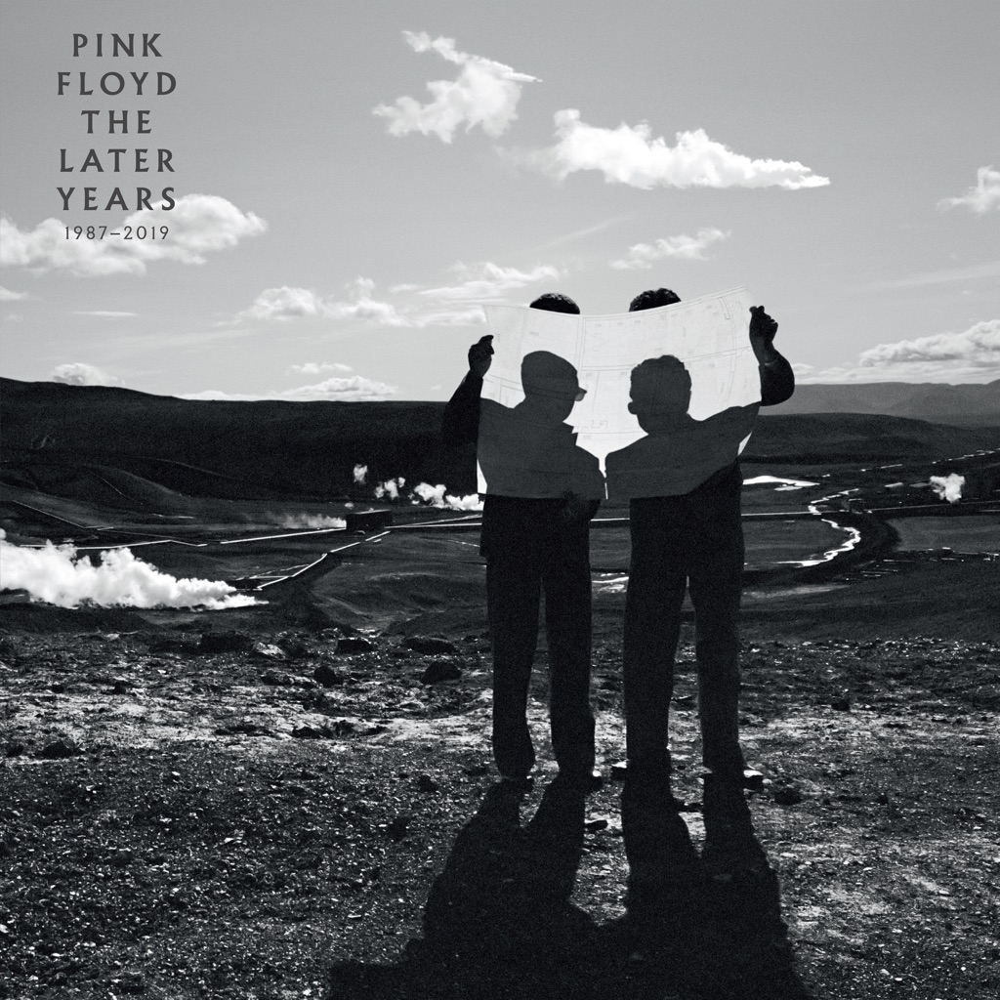

<!-- section break -->

1. Shine On You Crazy Diamond, Parts 1-5 (Live At Knebworth 1990)
2. Marooned Jam (The Division Bell Sessions)
3. One Slip (2019 Remix)
4. Lost For Words (Pulse Tour Rehearsal 1994)
5. Us And Them (Delicate Sound Of Thunder 2019 Remix)
6. Comfortably Numb (Live At Knebworth 1990)
7. Sorrow (2019 Remix)
8. Learning To Fly (Delicate Sound Of Thunder 2019 Remix)
9. High Hopes (Early Version) (The Division Bell Sessions)
10. On The Turning Away (2019 Remix)
11. Wish You Were Here (Live At Knebworth 1990)
12. Run Like Hell (Delicate Sound Of Thunder 2019 Remix)

<!-- section break -->

## Spotify


## Release Information
|  Key           | Value                                                |
| ---------------| ---------------------------------------------------- |
| Release Year   | 2019                                   |
| Discogs Link   | [Pink Floyd - The Later Years 1987-2019](https://www.discogs.com/release/14462719-Pink-Floyd-The-Later-Years-1987-2019) |
| Label          | Pink Floyd Records |
| Format         | Vinyl 2× LP Compilation (180 gram) |
| Catalog Number | PFRLY19LP |
| Notes | Gatefold cover, inner sleeves with printed credits. Includes a 24-page booklet. Black vinyl version only.  Hype-sticker on the shrink-wrap: "12 tracks 79 mins inc. unreleased studio and live recordings all with 2019 remixes inc. 24-page booklet All tracks taken from The later Years 1987-2019 (16-disc ltd. edition box set)".  Made in the E.U. |