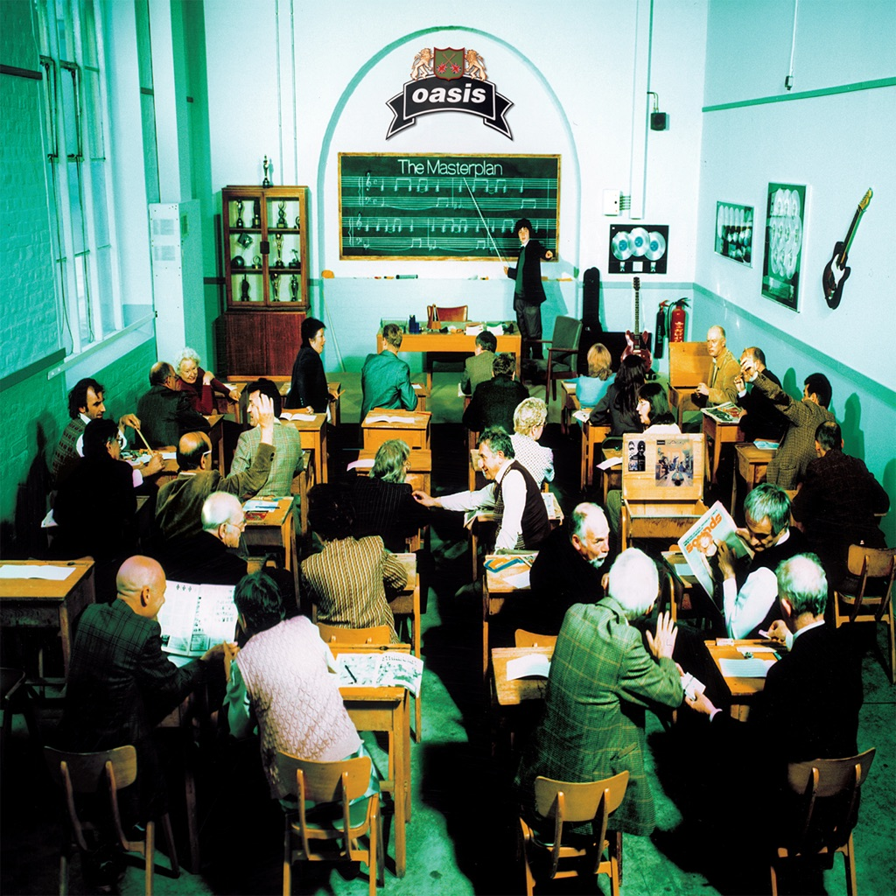

<!-- section break -->

1. Acquiesce (4:24)
2. Underneath The Sky (3:21)
3. Talk Tonight (4:21)
4. Going Nowhere (4:39)
5. Fade Away (4:13)
6. The Swamp Song (4:19)
7. I Am The Walrus (Live) (6:25)
8. Listen Up (6:21)
9. Rockin' Chair (4:35)
10. Half The World Away (4:21)
11. (It's Good) To Be Free (4:18)
12. Stay Young (5:05)
13. Headshrinker (4:38)
14. The Masterplan (5:22)

<!-- section break -->

## Videos
### Oasis - The Masterplan - 1998 (FULL ALBUM)
 

### More Videos

- [Oasis - The Masterplan](https://www.youtube.com/watch?v=dPPi2D6GK7A)

## Release Information
|  Key           | Value                                                |
| ---------------| ---------------------------------------------------- |
| Release Year   | 1998                                   |
| Discogs Link   | [Oasis - The Masterplan](https://www.discogs.com/release/1826939-Oasis-The-Masterplan) |
| Label          | Creation Records |
| Format         | Vinyl 2× LP Compilation |
| Catalog Number | CRELP 241 |
| Notes | Gatefold sleeve.  Track durations not shown on release.  Comes with a circular sticker on the sleeve which reads: CRELP241 Oasis The Masterplan Includes The Tracks 'The Masterplan' 'Acquiesce' 'Stay Young'.  ℗ & © 1998 Creation Records Ltd.  |