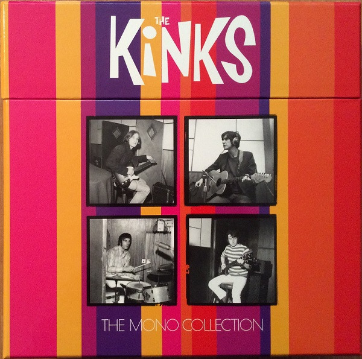

<!-- section break -->

1. Kinks
2. Beautiful Delilah (2:08)
3. So Mystifying (2:55)
4. Just Can't Go To Sleep (2:00)
5. Long Tall Shorty (2:51)
6. I Took My Baby Home (1:49)
7. I'm A Lover Not A Fighter (2:05)
8. You Really Got Me (2:17)
9. Cadillac (2:46)
10. Bald Headed Woman (2:43)
11. Revenge (1:31)
12. Too Much Monkey Business (2:17)
13. I've Been Driving On Bald Mountain (2:03)
14. Stop Your Sobbing (2:07)
15. Got Love If You Want It (3:49)
16. Kinda Kinks
17. Look For Me Baby (2:17)
18. Got My Feet On The Ground (2:16)
19. Nothin' In The World Can Stop Me Worryin' 'Bout That Girl (2:46)
20. Naggin' Woman (2:38)
21. Wonder Where My Baby Is Tonight (2:02)
22. Tired Of Waiting For You (2:35)
23. Dancing In The Street (2:21)
24. Don't Ever Change (2:25)
25. Come On Now (1:49)
26. So Long (2:11)
27. You Shouldn't Be Sad (2:02)
28. Something Better Beginning (2:26)
29. The Kink Kontroversy
30. Milk Cow Blues (3:43)
31. Ring The Bells (2:20)
32. Gotta Get The First Plane Home (1:49)
33. When I See That Girl Of Mine (2:13)
34. I Am Free (2:30)
35. Till The End Of The Day (2:24)
36. The World Keeps Going Round (2:37)
37. I'm On An Island (2:18)
38. Where Have All The Good Times Gone (2:52)
39. It's Too Late (2:35)
40. What's In Store For Me (2:07)
41. You Can't Win (2:41)
42. Face To Face
43. Party Line (2:38)
44. Rosy Won't You Please Come Home (2:36)
45. Dandy (2:14)
46. Too Much On My Mind (2:32)
47. Session Man (2:22)
48. Rainy Day In June (3:19)
49. House In The Country (3:09)
50. Holiday In Waikiki (2:55)
51. Most Exclusive Residence For Sale (2:50)
52. Fancy (2:31)
53. Little Miss Queen Of Darkness (3:21)
54. You're Looking Fine (2:53)
55. Sunny Afternoon (3:40)
56. I'll Remember (2:33)
57. Something Else By The Kinks
58. David Watts (2:33)
59. Death Of A Clown (3:05)
60. Two Sisters (2:03)
61. No Return (2:03)
62. Harry Rag (2:17)
63. Tin Soldier Man (2:50)
64. Situation Vacant (3:19)
65. Love Me Till The Sun Shines (3:19)
66. Lazy Old Sun (2:49)
67. Afternoon Tea (3:27)
68. Funny Face (2:18)
69. End Of The Season (2:58)
70. Waterloo Sunset (3:17)
71. Live At Kelvin Hall
72. Till The End Of The Day (3:22)
73. A Well Respected Man (3:10)
74. You're Looking Fine (3:30)
75. Sunny Afternoon (4:54)
76. Dandy (2:05)
77. I'm On An Island (2:54)
78. Come On Now (3:01)
79. You Really Got Me (2:13)
80. Medley: Milk Cow Blues / Batman Theme / Tired Of Waiting For You / Milk Cow Blues (8:55)
81. The Kinks Are The Village Green Preservation Society
82. The Village Green Preservation Society (2:53)
83. Do You Remember Walter? (2:27)
84. Picture Book (2:36)
85. Johnny Thunder (2:31)
86. Last Of The Steam-Powered Trains (4:11)
87. Big Sky (2:51)
88. Sitting By The Riverside (2:24)
89. Animal Farm (3:01)
90. Village Green (2:11)
91. Starstruck (2:27)
92. Phenomenal Cat (2:39)
93. All Of My Friends Were There (2:25)
94. Wicked Annabella (2:43)
95. Monica (2:20)
96. People Take Pictures Of Each Other (2:19)
97. Arthur (Or The Decline And Fall Of The British Empire)
98. Victoria (3:43)
99. Yes Sir, No Sir (3:50)
100. Some Mother's Son (3:27)
101. Drivin' (3:15)
102. Brainwashed (2:37)
103. Australia (6:46)
104. Shangri-La (5:23)
105. Mr. Churchill Says (4:44)
106. She's Bought A Hat Like Princess Marina (3:10)
107. Young And Innocent Days (3:24)
108. Nothing To Say (3:10)
109. Arthur (5:28)
110. The Kinks
111. You Really Got Me (2:17)
112. Long Tall Shorty (2:51)
113. All Day And All Of The Night (2:42)
114. Beautiful Delilah (2:08)
115. Tired Of Waiting For You (2:35)
116. I'm A Lover Not A Fighter (2:05)
117. A Well Respected Man (2:40)
118. Till The End Of The Day (2:24)
119. See My Friends (2:44)
120. Don't You Fret (2:45)
121. Dedicated Follower Of Fashion (3:01)
122. Sunny Afternoon (3:40)
123. Dead End Street (3:22)
124. Death Of A Clown (3:05)
125. Two Sisters (2:03)
126. Big Black Smoke (2:31)
127. Susannah's Still Alive (2:20)
128. Autumn Almanac (3:03)
129. Waterloo Sunset (3:17)
130. Last Of The Steam-Powered Trains (4:11)
131. Wonderboy (2:48)
132. Do You Remember Walter? (2:27)
133. Dandy (2:14)
134. Animal Farm (3:01)
135. Days (2:55)

<!-- section break -->

## Release Information
|  Key           | Value                                                |
| ---------------| ---------------------------------------------------- |
| Release Year   | 2016                                   |
| Discogs Link   | [The Kinks - The Mono Collection](https://www.discogs.com/release/9540202-The-Kinks-The-Mono-Collection) |
| Label          | BMG |
| Format         | Box Set Compilation Limited Edition, Vinyl LP Album, Vinyl LP Album, Vinyl LP Album, Vinyl LP Album, Vinyl LP Album, Vinyl LP Album, Vinyl LP Album, Vinyl LP Album, Vinyl 2× LP Compilation, All Media Reissue Remastered Mono (180g) |
| Catalog Number | KINKSBOX003 |
| Notes | Includes hardcover 48-page book including never-before-seen photos and new interviews with Ray Davies, Dave Davies and Mick Avory.  This compilation ℗ & © 2016 Sanctuary Records Group Ltd, a BMG company.  The Kinks This compilation ℗ & © 1964 Sanctuary Records Group Ltd, a BMG Company. Recording first published 2 Oct, 1964  Kinda Kinks This compilation ℗ & © 1965 Sanctuary Records Group Ltd, a BMG Company. Recording first published 5 Mar, 1965  The Kink Kontroversy [E3, E5 to F6] Published by ABKCO Music, Inc/Warner Chappell ℗ 1965 except 'I Am Free', 'Till The End Of The Day', 'The World Keeps Going Round', 'I'm On An Island' and 'You Can't Win' ℗ 2014 This compilation ℗ & © 1965 Sanctuary Records Group Ltd, a BMG Company. Recording first published 26 Nov, 1965  Face To Face [G1 to H7] Published by ABKCO Music, Inc/Warner Chappell  ℗ 1966 except 'Party Line', 'Rosy Won't You Please Come Home', 'Dandy', 'Too Much On My Mind', 'Session Man', 'Most Exclusive Residence For Sale', 'Fancy', and 'Sunny Afternoon' ℗ 2014 This compilation ℗ & © 1966 Sanctuary Records Group Ltd, a BMG Company. Recording first published 28 Oct, 1966  Something Else By The Kinks [I1 to J6] Published by ABKCO Music, Inc/Warner Chappell ℗ 1967 except 'David Watts', 'Death Of A Clown', 'Harry Rag', 'Tin Soldier Man', 'Love Me Till The Sun Shines', 'Funny Face', and 'Waterloo Sunset' ℗ 2014 This compilation ℗ & © 1967 Sanctuary Records Group Ltd, a BMG Company. Recording first published 15 Sep, 1967  Live At Kelvin Hall [K1, K3 to L1] Published by ABKCO Music, Inc/Warner Chappell This compilation ℗ 1967 & © 1968 Sanctuary Records Group Ltd, a BMG Company. Recording first published 12 Jan, 1968  The Kinks Are The Village Green Preservation Society [M1 to N8] Published by ABKCO Music, Inc/Warner Chappell ℗ 1968 except 'Do You Remember Walter?', 'Picture Book', 'Johnny Thunder', 'Big Sky', 'Animal Farm', 'Starstruck', and 'People Take Pictures Of Each Other' ℗ 2014 This compilation ℗ & © 1968 Sanctuary Records Group Ltd, a BMG Company. Recording first published 22 Nov, 1968 Packaged in a gatefold sleeve.  Arthur (Or The Decline And Fall Of The British Empire) [O1 to P6] Published by ABKCO Music, Inc/Warner Chappell ℗ 1969 except 'Some Mother's Son', 'Drivin'', 'Shangri-La', and 'She's Bought A Hat Like Princess Marina' ℗ 2014 Recorded at Pye Studios, London This compilation ℗ & © 1967 Sanctuary Records Group Ltd, a BMG Company. Recording first published 10 Oct, 1969 Packaged in a gatefold sleeve. Includes a printed lyrics insert.  The Kinks [R2, R5 to T7] Published by ABKCO Music, Inc/Warner Chappell ℗ 1970 except 'Till The End Of The Day', 'Dedicated Follower Of fashion', 'Sunny Afternoon', 'Dead End Street', 'Death Of A Clown', 'Autumn Almanac', 'Waterloo Sunset', 'Wonderboy', 'Do You Remember Walter?', 'Dandy', 'Animal Farm', and 'Days' ℗ 2014 This compilation ℗ 1964, 1965, 1966, 1967, 1968 & © 1970 Sanctuary Records Group Ltd, a BMG Company. Recording first published 27 Feb, 1970 Packaged in a gatefold sleeve. |