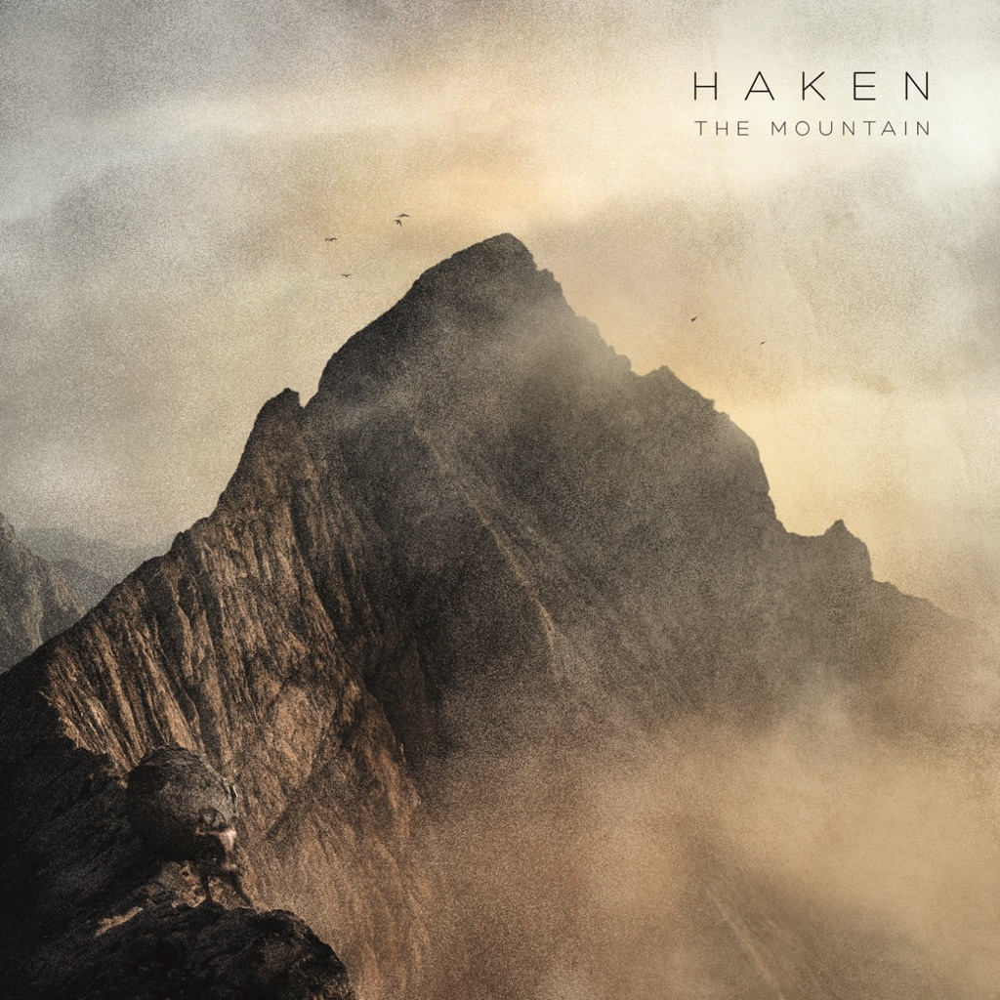

<!-- section break -->

1. The Path
2. Atlas Stone
3. Cockroach King
4. In Memorian
5. Because It's There
6. Falling Back To Earth
7. As Death Embraces
8. Pareidolia
9. Somebody
10. The Path Unbeaten
11. Nobody
12. The Path (2:47)
13. Atlas Stone (7:34)
14. Cockroach King (8:15)
15. In Memorian (4:17)
16. Because It's There (4:24)
17. Falling Back To Earth (11:51)
18. As Death Embraces (3:13)
19. Pareidolia (10:51)
20. Somebody (9:01)
21. The Path Unbeaten (2:12)
22. Nobody (4:53)

<!-- section break -->

## Videos
### The Path
 

### More Videos

- [Atlas Stone](https://www.youtube.com/watch?v=JUK4CMh4Feg)
- [Cockroach King](https://www.youtube.com/watch?v=mwcA2xuKtts)
- [In Memoriam](https://www.youtube.com/watch?v=-xgE_g0PJ-s)
- [Because It's There](https://www.youtube.com/watch?v=3u4d7k3nMXA)
- [Falling Back To Earth](https://www.youtube.com/watch?v=52ALziuI-AY)
- [As Death Embraces](https://www.youtube.com/watch?v=FHNbW3I-lug)
- [Pareidolia](https://www.youtube.com/watch?v=-AbGjGpJPO0)
- [Somebody](https://www.youtube.com/watch?v=kLIyBYQkr3w)
- [The Path Unbeaten](https://www.youtube.com/watch?v=N8naO6HASm0)
- [Nobody](https://www.youtube.com/watch?v=bVmucEX4DZQ)

## Release Information
|  Key           | Value                                                |
| ---------------| ---------------------------------------------------- |
| Release Year   | 2021                                   |
| Discogs Link   | [Haken - The Mountain](https://www.discogs.com/release/17706778-Haken-The-Mountain) |
| Label          | Inside Out Music |
| Format         | Vinyl 2× LP Album Stereo (180 Gram), CD Album Stereo, All Media Reissue Stereo |
| Catalog Number | IOMLP 578 |
| Notes | LP tracks position given with 0s and regardless of sides on back.  Tracks D10, D11, CD-10 and CD-11 are bonus tracks.  Packaged in a gatefold jacket with 4-page color insert, black polylined LP sleeves and hype sticker affixed to the shrink wrap on the front. CD is packaged inside in an envelope-style polypropylene sleeve. |