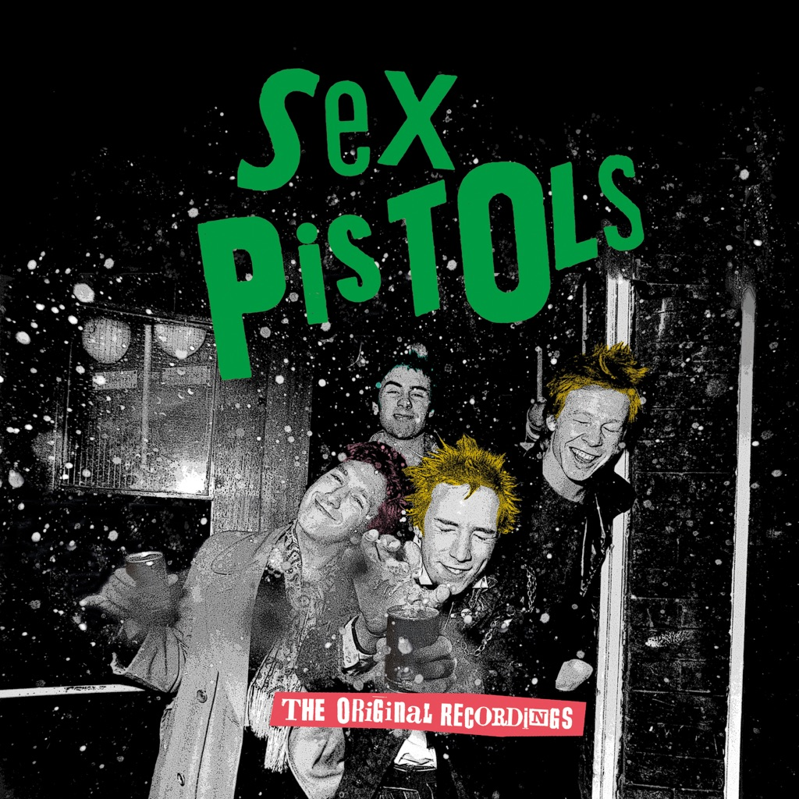

<!-- section break -->

1. Pretty Vacant
2. God Save The Queen
3. Bodies
4. No Feelings
5. I Wanna Be Me
6. Anarchy In The UK
7. Submission
8. No Fun
9. (I'm Not Your) Stepping Stone
10. Holidays In The Sun
11. New York
12. Problems
13. Lonely Boy
14. Silly Things
15. Something Else
16. C'Mon Everybody
17. Satellite
18. Did You No Wrong
19. Substitute
20. My Way

<!-- section break -->

## Spotify


## Release Information
|  Key           | Value                                                |
| ---------------| ---------------------------------------------------- |
| Release Year   | 2022                                   |
| Discogs Link   | [Sex Pistols - The Original Recordings](https://www.discogs.com/release/23371298-Sex-Pistols-The-Original-Recordings) |
| Label          | UMC |
| Format         | Vinyl 2× LP Compilation Stereo (Green) |
| Catalog Number | 455 953-5 |
