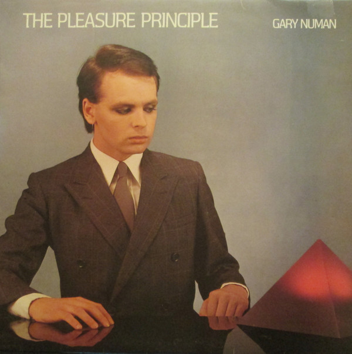

<!-- section break -->

1. Airlane (3:18)
2. Metal (3:33)
3. Complex (3:14)
4. Films (4:09)
5. M.E. (5:37)
6. Tracks (2:52)
7. Observer (2:53)
8. Conversation (7:38)
9. Cars (3:53)
10. Engineers (4:00)

<!-- section break -->

## Spotify


## Videos
### Conversation (Remastered 2009)
 

### More Videos

- [GARY NUMAN PLEASURE PRINCIPLE 1979 Cassette Tape Rip Full Album](https://www.youtube.com/watch?v=KJmujhpDslY)
- [Airlane (Remastered 2009)](https://www.youtube.com/watch?v=4Kv0yLg4LBQ)
- [Metal (Remastered 2009)](https://www.youtube.com/watch?v=ZmZ6_tbLgXM)
- [Complex](https://www.youtube.com/watch?v=QKAb_J_NGyQ)
- [Films (Remastered 2009)](https://www.youtube.com/watch?v=6HbIGk6zH_k)
- [M.E. (Remastered 2009)](https://www.youtube.com/watch?v=-C_ijHitM-Q)
- [Tracks (Remastered 2009)](https://www.youtube.com/watch?v=uTgDYuOmUW0)
- [Observer (Remastered 2009)](https://www.youtube.com/watch?v=iOwiOhBusgs)
- [Cars (Remastered 2009)](https://www.youtube.com/watch?v=LrjM8Fi7J58)
- [Engineers (Remastered 2009)](https://www.youtube.com/watch?v=qW2DML0OCOM)

## Release Information
|  Key           | Value                                                |
| ---------------| ---------------------------------------------------- |
| Release Year   | 1979                                   |
| Discogs Link   | [Gary Numan - The Pleasure Principle](https://www.discogs.com/release/45996-Gary-Numan-The-Pleasure-Principle) |
| Label          | Beggars Banquet |
| Format         | Vinyl LP Album Stereo |
| Catalog Number | BEGA 10 |
| Notes | Comes with a printed inner sleeve (rounded corners) containing album lyrics on one side and band picture on the other.  ℗ 1979 Beggars Banquet. © 1979 A Beggars Banquet Recording. All songs © 1979  Distributed by WEA Records Ltd. A Warner Communications Company.  All titles:- Beggars Banquet / Andrew Heath Music Ltd. |