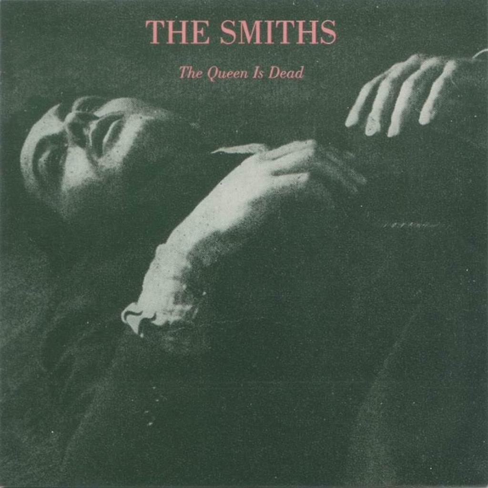

<!-- section break -->

1. 2017 Remastered Album
2. The Queen Is Dead  (6:24)
3. Frankly, Mr. Shankly (2:18)
4. I Know It's Over (5:48)
5. Never Had No One Ever (3:37)
6. Cemetry Gates (2:38)
7. Bigmouth Strikes Again (3:12)
8. The Boy With The Thorn In His Side (3:16)
9. Vicar In A Tutu (2:22)
10. There Is A Light That Never Goes Out (4:03)
11. Some Girls Are Bigger Than Others (3:16)
12. Additional Recordings 
13. The Queen Is Dead (Full Version) (7:14)
14. Frankly, Mr. Shankly (Demo) (2:19)
15. I Know It's Over (Demo) (5:49)
16. Never Had No One Ever (Demo) (4:41)
17. Cemetry Gates (Demo) (3:01)
18. Bigmouth Strikes Again (Demo) (3:07)
19. Some Girls Are Bigger Than Others (Demo) (3:57)
20. The Boy With The Thorn In His Side (Demo Mix) (3:19)
21. There Is A Light That Never Goes Out (Take 1) (4:25)
22. Rubber Ring (Single B-Side) (3:54)
23. Asleep (Single B-Side) (4:02)
24. Money Changes Everything (Single B-Side) (4:41)
25. Unloveable (Single B-Side) (3:56)
26. Live In Boston
27. How Soon Is Now? (5:25)
28. Hand In Glove (2:58)
29. I Want The One I Can't Have (3:24)
30. Never Had No One Ever (3:29)
31. Stretch Out And Wait (3:09)
32. The Boy With The Thorn In His Side (3:34)
33. Cemetry Gates (3:01)
34. Rubber Ring / What She Said / Rubber Ring (4:17)
35. Is It Really So Strange? (3:23)
36. There Is A Light That Never Goes Out (4:09)
37. That Joke Isn't Funny Anymore (4:51)
38. The Queen Is Dead (5:08)
39. I Know It's Over (7:39)

<!-- section break -->

## Spotify


## Videos
### T̶h̶e̶ q̶u̶e̶e̶n̶ i̶s̶ d̶e̶a̶d̶  - T̶h̶e̶ S̶m̶i̶t̶h̶s̶ (̶F̶u̶l̶l̶ a̶l̶b̶u̶m̶)̶ H̶Q̶
 

## Release Information
|  Key           | Value                                                |
| ---------------| ---------------------------------------------------- |
| Release Year   | 2017                                   |
| Discogs Link   | [The Smiths - The Queen Is Dead](https://www.discogs.com/release/11023833-The-Smiths-The-Queen-Is-Dead) |
| Label          | Warner Bros. Records |
| Format         | Box Set Deluxe Edition, Vinyl LP Album Remastered, Vinyl 2× LP Compilation, Vinyl 2× LP Album |
| Catalog Number | 0190295785628 |
| Notes | Round silver hype sticker on shrink: '5 LP BOX SET featuring the 2017 Master of the seminal album, additional recordings and an unreleased live album, all heavyweight vinyl 0190295785628'. All three issued with gatefold sleeve and printed inner sleeves. Made in the EU. |