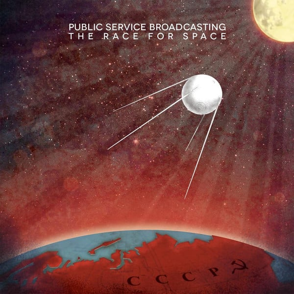

<!-- section break -->

1. The Race For Space
2. Sputnik
3. Gagarin
4. Fire In The Cockpit
5. E. V. A.
6. The Other Side
7. Valentina
8. Go!
9. Tomorrow

<!-- section break -->

## Spotify


## Videos
### PUBLIC SERVICE BROADCASTING - VALENTINA [Ft. SMOKE FAIRIES]
 

### More Videos

- [🔴Public Service Broadcasting – Complete A Side [ The Race For Space LP ]🔴](https://www.youtube.com/watch?v=_87kEpkrDQE)
- [PUBLIC SERVICE BROADCASTING - E.V.A.](https://www.youtube.com/watch?v=PFSq4Q8WDs0)
- [🔴Public Service Broadcasting – Complete B Side [ The Race For Space LP ]🔴](https://www.youtube.com/watch?v=8LbCWtjZ8AI)

## Release Information
|  Key           | Value                                                |
| ---------------| ---------------------------------------------------- |
| Release Year   | 2015                                   |
| Discogs Link   | [Public Service Broadcasting - The Race For Space](https://www.discogs.com/release/6678659-Public-Service-Broadcasting-The-Race-For-Space) |
| Label          | Test Card Recordings |
| Format         | Vinyl LP Album Limited Edition (Clear) |
| Catalog Number | TCRVA02X |
| Notes | Special edition clear vinyl featuring American and Russian reversible gatefold, printed inner-sleeve and full-sized, 8 page booklet.  Download card included. Outer shrink-wrap stickered with track names. Band name and album title only printed onto sleeve.    'This record has been mastered quieter than most modern albums to preserve its dynamics. PSB do not like the loudness wars. Listening to it may therefore require judicious use of the volume knob. Thanks!' |