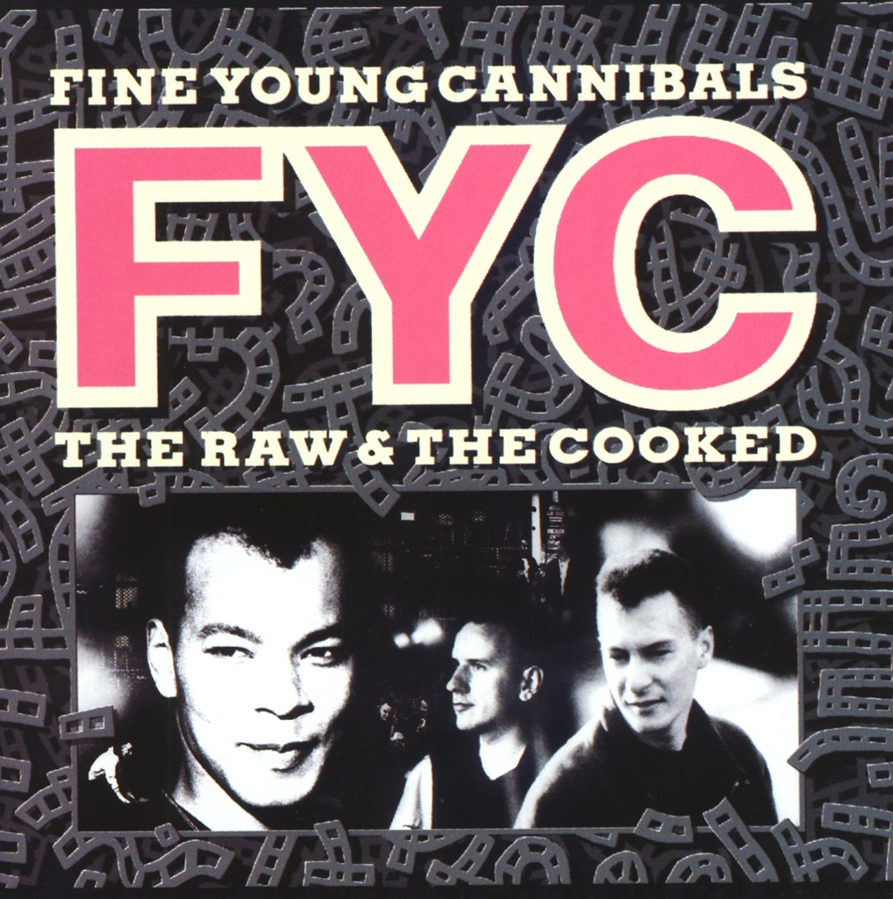

<!-- section break -->

1. She Drives Me Crazy
2. Good Thing
3. I'm Not The Man I Used To Be
4. I'm Not Satisfied
5. Tell Me What
6. Don't Look Back
7. It's OK (It's Alright)
8. Don't Let It Get You Down
9. As Hard As It Is
10. Ever Fallen In Love

<!-- section break -->

## Spotify


## Videos
### As Hard As It Is (Remastered)
 

### More Videos

- [Fine Young Cannibals - The Raw And The Cooked (Full Album)](https://www.youtube.com/watch?v=5-5U4U1bdQQ)
- [Fine Young Cannibals - She Drives Me Crazy  (Official Video)](https://www.youtube.com/watch?v=UtvmTu4zAMg)
- [Fine Young Cannibals - Good Thing (Official Video)](https://www.youtube.com/watch?v=We_9MthGzwk)
- [Fine Young Cannibals - I'm Not Satisfied](https://www.youtube.com/watch?v=Dqvy1Kpk6Pc)
- [Fine Young Cannibals - Don't Look Back](https://www.youtube.com/watch?v=kdTKpC53no8)
- [Fine Young Cannibals - I'm Not the Man I Used to Be](https://www.youtube.com/watch?v=TrBYsPJ0rkA)
- [She Drives Me Crazy (Remastered)](https://www.youtube.com/watch?v=uFLI968mYjE)
- [Good Thing (Remastered)](https://www.youtube.com/watch?v=ytTrfCLniro)
- [I'm Not the Man I Used to Be (Remastered)](https://www.youtube.com/watch?v=BnmDWxqZbKM)
- [I'm Not Satisfied (Remastered)](https://www.youtube.com/watch?v=rAv92AJRpQ4)
- [Tell Me What (Remastered)](https://www.youtube.com/watch?v=CkUSSOnO4NU)
- [Fine Young Cannibals - Don't Look Back](https://www.youtube.com/watch?v=t0VauRGl0f0)
- [It's Ok (It's Alright)](https://www.youtube.com/watch?v=MvmBjzI6KCc)
- [Don't Let It Get You Down (Remastered)](https://www.youtube.com/watch?v=sZgT4I2ALb8)
- [Ever Fallen in Love? (Remastered)](https://www.youtube.com/watch?v=r2l7dvXfjHs)
- [You Never Know (Remastered)](https://www.youtube.com/watch?v=iejcqPeNhls)
- [Social Security (Remastered)](https://www.youtube.com/watch?v=QIUQnClOTm4)

## Release Information
|  Key           | Value                                                |
| ---------------| ---------------------------------------------------- |
| Release Year   | 1989                                   |
| Discogs Link   | [Fine Young Cannibals - The Raw & The Cooked](https://www.discogs.com/release/251670-Fine-Young-Cannibals-The-Raw-The-Cooked) |
| Label          | London Records |
| Format         | Vinyl LP Album |
| Catalog Number | 828 069. 1 |
| Notes | © 1988 FFRR Records Ltd. FFRR Records Limited trading as London Records Limited. A1, A3, A4 & B1 to B3 ℗ 1988 FFRR Records Ltd. A2, A5 & B4 ℗ 1987 Touchstone Pictures B5 ℗ 1987 FFRR Records Ltd.  Publishers: A1, A3, A4, B1 to B3 & B5 - Virgin Music (Pubs.) Ltd. A2, A5 & B4 - Campbell Connelly Issued in a single sleeve and with a printed inner sleeve.  All runout data is stamped. |