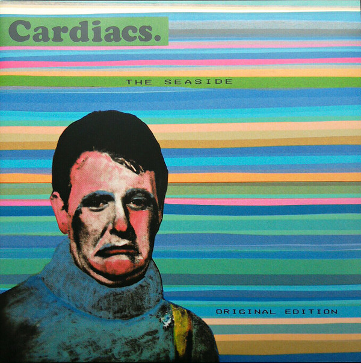

<!-- section break -->

1. Jibber And Twitch
2. Gena Lolla Brigida
3. Hello Mr. Sparrow
4. It's A Lovely Day
5. A Wooden Fish On Wheels
6. Nurses Whispering Verses
7. Is This The Life?
8. A Little Man And A House
9. Hope Day
10. Dinner Time
11. Ice A Spot And A Dot On The Dog
12. R.E.S.
13. To Go Off And Things

<!-- section break -->

## Videos
### Cardiacs - RES Music Video [w/ The Seaside 2015 Reissue Audio] [720]
 

### More Videos

- [Cardiacs -  Jibber and Twitch rehearsal](https://www.youtube.com/watch?v=OxhuQWKwbqY)
- [Cardiacs - To Go Off And Things (1984)](https://www.youtube.com/watch?v=MXZLXBn6UAE)
- [Cardiacs - Nurses Whispering Verses](https://www.youtube.com/watch?v=8WpSRzp6GcE)
- [Cardiacs - As Cold As Can Be In An English Sea rehearsal.](https://www.youtube.com/watch?v=N5QYijFfOaQ)
- [Cardiacs - An Ant rehearsal](https://www.youtube.com/watch?v=V0yTGM4D1io)
- [Cardiacs - A Little Man and His House Music Video [w/ The Seaside 2015 Reissue Audio] [720]](https://www.youtube.com/watch?v=LSbRmyVMRhU)
- [Cardiacs - To Go Off and Things Music Video [w/ The Seaside 2015 Reissue Audio] [720]](https://www.youtube.com/watch?v=4vM9-0Fhea4)

## Release Information
|  Key           | Value                                                |
| ---------------| ---------------------------------------------------- |
| Release Year   | 2015                                   |
| Discogs Link   | [Cardiacs - The Seaside (Original Edition)](https://www.discogs.com/release/7622910-Cardiacs-The-Seaside-Original-Edition) |
| Label          | Alphabet (3) |
| Format         | Vinyl 2× LP Album Remastered |
| Catalog Number | ALPH LP 001 |
| Notes | 2015 remastered "Original Edition"  Remastered from the original tapes with all 13 original tracks restored and committed to heavy double vinyl. Lovingly recreated artwork with unseen photography in gatefold format. Download voucher includes three alternate version of 'Gena Lolla Brigida', 'Hope Day' and 'Jibber and Twitch' from the 1995 reissue.   Originally released in 1984 as [url=http://www.discogs.com/Cardiacs-The-Seaside/release/4391932]ALPH 001[/url] Record at Crow Studios, Surbition, Surrey, England. Transferred from the original analogue tapes at FX Copyroom. Remastered at Golden Digital No 1 Studio, Prague, July 2015.   © 1984 The Alphabet Business Concern.  |