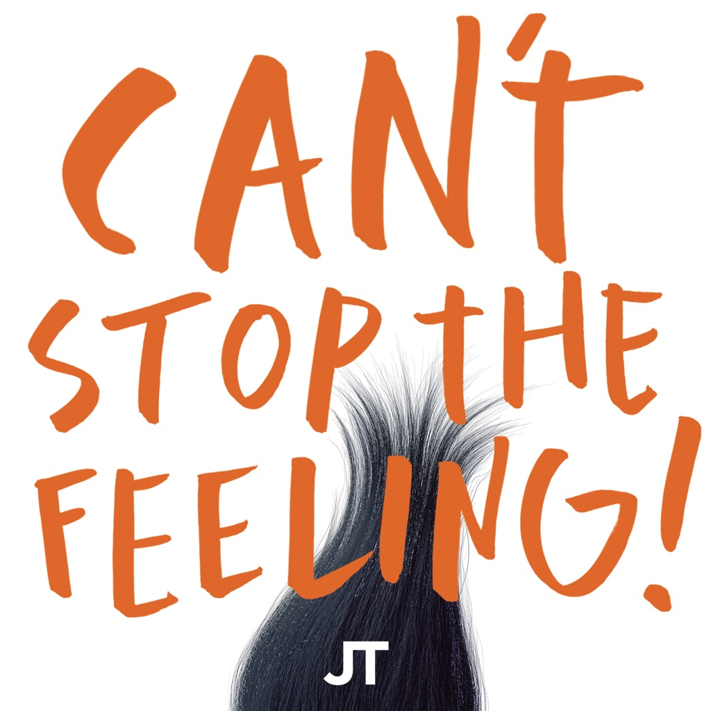

<!-- section break -->

1. Soul Desert
2. She Brings The Rain
3. Spoon
4. Shikako Maru Ten
5. Turtles Have Short Legs
6. Halleluwah (Edit)
7. Vitamin C
8. I'm So Green
9. Mushroom
10. Moonshake
11. Future Days (Edit)
12. Dizzy Dizzy (Edit)
13. Splash (Edit)
14. Hunters And Collectors (Edit)
15. Vernal Equinox (Edit)
16. I Want More
17. ...And More
18. Silent Night
19. Cascade Waltz
20. Don't Say No (Edit)
21. Return
22. Can Can
23. Hoolah Hoolah (Edit)

<!-- section break -->

## Spotify


## Videos
### Can - Turtles Have Short Legs (Official Audio)
 

### More Videos

- [Can - Soul Desert (Official Audio)](https://www.youtube.com/watch?v=TECyopdL4fI)
- [Can -  She Brings The Rain (Official Audio)](https://www.youtube.com/watch?v=xiuuSoPphxI)
- [Can - Spoon (Official Audio)](https://www.youtube.com/watch?v=l6PH7a4RptU)
- [Can - Shikako Maru Ten (Official Audio)](https://www.youtube.com/watch?v=jNnilECnMpw)
- [Can - Halleluwah (Edit) (Official Audio)](https://www.youtube.com/watch?v=ry_3f0q8QZE)
- [Can - Vitamin C (Official Audio)](https://www.youtube.com/watch?v=zrkUiCugQDE)
- [Can - I'm So Green (Official Audio)](https://www.youtube.com/watch?v=Q6l8HwHde1M)
- [Can - Mushroom (Official Audio)](https://www.youtube.com/watch?v=cR5gYbQzr5s)
- [Can - Moonshake (Official Audio)](https://www.youtube.com/watch?v=IL4B69x8X7s)
- [Can - Future Days (Edit) (Official Audio)](https://www.youtube.com/watch?v=NNdAhHQNDcg)
- [Can - Dizzy Dizzy (Edit) (Official Audio)](https://www.youtube.com/watch?v=SW2nrz8bgoA)
- [Can - Splash (Edit) (Official Audio)](https://www.youtube.com/watch?v=HtX9AAQak44)
- [Can - Hunters And Collectors (Edit) (Official Audio)](https://www.youtube.com/watch?v=8Y2K1TSQcPg)
- [Can - Vernal Equinox (Edit) (Official Audio)](https://www.youtube.com/watch?v=jEUfuOY0XUQ)
- [Can - I Want More (Official Audio)](https://www.youtube.com/watch?v=2yWItRfjg8w)
- [Can - ...And More (Official Audio)](https://www.youtube.com/watch?v=fB1k0-RKecU)
- [Can - Silent Night (Official Audio)](https://www.youtube.com/watch?v=t04ANDPU42Y)
- [Can - Cascade Waltz (Official Audio)](https://www.youtube.com/watch?v=cAnPP7wfGUs)
- [Can - Don't Say No (Edit) (Official Audio)](https://www.youtube.com/watch?v=KVt6i-ks5pg)
- [Can - Return (Official Audio)](https://www.youtube.com/watch?v=PTKdCqMbrdo)
- [Can - Can (Official Audio)](https://www.youtube.com/watch?v=P05K2T8kdaU)
- [Can - Hoolah Hoolah (Edit) (Official Audio)](https://www.youtube.com/watch?v=EllzyiHzrRE)

## Release Information
|  Key           | Value                                                |
| ---------------| ---------------------------------------------------- |
| Release Year   | 2017                                   |
| Discogs Link   | [Can - The Singles](https://www.discogs.com/release/10434382-Can-The-Singles) |
| Label          | Spoon Records |
| Format         | Vinyl 3× LP Compilation |
| Catalog Number | SPOON60 |
| Notes | Issued in tri-fold sleeve with download code.  Made in the EU.  This Compilation 2017 Spoon Records und exclusive license to Mute Artists Limited for the world outside Germany |