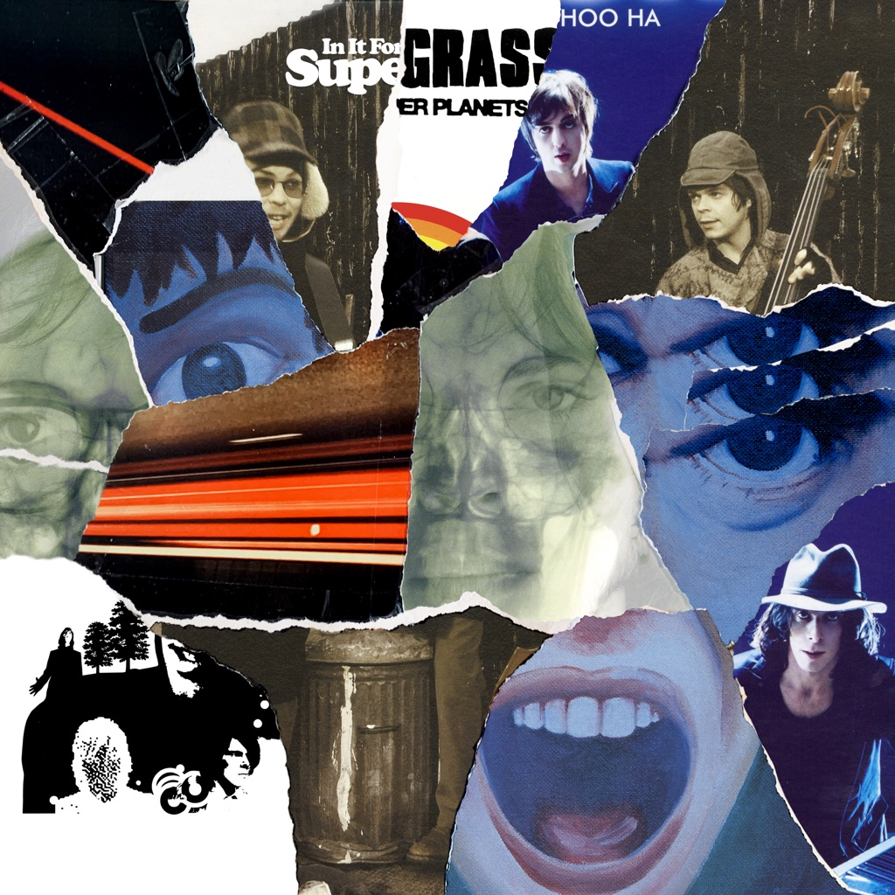

<!-- section break -->

1. Rarities, Remixes & B-Sides
2. Caught By The Fuzz (Backbeat Version)
3. Strange Ones (Backbeat Version)
4. Caught By The Fuzz (Acoustic)
5. Odd?
6. Wait For The Sun
7. Sex!
8. Condition
9. Je Suis Votre Papa Sucre
10. Melanie Davis
11. Sometimes We're Very Sad
12. Nothing More's Gonna Get In My Way
13. 20ft Halo
14. Sun Hits The Sky (Bently Rhythm Ace Remix)
15. Some Girls Are Bigger Than Others
16. Don't Be Cruel
17. The Animal
18. We Still Need More (Than Anyone Can Give)
19. We Still Need More (Than Anyone Can Give) (Dust Brothers Recording)
20. Sick
21. What A Shame
22. Lucky (No Fear)
23. You'll Never Walk Again
24. You Too Can Play Alright
25. Believer
26. Faraway (Acoustic)
27. Oracle
28. Velvetine
29. Electric Cowboy
30. Tishing In Windows (Kicking In Doors)
31. That Old Song
32. The Loner
33. I Told The Truth
34. Everytime
35. Kiss Of Life (Tom Tom Club Mix)
36. We Dream Of This
37. Fin (Dave Eringa Alternative Mix)
38. Car Crash
39. I Believe In Love
40. Live
41. Mark Radcliffe BBC Radio Session 24th October 1994
42. Mark Radcliffe Introduction
43. Strange Ones
44. Time
45. Interview
46. Sitting Up Straight
47. Lenny
48. RDS Arena Dublin, 22nd June 1996
49. Shane O'Donoghue Introduction
50. Lenny
51. Caught By The Fuzz
52. Sitting Up Straight
53. I'd Like To Know
54. Odd?
55. Lose It 
56. Richard III
57. Strange Ones
58. Time
59. Alright
60. We're Not Supposed To
61. She's So Alone
62. Melanie Davis
63. Going Out
64. Glastonbury Festival, 26th June 1997
65. I'd Like To Know
66. Richard III
67. Sitting Up Straight
68. Cheapskate
69. Time 
70. Alright
71. Odd?
72. In It For The Money
73. Tonight
74. You Can See Me
75. Caught By The Fuzz
76. Going Out
77. It's Not Me
78. Sun Hits The Sky
79. Strange Ones
80. Lenny
81. Reading Festival, 29th August 1998
82. Out Of The Blue
83. Alright
84. In It For The Money
85. Richard III
86. Sun Hits The Sky
87. Going Out
88. T In The Park, 9th July 2000
89. Mary 
90. Alright
91. Time
92. Jesus Came From Outta Space
93. Sick
94. Faraway
95. Sun Hits The Sky
96. Going Out
97. Caught By The Fuzz
98. Reading Festival, 25th August 2001
99. Steve Lamacq Introduction
100. Pumping On Your Stereo
101. Caught By The Fuzz
102. Moving
103. Can't Get Up
104. Beautiful Prople
105. Late In The Day
106. Lose It
107. Funniest Thing
108. Richard III
109. Going Out
110. Sun Hits The Sky
111. Lenny
112. Radio Kerrang! Session, 10th August 2005
113. St. Petersburg
114. Late In The Day
115. Seen The Light
116. Sitting Up Straight
117. Ronnie Scott's Jazz Club, London, 18th August 2005
118. Kiss Of Life
119. Tales Of Endurance (Parts 4, 5 & 6)
120. Roxy
121. Moving
122. Low C
123. Road To Rouen
124. Bullet
125. Sun Hits The Sky
126. Fin
127. Mary
128. Later With Jools Holland, 29th February 2008
129. Diamond Hoo Ha Man
130. Bad Blood
131. Rebel In You
132. Shepherd's Bush Empire, London, 10th December 2008
133. The Return Of...
134. Ghost Of A Friend
135. Outside
136. Roots & Vines (Demos, Out-Takes & Oddities)
137. Sitting Up Straight (4 Track Demo)
138. Caught By The Fuzz (4 Track Demo)
139. Lose It (4 Track Demo)
140. Richard III (4 Track Demo)
141. Out Of The Blue (Studio Recording Monitor Mix)
142. Moving (8 Track Demo)
143. Sun Hits The Sky (Acoustic Radio Session, Studio Brussel, 2002)
144. Stinkfinger (Studio Recording Monitor Mix)
145. Dark Star (Studio Recording)
146. Brecon Beacons (Rehearsal Room Demo)
147. Can't Get Up (Mini-Disc)
148. Funniest Thing (4 Track Demo)
149. Orbiting Around The World (Mini-Disc)
150. Sad Girl (Radio Kerrang! 105.2, Birmingham, 2005)
151. Road To Rouen (Studio Outtake)
152. Fin (Live At UEA, Norwich, 2005)
153. Car Crash (Rehearsal Room Demo)
154. Next To You (Studio Recording Monitor Mix)
155. Bury My Heart (Demo)
156. 345 (Demo)
157. Tronic (Demo)
158. The Studio Albums
159. I Should Coco
160. I'd Like To Know
161. Caught By The Fuzz
162. Mansize Rooster
163. Alright
164. Lose It
165. Lenny
166. Strange Ones
167. Sitting Up Straight
168. She's So Loose
169. We're Not Supposed To
170. Time
171. Sofa (Of My Lethargy)
172. Time To Go
173. In It For The Money
174. In It For The Money 
175. Richard III 
176. Tonight 
177. Late In The Day 
178. G-Song 
179. Sun Hits The Sky 
180. Going Out 
181. It's Not Me 
182. Cheapskate 
183. You Can See Me 
184. Hollow Little Reign
185. Sometimes I Make You Sad
186. Supergrass
187. Moving
188. Your Love
189. What Went Wrong (In Your Head)
190. Beautiful People
191. Shotover Hill
192. Eon
193. Mary
194. Jesus Came From Outta Space
195. Pumping On Your Stereo
196. Born Again
197. Faraway
198. Mama And Papa
199. Life On Other Planets
200. Za
201. Rush Hour Soul
202. Seen The Light
203. Brecon Beacons
204. Can't Get Up
205. Evening Of The Day
206. Never Done Nothing Like That Before
207. Funniest Thing
208. Grace
209. LA Song
210. Prophet 15
211. Run
212. Road To Rouen
213. Tales Of Endurance (Parts 4, 5 & 6)
214. St. Petersburg
215. Sad Girl
216. Roxy
217. Coffee In The Pot
218. Road To Rouen
219. Kick In The Teeth
220. Low C
221. Fin
222. Diamond Hoo Ha
223. Diamond Hoo Ha Man
224. Bad Blood
225. Rebel In You
226. When I Needed You
227. 345
228. The Return Of...
229. Rough Knuckles
230. Ghost Of A Friend
231. Whiskey And Green Tea
232. Outside 
233. Butterfly
234. I Should Coco
235. I'd Like To Know
236. Caught By The Fuzz
237. Mansize Rooster
238. Alright
239. Lose It
240. Lenny
241. Strange Ones
242. Sitting Up Straight
243. She's So Loose
244. We're Not Supposed To
245. Time
246. Sofa (Of My Lethargy)
247. Time To Go
248. In It For The Money
249. In It For The Money
250. Richard III
251. Tonight
252. Late In The Day
253. G-Song
254. Sun Hits The Sky
255. Going Out
256. It's Not Me
257. Cheapskate
258. You Can See Me
259. Hollow Little Reign
260. Sometimes I Make You Sad
261. Supergrass
262. Moving
263. Your Love
264. What Went Wrong (In Your Head)
265. Beautiful People
266. Shotover Hill
267. Eon
268. Mary
269. Jesus Came From Outta Space
270. Pumping On Your Stereo
271. Born Again
272. Faraway
273. Mama And Papa
274. Life On Other Planets 
275. Za
276. Rush Hour Soul
277. Seen The Light
278. Brecon Beacons
279. Can't Get Up
280. Evening Of The Day
281. Never Done Nothing Like That Before
282. Funniest Thing
283. Grace
284. LA Song
285. Prophet 15
286. Run
287. Road To Rouen 
288. Tales Of Endurance (Parts 4, 5 & 6)
289. St. Petersburg
290. Sad Girl
291. Roxy
292. Coffee In The Pot
293. Road To Rouen
294. Kick In The Teeth
295. Low C
296. Fin
297. Diamond Hoo Ha 
298. Diamond Hoo Ha Man
299. Bad Blood
300. Rebel In You
301. When I Needed You
302. 345
303. The Return Of...
304. Rough Knuckles
305. Ghost Of A Friend
306. Whiskey And Green Tea
307. Outside
308. Butterfly
309. 2020 Remixes Single
310. Caught By The Fuzz (Danny Goffey 2020 Remix)
311. Richard III (Cousn 2020 Remix)

<!-- section break -->

## Spotify


## Videos
### Supergrass - Diamond Hoo Ha Man (Official HD Video)
 

### More Videos

- [Strange Ones](https://www.youtube.com/watch?v=aJsVw_PyTGs)
- [Supergrass - Alright (Official HD Video)](https://www.youtube.com/watch?v=qUE4oDunYkc)
- [Supergrass - Bad Blood (Official HD Video)](https://www.youtube.com/watch?v=WZhinVDm9yM)

## Release Information
|  Key           | Value                                                |
| ---------------| ---------------------------------------------------- |
| Release Year   | 2020                                   |
| Discogs Link   | [Supergrass - The Strange Ones 1994-2008 ](https://www.discogs.com/release/14711503-Supergrass-The-Strange-Ones-1994-2008-) |
| Label          | BMG |
| Format         | CD 2× Compilation, CD 5×, CD 6× Album Reissue, Vinyl 6× LP Album Picture Disc Reissue (180 GMS), Vinyl 7" 45 RPM Single, Box Set Compilation Deluxe Edition Limited Edition |
| Catalog Number | BMGCAT377BOX |
| Notes | Labelled as "Limited Edition Super Deluxe Box Set" on sticker on shrink wrap.  2-part, rigid, 12″ x 12” x 3″ box, matte laminate outer finish with hot foil cover text, containing: 13 CDs – 1 x 2CD set – Remixes, B-sides, acoustic versions and other rarities (BMGCAT377BOX-1) – 1 x 4CD set – Live (5 hours of previously unreleased, career-spanning performances: radio sessions, full live shows & acoustic sets) (BMGCAT377BOX-2) – 1 x 1CD set – Demos, out-takes and oddities (all previously unreleased) (BMGCAT377BOX-3) – 1 x 6CD set – All 6 original studio albums in new digipack (BMGCAT377BOX-4) 6 LPs – 6 x original albums as picture discs: I SHOULD COCO (BMGCAT328SV) / IN IT FOR THE MONEY (BMGCAT329SV) / SUPERGRASS (BMGCAT330SV) / LIFE ON OTHER PLANETS (BMGCAT331SV) / ROAD TO ROUEN (BMGCAT332SV) / DIAMOND HOO HA (BMGCAT333SV) 7” single – Caught By The Fuzz / Richard III (2020 Remixes) (BMGCAT377BOXSV) Book – 12″ x 12″  52-page book. Story of each album, written by separate journalists: Everett True, Charles Shaar Murray, Sylvia Patterson, Andrew Male, Adam Sweeting and Paul Moody. Quotes from new band interviews with Matt Everitt. Unseen photos and memorabilia. Colour posters x 4 Supergrass is 10 – button badges x 8  Rarities, Remixes & B-Sides originally were released on the UK singles (except where noted): 1-1 to 1-3 Caught By The Fuzz 1-4 Mansize Rooster 1-5 to 1-6 Lenny 1-7 to 1-8 Alright/Time 1-9 Going Out 1-10 to 1-12 Richard III 1-11 to 1-14 Sun Hits The Sky (1-13 was a promo only remix, also on a Ministry of Sound compilation mix album by [a=Bentley Rhythm Ace]) 1-15 to 1-17 Late In The Day 2-1 "Dead Man On Campus" Soundtrack  2-2 to 2-5 Pumping On Your Stereo 2-6 to 2-8 Moving 2-9 "Mike Bassett: England Manager" OST 2-10 to 2-13 Grace 2-14 to 2-15 See The Light 2-16 Rush Hour Soul 2-17 to 2-18 Kiss Of Life 2-19 Previously unreleased version  2-20 Rebel In You 2-21 Sofa (Of My Lethargy)  3-5 was previously released on [r785638]  4-2 was previously released on [r3207958]  A near comprehensive collection of Supergrass' entire output.  It does omit a few studio recordings, B-sides, live recordings, rarities and remixes including:   Studio Recordings:  - Kiss of Life  - It's Not Me (Demo) from Late In The Day UK single  - Cheapskate (US Version) - Cover of [a=Jimi Hendrix]'s Stone Free which were was issued as a bonus 7" to the original UK vinyl release of I Should Coco - Various demos and outtakes that were included on the 20th anniversary edition of I Should Coco  - The one-off band called Crisis for the charity Crisis (which featured Supergrass (minus Mickey) alongside [a=Paul Weller] and [a=Beth Ditto] and [a=The Enemy (2)]): "Consequences"   Remixes: - The Tom Tom Club Dirty Mix plus both Chicken Lips remixes from the Kiss Of Life promos  - East Is East Mix (from the OST of East Is East) of Moving  Instrumentals - Sofa (Of My Lethargy) (featured on the 20th anniversary edition of I Should Coco) - Diamond Hoo Ha Man (from the single promo) - Bad Blood (from the single promo) - Rebel In You (from the single promo)  Live Recordings & Sessions: - Odd? (Maida Vale John Peel Radio 1 Session) which was issued as a bonus 7" to the original UK vinyl release of I Should Coco - The Bath Moles and La Route Du Rock, Saint Malo live recordings from the 20th anniversary UK I Should Coco release - Evening Session recording of Caught By The Fuzz from [r1135468] - Jools Holland recording of Alright from [r1347163] - Glastonbury 1995 recording of Caught By The Fuzz from [r1070468] - Glastonbury 2003 recording of Pumping on Your Stereo from [m763663] - Triple J Live at the Wireless recording of Caught By The Fuzz from [r10498721] - 2 Metre Dutch radio session of Jesus Came From Outer Space from [r1890333] - Evening Session recording of Late In The Day from [r6413239] - Various live recordings from the '2002 Live' promo - The Glasgow Plaza live recordings of Strange Ones, She's So Loose, Lose It and a cover of [a=The Kinks] Where Have All The Good Times Gone? from the Japanese Alright EP (Stranges Ones was also on the Going Out UK single and She's So Loose was also on the Going Out Australian single) - Sun Hits The Sky (Radio 1 evening session version) from the Sun Hits The Sky UK single - Various live recordings (Pinkpop Festival & VPRO recordings) from the Sun Hits The Sky Dutch single  - The Peel Acre live recordings and Lamaq live recording from the Mary UK singles  - The Shepherd's Bush & Oslo live recordings from the Seen The Light UK DVD single  - Low C (Live Acoustic) from Oxford from the Low C single  - The live acoustic cover of [a=Gil Scott-Heron]'s of Lady Day & John Coltrane at Ronnie Scott's from the Low C DVD single  - The Portsmouth Pyramid live recordings from the St Petersburg single  - Fin (Live acoustic from Jonathan Ross' Radio 2 show) from the Fin single  - [a=Diamond Hoo Ha Men] cover of [a=Michael Jackson]'s Beat It from the Bad Blood single (live on XFM) - [a=Diamond Hoo Ha Men] version of Bad Blood (live on DHHM) from the Bad Blood single  - Guilfest 2007 recording of Diamond Hoo Ha Man released as a download only track  - The iTunes 2007 Diamond Hoo Ha Men live recordings from the Apple Store on Regent Street, London - The iTunes 2007 recordings from the Apple Store in San Francisco  - Bad Blood live recording from [r1368751] |