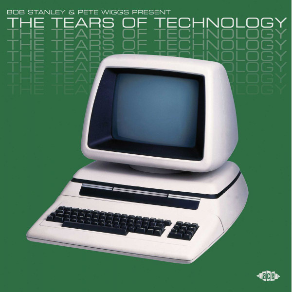

<!-- section break -->

1. Jean Walks In Fresh Fields (1:48)
2. Grey Skies (4:17)
3. Real To Real (2:49)
4. Tidal Flow (3:51)
5. An Evening In The Ray (2:48)
6. The Winds (5:10)
7. Youth (3:14)
8. Europe After The Rain (3:58)
9. Personal Loss (2:51)
10. Lights Of April (2:19)
11. Sealand (7:42)
12. Private Plane (3:58)
13. Direct Lines (3:51)
14. Unless (4:38)
15. October (Love Song) (3:51)
16. A Map Of You (3:48)
17. WXJL Tonight (4:35)
18. Christiana (3:36)
19. Tiny Children (3:49)
20. Behind The Shades (5:55)
21. Feather Bed (3:02)

<!-- section break -->

## Videos
### Sealand (2003 Digital Remaster)
 

### More Videos

- [China Crisis - Jean Walks in Fresh Fields](https://www.youtube.com/watch?v=d7Mf_mxnsjg)
- [Turquoise Days - Grey Skies](https://www.youtube.com/watch?v=GqpL5iNa4rA)
- [Reel To Real (Remastered 2002)](https://www.youtube.com/watch?v=ACV2n3lJxFs)
- [Illustration - Tidal Flow](https://www.youtube.com/watch?v=zs_BTg2FQTc)
- [An Evening In The Ray](https://www.youtube.com/watch?v=pqhTGaRRXSg)
- [The Turquoise Swimming Pools - The Winds](https://www.youtube.com/watch?v=zwa54ZlE25Y)
- [Youth](https://www.youtube.com/watch?v=2ikFs0cwqp0)
- [John Foxx - Europe After The Rain (HQ)](https://www.youtube.com/watch?v=DFjkOWigb-M)
- [Patrik Fitzgerald - Personal Loss](https://www.youtube.com/watch?v=GMVLCp183Ks)
- [Eyeless In Gaza - Light of April](https://www.youtube.com/watch?v=3OoJWs5wtfM)
- [THOMAS LEER private plane 1978](https://www.youtube.com/watch?v=sehOKE4vNGE)
- [The Electronic Circus   Direct Lines 1981](https://www.youtube.com/watch?v=n9uLSLUxHzU)
- [Pale Fountains - Unless - 1983](https://www.youtube.com/watch?v=pAOi3hmA3Cw)
- [Chris & Cosey - October Love Song](https://www.youtube.com/watch?v=2jJ0P06zx78)
- [New Musik - A Map Of You](https://www.youtube.com/watch?v=xvARmk0cML0)
- [WXJL Tonight (2003 Digital Remaster)](https://www.youtube.com/watch?v=mvDPlDVP-iI)
- [Paul Haig - Christiana](https://www.youtube.com/watch?v=L3IdU1ATLWo)
- [Oppenheimer Analysis - Behind The Shades](https://www.youtube.com/watch?v=YGc5oF4tn9E)
- [Trevor Bastow - feather bed](https://www.youtube.com/watch?v=obMWwz1M5NE)

## Release Information
|  Key           | Value                                                |
| ---------------| ---------------------------------------------------- |
| Release Year   | 2020                                   |
| Discogs Link   | [Bob Stanley - The Tears Of Technology](https://www.discogs.com/release/14861335-Bob-Stanley-Pete-Wiggs-The-Tears-Of-Technology) |
| Label          | Ace |
| Format         | Vinyl 2× LP Compilation Limited Edition (White) |
| Catalog Number | XXQLP2068W |
| Notes | The copyrights in these sound recordings are owned by the copyright owners listed inside and are licensed to Ace Records Ltd  This compilation P & C 2020 Ace Records Ltd  White Vinyl version exclusive to Rough Trade in the UK.   Side One label credits A3 to "Imple Minds"; Side Four Label credits D to "Revor Bastow"   |