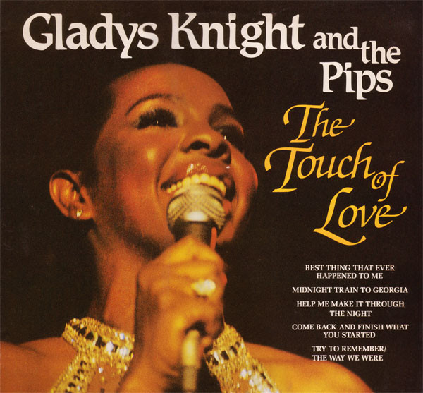

<!-- section break -->

1. The Look Of Love
2. Best Thing That Ever Happened To Me
3. Perfect Love
4. Midnight Train To Georgia
5. The One And Only
6. Sorry Doesn't Always Make It Right
7. So Sad The Song
8. Home Is Where The Heart Is
9. Help Me Make It Through The Night
10. Baby Don't Change Your Mind
11. I Feel A Song In My Heart
12. Where Peaceful Waters Flow
13. We Don't Make Each Other Laugh Any More
14. Nobody But You
15. Come Back And Finish What You Started
16. Try To Remember / The Way We Were

<!-- section break -->

## Release Information
|  Key           | Value                                                |
| ---------------| ---------------------------------------------------- |
| Release Year   | 1980                                   |
| Discogs Link   | [Gladys Knight And The Pips - The Touch Of Love](https://www.discogs.com/release/2171568-Gladys-Knight-And-The-Pips-The-Touch-Of-Love) |
| Label          | K-Tel |
| Format         | Vinyl LP Compilation |
| Catalog Number | NE 1090 |
| Notes | Produced in association with PYE and Buddah Records.  This version differs to [r13604417]: the other release shows a black K-Tel logo in the bottom left of the front sleeve, and WEA in the runouts. |