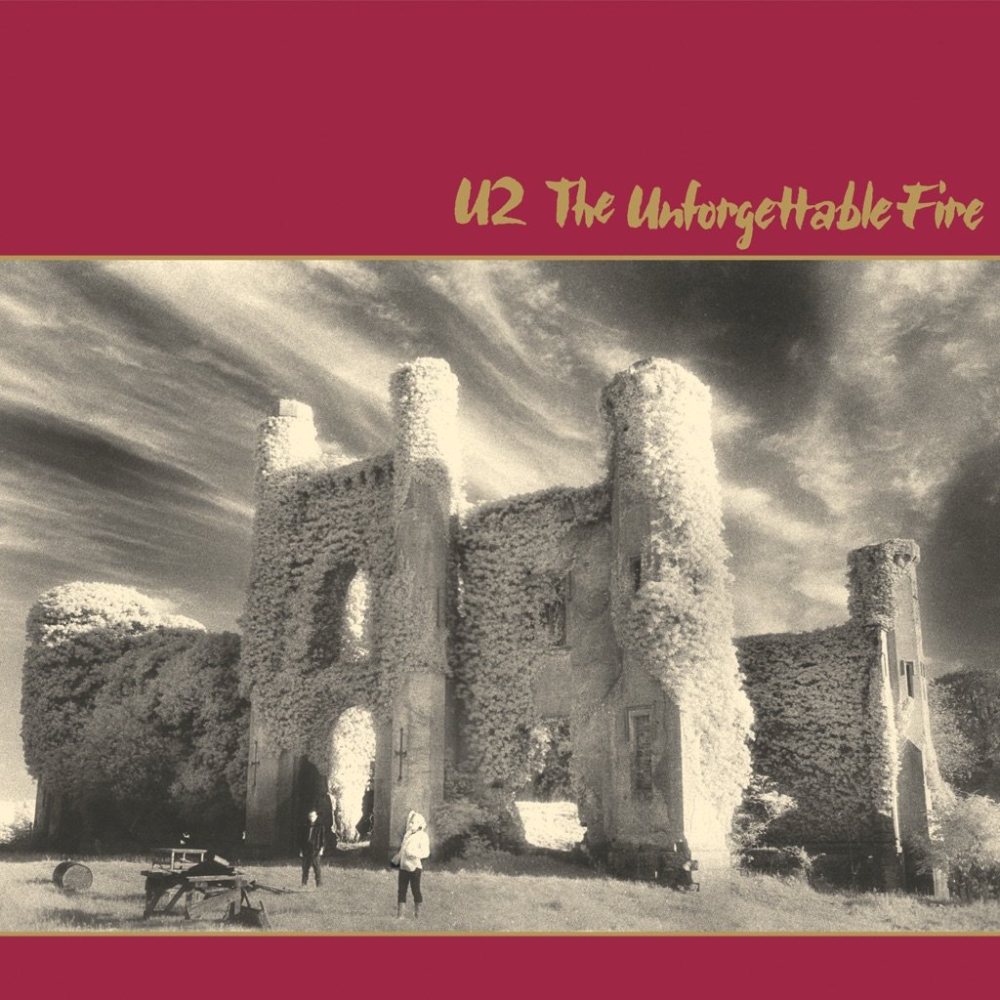

<!-- section break -->

1. A Sort Of Homecoming
2. Pride (In The Name Of Love)
3. Wire
4. The Unforgettable Fire
5. Promenade
6. 4th Of July
7. Bad
8. Indian Summer Sky
9. Elvis Presley And America
10. MLK

<!-- section break -->

## Spotify


## Videos
### U2 - Pride (In The Name Of Love) (European Reissue CD)
 

## Release Information
|  Key           | Value                                                |
| ---------------| ---------------------------------------------------- |
| Release Year   | 2019                                   |
| Discogs Link   | [U2 - The Unforgettable Fire](https://www.discogs.com/release/13734008-U2-The-Unforgettable-Fire) |
| Label          | Mercury |
| Format         | Vinyl LP Album Limited Edition Reissue (Burgundy, 180g) |
| Catalog Number | 1792416 |
| Notes | 35th Anniversary Colour stated as "wine" on release. Includes 16 page booklet with lyrics  Exclusive retailers in multiple territories:  UK - HMV Australia - JB HiFi Canada - Sunrise Records France - FNAC US - [l1052727] |