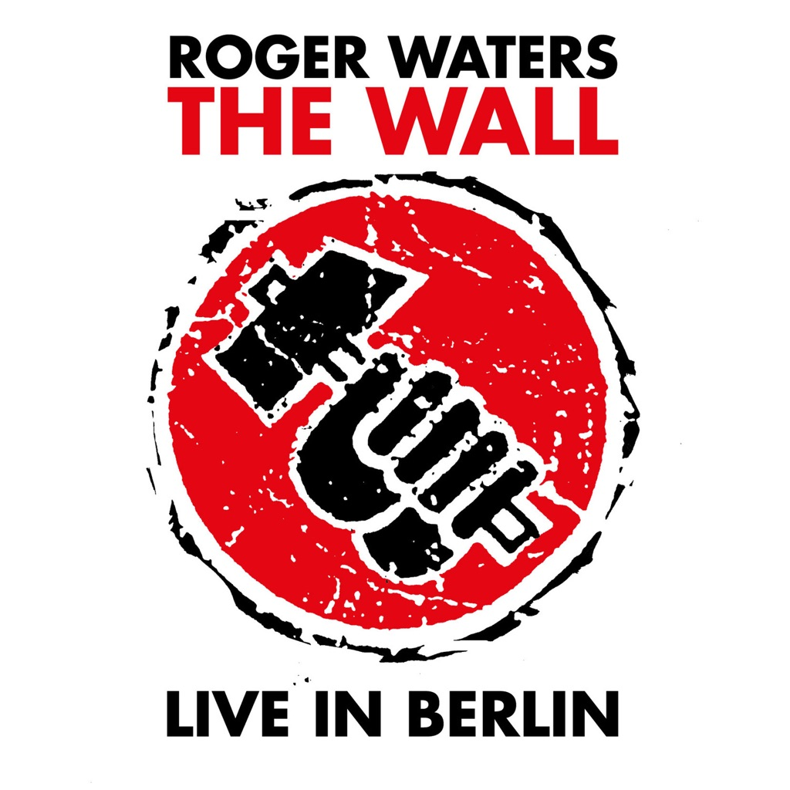

<!-- section break -->

1. Part One
2. In The Flesh?
3. The Thin Ice
4. Another Brick In The Wall (Part 1)
5. The Happiest Days Of Our Lives
6. Another Brick In The Wall (Part 2)
7. Mother
8. Goodbye Blue Sky
9. Empty Spaces
10. Young Lust
11. Oh My God - What A Fabulous Room / One Of My Turns
12. Don't Leave Me Now
13. Another Brick In The Wall (Part 3)
14. Goodbye Cruel World
15. Part Two
16. Hey You
17. Is There Anybody Out There?
18. Nobody Home
19. Vera
20. Bring The Boys Back Home
21. Comfortably Numb
22. In The Flesh
23. Run Like Hell
24. Waiting For The Worms
25. Stop
26. The Trial
27. Encore
28. The Tide Is Turning

<!-- section break -->

## Spotify


## Release Information
|  Key           | Value                                                |
| ---------------| ---------------------------------------------------- |
| Release Year   | 2020                                   |
| Discogs Link   | [Roger Waters - The Wall (Live In Berlin)](https://www.discogs.com/release/15928391-Roger-Waters-The-Wall-Live-In-Berlin) |
| Label          | UMC |
| Format         | Vinyl 2× LP Album Record Store Day Limited Edition Reissue Stereo (Clear, 180 gram, 30th Anniversary Edition) |
| Catalog Number | 0602508538506 |
| Notes | Record Store Day - RSD Drops Sep 26th 2020 Quantity: 8.000 copies Gatefold cover with records housed in printed inner sleeves. Includes a download card.  Global, worldwide release.  Some copies do not have a hype sticker. Some copies did not include a download card.  Title on the spine: The Wall - Live In Berlin 1990  Back cover: Roger Waters : The Wall Saturday 21st July 1990  Made in the EU.  Label rim text: Made In The EU.  Runouts are etched. In runouts, all Optimal plating symbols may be inverted (e.g., “⊥” vs “T”) and/or mirrored (e.g., “1△” vs “△↾”). For example, the following have been entered as mirrored: Variant 2: side A: "1II"; side B: "1△"; side C: "4I="; side D: "1IV" and in variant 3: side A: "1△". |