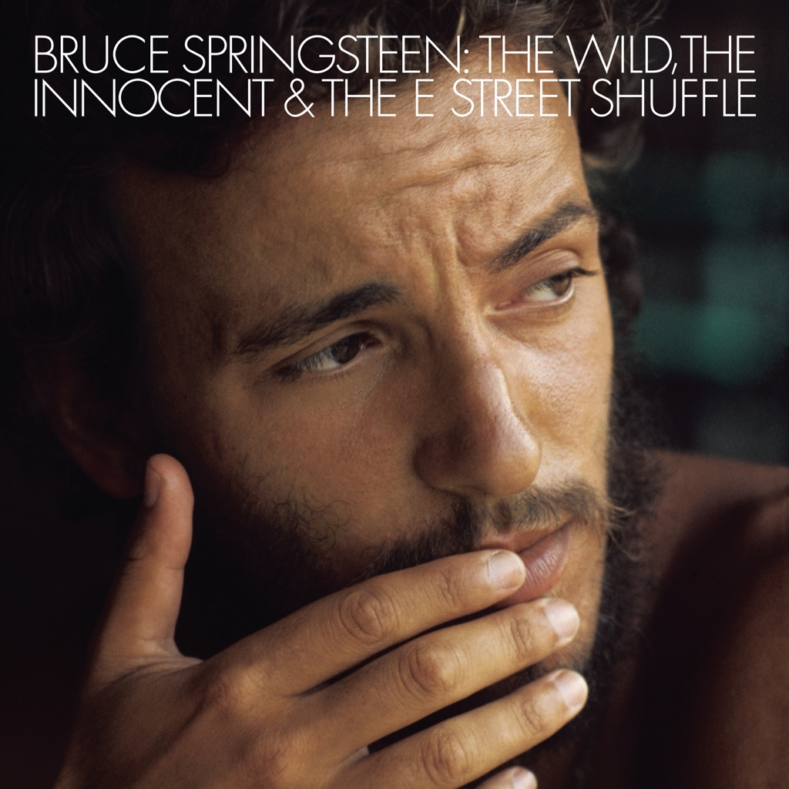

<!-- section break -->

1. The E Street Shuffle (4:26)
2. 4th Of July, Asbury Park (Sandy) (5:35)
3. Kitty's Back (7:07)
4. Wild Billy's Circus Story (4:43)
5. Incident On 57th Street (7:45)
6. Rosalita (Come Out Tonight) (7:02)
7. New York City Serenade (9:56)

<!-- section break -->

## Spotify


## Videos
### Rosalita (Come Out Tonight)
 

### More Videos

- [The E Street Shuffle](https://www.youtube.com/watch?v=LWLMaZ7H3B0)
- [4th of July, Asbury Park (Sandy)](https://www.youtube.com/watch?v=EiGfB0QBTV4)
- [Kitty's Back](https://www.youtube.com/watch?v=bLulUBjiIIc)
- [Wild Billy's Circus Story](https://www.youtube.com/watch?v=CM8XT4Qk1bQ)
- [Incident on 57th Street](https://www.youtube.com/watch?v=ioQcvijom28)
- [New York City Serenade](https://www.youtube.com/watch?v=fEQENfRoBgw)

## Release Information
|  Key           | Value                                                |
| ---------------| ---------------------------------------------------- |
| Release Year   | 1975                                   |
| Discogs Link   | [Bruce Springsteen - The Wild, The Innocent &  The E Street Shuffle](https://www.discogs.com/release/5153034-Bruce-Springsteen-The-WildInnocent-The-E-Street-Shuffle) |
| Label          | CBS |
| Format         | Vinyl LP Album Reissue |
| Catalog Number | S 65780 |
| Notes | Second UK issue on CBS Sunburst label.  (First issue on CBS walking man label,  release [r=1987682] has A2 4/B2 Matrix).  Wide title, first line in record title on label is 70 mm long. |