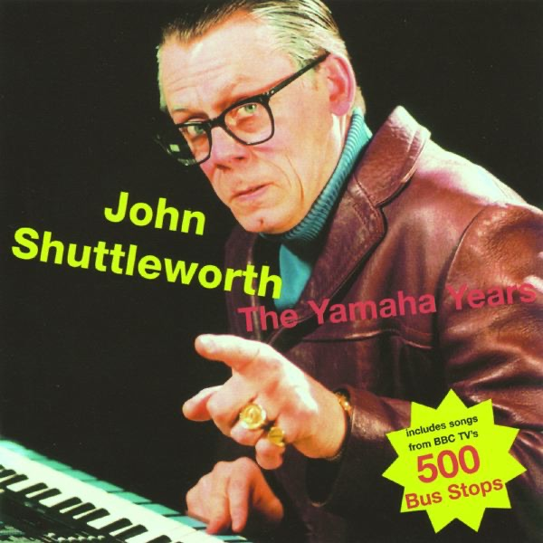

<!-- section break -->

1. My Wife Died In 1970
2. Modern Man
3. Have You Seen My Wife?
4. You're Like Manchester
5. Eggs And Gammon
6. Man Who Lives On The M62
7. Up And Down Like A Bride's Nightie
8. The Christmas Orphan
9. Y Reg
10. 500 Bus Stops
11. Save The Whale
12. The Bee And The Wasp
13. Can You Ken Ken?
14. Shopkeepers In The North
15. Mary Had A Little Lamb
16. How To Be Happy In A Sad Sad World
17. From A Father To A Son (The Burial Song)
18. What's A Shuttleworth?
19. Do The Stars Remember?
20. Pigeons In Flight
21. Where Are The Gents?
22. I Like To Dance
23. John Goes To Matlock
24. Ring
25. Excerpt From A Radio Non-Broadcast
26. The History Of Rock N Roll
27. John Goes To London

<!-- section break -->

## Spotify


## Videos
### John Shuttleworth - Have you seen my Wife
 

### More Videos

- [John Shuttleworth - My Wife Died in 1970 with lyrics](https://www.youtube.com/watch?v=1o2Rb7OTvZw)
- [John Shuttleworth Y reg](https://www.youtube.com/watch?v=4LroHr6aOo4)
- [Eggs & Gammon.wmv](https://www.youtube.com/watch?v=0a78vNJH2xQ)
- [John Shuttleworth - The Bee And The Wasp](https://www.youtube.com/watch?v=q54T3lbw1Do)
- [John Shuttleworth  Shopkeepers in the North](https://www.youtube.com/watch?v=PI7o-FJM8f4)
- [Pigeons in Flight - John Shuttleworth](https://www.youtube.com/watch?v=GXp455mQ4xE)

## Release Information
|  Key           | Value                                                |
| ---------------| ---------------------------------------------------- |
| Release Year   | 2015                                   |
| Discogs Link   | [John Shuttleworth - The Yamaha Years](https://www.discogs.com/release/7453474-John-Shuttleworth-The-Yamaha-Years) |
| Label          | Free Range Product |
| Format         | Vinyl 2× LP Album Stereo |
| Catalog Number | FRP2LP001 |
| Notes | "Includes songs from BBC TV's 500 Bus Stops"    "All songs written, performed and produced by Graham Fellows except 'The Christmas Orphan' written by G. Fellows and P. Ovcar"    Licensed From Chic Ken Productions  Contains 7 bonus tracks not featured on the CD version   |