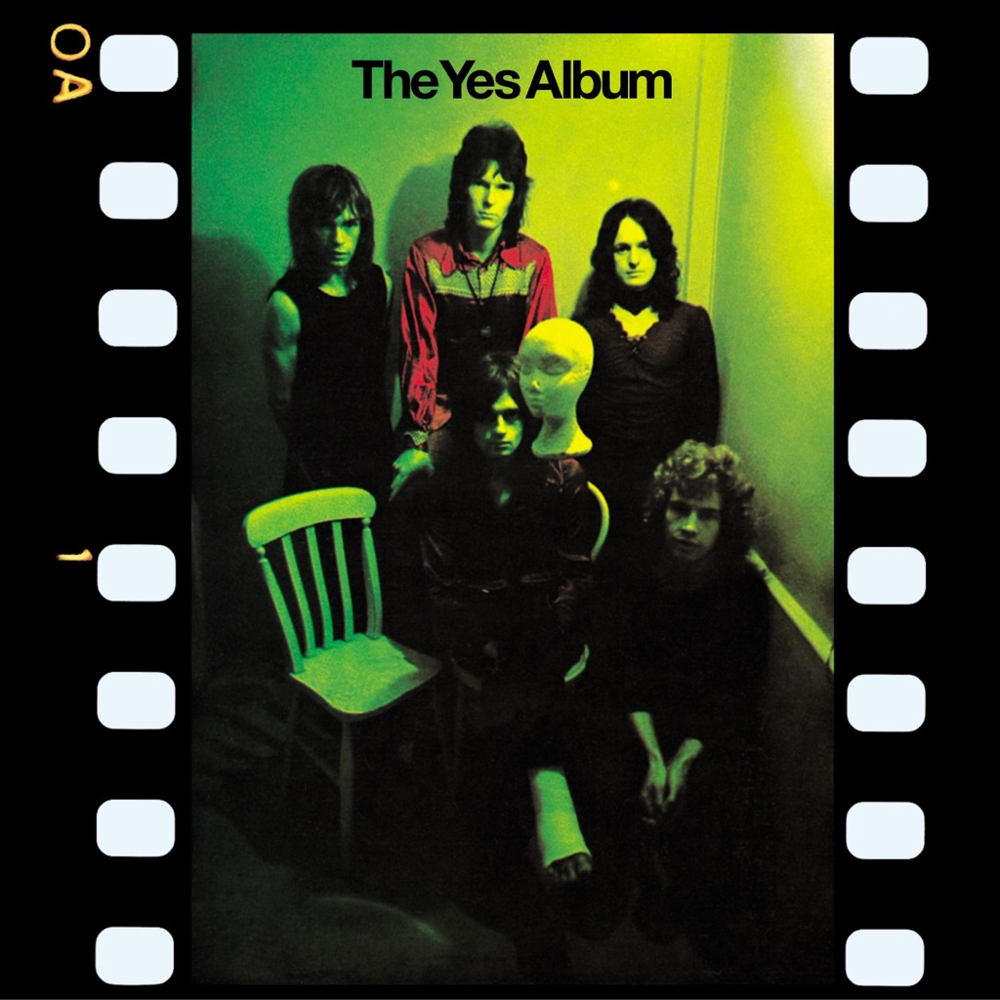

<!-- section break -->

1. Yours Is No Disgrace (9:36)
2. The Clap (3:07)
3. Starship Trooper (9:23)
4. I've Seen All Good People (6:47)
5. A Venture (3:13)
6. Perpetual Change (8:50)

<!-- section break -->

## Spotify


## Release Information
|  Key           | Value                                                |
| ---------------| ---------------------------------------------------- |
| Release Year   | 0                                   |
| Discogs Link   | [Yes - The Yes Album](https://www.discogs.com/release/702483-Yes-The-Yes-Album) |
| Label          | Atlantic |
| Format         | Vinyl LP Album Reissue |
| Catalog Number | ATL 40 106 |
| Notes | First cat. number on labels, the spine, and the cover. Second cat. number on the back cover.  Recorded at Advision Studios, London, Autumn 1970. Track A2 recorded live, Lyceum London ℗ 1971 Atlantic Records  |