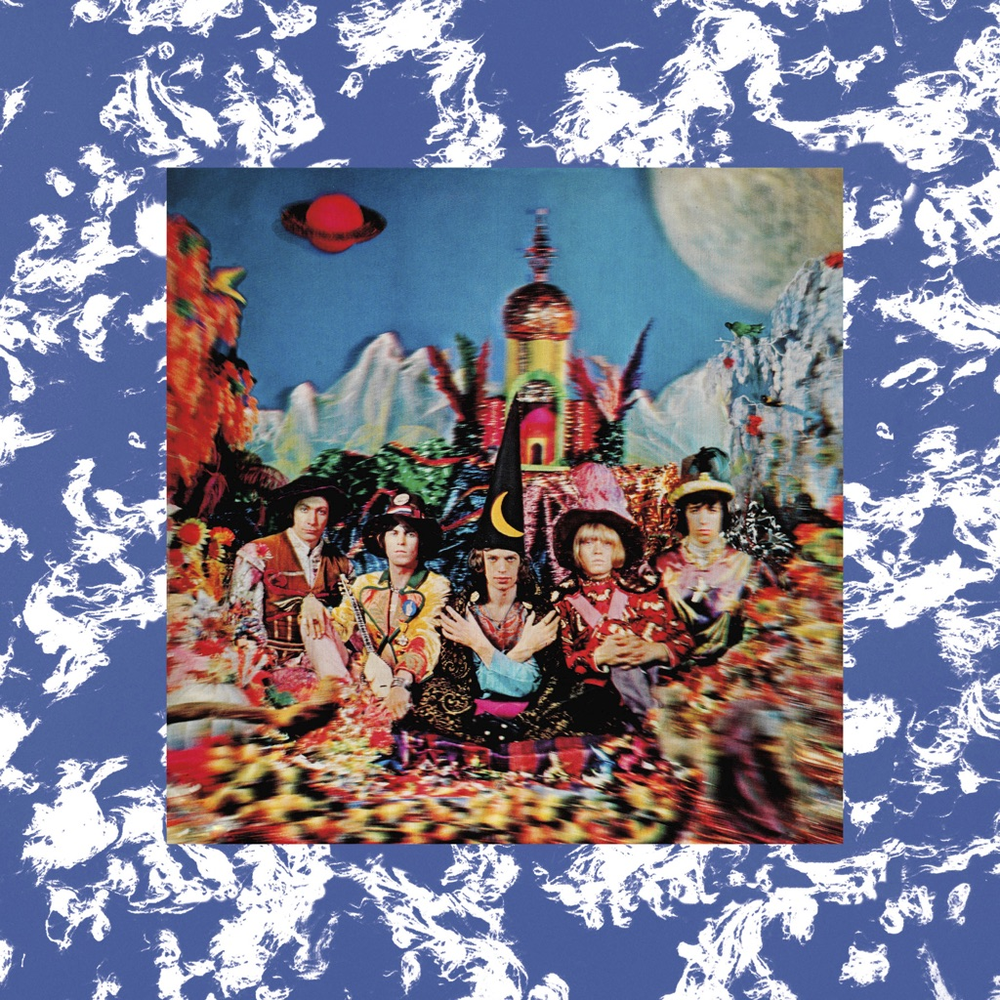

<!-- section break -->

1. Sing This All Together
2. Citadel
3. In Another Land
4. 2000 Man
5. Sing This All Together (See What Happens)
6. She's A Rainbow
7. The Lantern
8. Gomper
9. 2000 Light Years From Home
10. On With The Show

<!-- section break -->

## Spotify


## Release Information
|  Key           | Value                                                |
| ---------------| ---------------------------------------------------- |
| Release Year   | 2003                                   |
| Discogs Link   | [The Rolling Stones - Their Satanic Majesties Request](https://www.discogs.com/release/381198-The-Rolling-Stones-Their-Satanic-Majesties-Request) |
| Label          | ABKCO |
| Format         | Vinyl LP Album Reissue Remastered Stereo (Gatefold, 180g) |
| Catalog Number | 882 329-1 |
| Notes | Some copies comes with sticker of the The Rolling Stones DSD Remastered Series on front cover (applied on the shrink-wrap) Laminated sleeve. Generic anti-static poly-lined dust inner sleeve. DSD Direct Stream Digital, Direct SBM Super Bit Mapping Direct  [On labels] DSD, & SBM Direct are Trademarks of Sony & Philips ©2003 ℗1967 ABKCO Records. Manufactured by ABKCO Records a division of ABKCO Music & Records, Inc Made in EU 882 329-1  [On back] ©2003 ABKCO Records. [...] Printed in EU. DSD, & SBM Direct are Trademarks of Sony & Philips.  Some copies distributed with barcode sticker (text): 0 18771 90021 4  Runouts are hand-etched except of the stamped -7642-. |