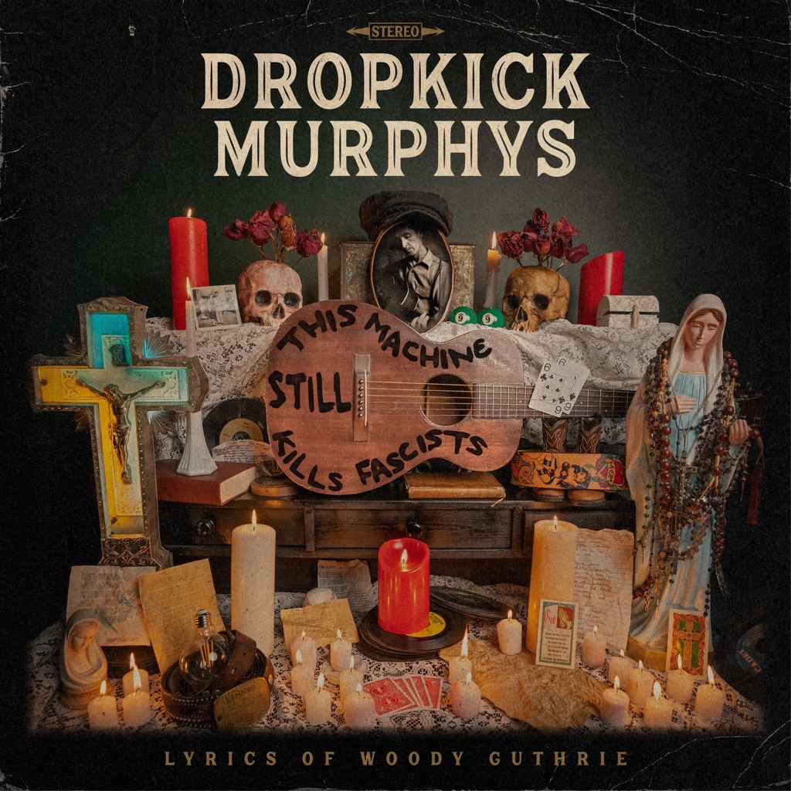

<!-- section break -->

1. Two 6's Upside Down (3:29)
2. Talking Jukebox (3:14)
3. Ten Times More (2:11)
4. Never Git Drunk No More (3:26)
5. All You Fonies (2:49)
6. The Last One (3:34)
7. Cadillac, Cadillac (2:53)
8. Waters Are A'Risin (3:03)
9. Where Trouble Is At (2:34)
10. Dig A Hole (3:10)
11. Bonus Track
12. Never Git Drunk No More (Alternate Version)

<!-- section break -->

## Spotify


## Videos
### Dropkick Murphys Two 6's Upside Down (Music Video)
 

### More Videos

- [Dropkick Murphys All You Fonies (Music Video)](https://www.youtube.com/watch?v=kM2Cf6h0-rs)
- [Dig A Hole (feat. Woody Guthrie)](https://www.youtube.com/watch?v=kNaH6VfnB4Y)
- [Never Git Drunk No More (feat. Nikki Lane)](https://www.youtube.com/watch?v=rf63LeDTiOY)
- [Talking Jukebox](https://www.youtube.com/watch?v=7Y7u4T37Scs)
- [Where Trouble Is At](https://www.youtube.com/watch?v=2btpqK2Ss3s)
- [Cadillac, Cadillac](https://www.youtube.com/watch?v=n_GPhieZfqY)

## Release Information
|  Key           | Value                                                |
| ---------------| ---------------------------------------------------- |
| Release Year   | 2022                                   |
| Discogs Link   | [Dropkick Murphys - This Machine Still Kills Fascists](https://www.discogs.com/release/25013020-Dropkick-Murphys-This-Machine-Still-Kills-Fascists) |
| Label          | Dummy Luck Music |
| Format         | Vinyl LP Album Limited Edition Stereo (Crystal) |
| Catalog Number | DLM002LPXC |
| Notes | Indie store exclusive pressed on crystal vinyl  Catalog Number DLM002LPXC on sticker. Catalog DLM002LP on spine. Catalog DLM-002 on labels.  Songs are listed on the sleeve in track order and are not divided into sides |